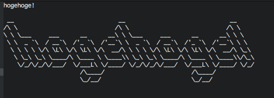

Atomの公式ページにpackageの作り方が載っているので基本的にその通りに作ってみます。AtomいいよAtom。

https://atom.io/docs/v0.186.0/your-first-package

## Packageのテンプレートを自動生成
コマンドパレット(cmd + shift + p)から`Package Generator: Generate Package`を実行します。

ソースのパスはお好きなところを指定。`/path/to/ascii-art`みたいな。

こんな感じに自動生成されます。

```
$ tree
.
├── CHANGELOG.md
├── LICENSE.md
├── README.md
├── keymaps
│   └── ascii-art.cson
├── lib
│   ├── ascii-art-view.coffee
│   └── ascii-art.coffee
├── menus
│   └── ascii-art.cson
├── package.json
├── spec
│   ├── ascii-art-spec.coffee
│   └── ascii-art-view-spec.coffee
└── styles
    └── ascii-art.less
```

## Hellom World!してみる

自動生成コードをざくっと削除して、こんな感じにします。

```lib/ascii-art.coffee
AsciiArtView = require './ascii-art-view'
{CompositeDisposable} = require 'atom'

module.exports =
  activate: ->
    atom.commands.add 'atom-workspace', "ascii-art:convert", => @convert()
  convert: ->
    # This assumes the active pane item is an editor
    editor = atom.workspace.getActivePaneItem()
    editor.insertText('Hello, World!')
```

ctrl-alt-cmd-lという超絶押しにくいショートカットでwindowをリロードすると使えるようになるらしいのでやってみる。

コマンドパレットから`Ascii Art:Convert`が選択できるようになってる。この時点では、カーソル位置に`Hello, World!`って出力されればOK。

## トリガーとキーバインドを設定

公式とは違うんだけどこういう風にしてみた。atom-workspaceのときにコマンドをactiveにするっていうことなのかな？

```package.json
"activationCommands": {
    "atom-workspace": ["ascii-art:toggle", "ascii-art:convert"]
  },
```

キーバインドの設定。見ての通りですね。

```keymaps/ascii-art.cson
'atom-text-editor':
  'ctrl-alt-a': 'ascii-art:convert'
```

再び超絶押しにくいショートカットキーを使ってwindowをリロードする。

適当なところで`control + alt + a`を押して`Hello, World!`というテキストが出力されればOK


## アスキーアートに変換する処理を実装
といってもアスキーアートに変換する処理そのものは既存の`figlet`パッケージを使わせていただきます。

```package.json
"dependencies": {
   "figlet": "1.0.8"
}
```

依存パッケージを記述したらコマンドパレットから`Update Package Dependencies:update`を実行すると依存パッケージを取ってきてくれます。らくちんらくちん。

Hello, Worldって出てただけのところの処理を変更する。convert部分ですね。

```lib/ascii-art.coffee
  convert: ->
    editor = atom.workspace.getActivePaneItem()
    selection = editor.getLastSelection()

    figlet = require 'figlet'
    figlet selection.getText(), {font: "Larry 3D 2"}, (error, asciiArt) ->
      if error
        console.error(error)
      else
        selection.insertText("\n#{asciiArt}\n")
```

coffeeで書けるのめちゃいいね。jsでplugin書けるって聞いてたからてっきり生jsなのかと思ってた。

適当なテキストを入力して`control + alt + a`を押してみましょう。こんな感じになれば成功！



簡単！
