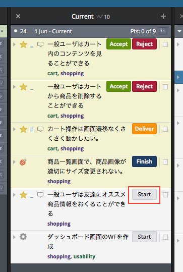
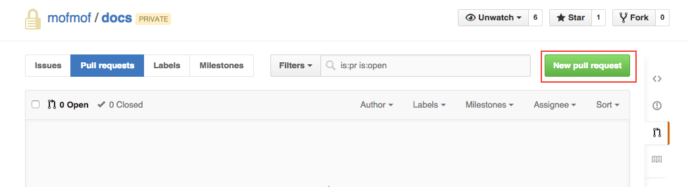
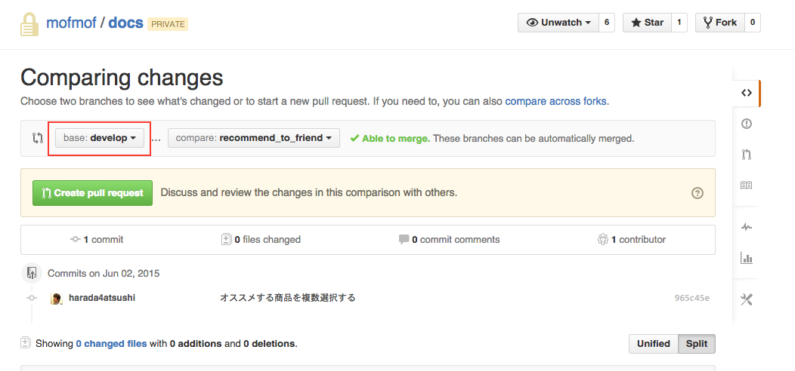
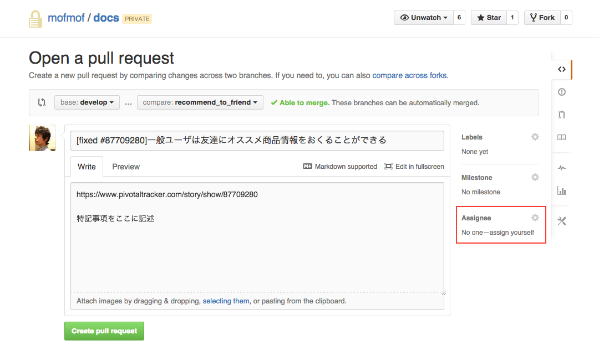
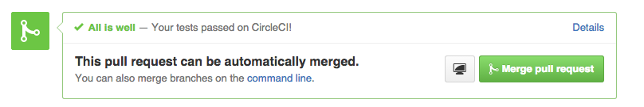

前にもQiitaで趣味開発チームの開発フローを公開したことはあるのですが、今度は弊社(mofmof inc.)の開発フローを公開してみます。結構丁寧に書いたのでもし使えそうだったらそのまま使っていただいて大丈夫ですよ。

実際にこのドキュメントを社内wikiに貼って運用しております。

## 開発フロー
GitHub Flowをベースにして少しカスタマイズしたやり方を採用しています。  

https://gist.github.com/Gab-km/3705015

PivotalTrackerで自分にアサインされているストーリーを確認し、開発着手時にStartボタンを押す。



ストーリーの内容を確認したら、developブランチから派生した新しいブランチを作成する。

```
$ git checkout develop
$ git pull origin develop
$ git checkout -b recommend_to_friend
```

開発途中はなるべくこまめにadd, commitしてください。

例) 変更を確認しながらaddして、commitする

```
$ git add -p
$ git commit -m "オススメする商品を複数選択する"
```

開発が完了したらブランチをpushする。

```
$ git push origin recommend_to_friend
```

GitHubの画面上からpull requestを作成する。



baseブランチがdevelopになっていることを確認する。




pull requestのタイトルを```[fixed #ストーリーID]ストーリータイトル```という形式にする。

pull requestの説明にPivotalTrackerのストーリーのリンクを貼り、特記事項があれば記述する。

プロジェクトの担当者をAssignしてください。



pull requestを作成する。CIがグリーンであることを確認したら次にアサインされているストーリーに着手する。

※ やむを得ずテストが壊れた状態でpull requestするときは、必ずテストに`pending`を入れてグリーンしておいてください。




pull requestのサンプル: https://github.com/mofmof/docs/pull/44


#### 補足
- 次のストーリーの開発を始めるとき、本来は再度developブランチから派生する必要がありますが、前回の作業内容のソースコードが必要な場合には、そのブランチから派生しても構いません。
- 一日の最後には作業途中でも必ず手元のソースコードをpushしてpull requestを作成しておいてください(仕掛りの状況を把握するため)。その際pull requestのタイトルには[WIP]とつけてください。  - pull requestはhubコマンドを使用することでコマンドラインで作成できます。

## コードレビューについて
- コードレビューは毎朝10:00〜10:45で実施しています。
- [WIP]がついていないpull requestをレビュー対象とします。
- 比較的細かい観点でレビューします。
- 疑問や感心した点も積極的にコメントをあげます。

### レビュー観点
* コメントの要/不要（処理内容がよく分からない場合など）
* クラス、変数、メソッドの命名は適切か
* 他により良い実装方法はないか

細かくレビューする目的は下記です。

1. コードをシンプルに保ち可読性を向上させるため
1. チーム内でコードの書き方を統一するため
1. チームメンバーのスキルの底上げ
文章だけのやりとりだと温度感が伝わらないのですが、「指摘」というより「改善できる可能性があるポイント」っていう程度に捉えていただければと思います。
