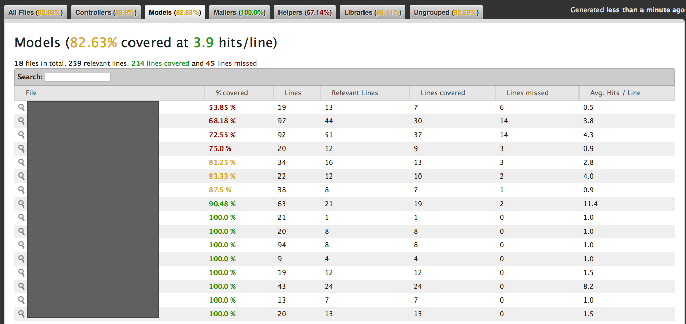
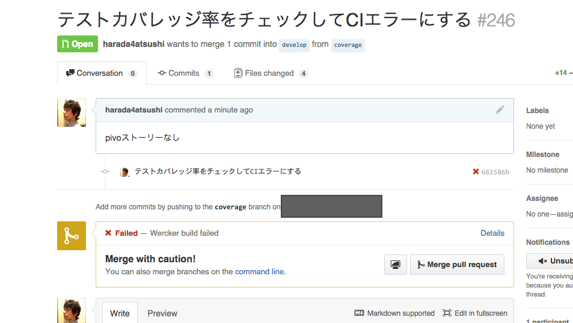
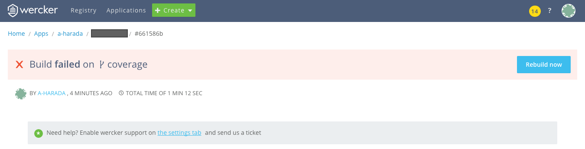

## SimpleCovでカバレッジを計測する

既にRailsプロジェクトがあって、rspecが実行出来る状態を前提とします。

簡単にカバレッジの計測が出来るSimpleCovというgemを使います。たった2行追記すればカバレッジを計測出来るというすぐれもの。

使い方はREADME参照。

https://github.com/colszowka/simplecov

Gemfileに追記

```
gem 'simplecov', :require => false, :group => :test
```

spec_helperに記述

```
require 'simplecov'
SimpleCov.start 'rails'
SimpleCov.minimum_coverage 90

RSpec.configure do |config|
...
```

```
$ bundle install
```

たったこれだけで出来上がり。簡単ですね。テストを実行します。


```
$ bundle exec rspec
```

`RAILS_ROOT/coverage/`配下にhtmlファイルが生成されるので見てみましょう。




こういう書き方をするとmodelやcontrollerごとにカバレッジがグループ化される。

```
SimpleCov.start 'rails'
```

coverageをgit管理する必要はないので.gitignoreに追記しておきましょう。

.gitignore


```
coverage
```


## werckerで動かして一定カバレッジ率以下でfailedにする

まずはカバレッジ率を99%(`SimpleCov.minimum_coverage 90`)に設定し、手動でrspecを実行し、`echo`でリターンコードを確認してみます。

99%は満たしていないのでリターンコードが2になってます。

```
$ rspec
Finished in 20.06 seconds (files took 4.75 seconds to load)
228 examples, 0 failures, 27 pending
Coverage report generated for RSpec to /path/to/rails-project/coverage. 598 / 722 LOC (82.83%) covered.
Coverage (82.83%) is below the expected minimum coverage (99.00%).

$ echo $?
2
```

続いてカバレッジ率を50%(`SimpleCov.minimum_coverage 50`)に引き下げて再度実行してみます。

50%は満たしているのでリターンコードが0になっていますね。

```
$ rspec
Finished in 20.06 seconds (files took 4.75 seconds to load)
228 examples, 0 failures, 27 pending
Coverage report generated for RSpec to /path/to/rails-project/coverage. 598 / 722 LOC (82.83%) covered.
$ echo $?
0
```

上記までやってあればCIの方で何も設定することはありませんでした。。rspec実行のリターンコードを見て build failed にしてくれます。






## まとめ

カバレッジ率をやみくもに上げようとするのは手段の目的化なので問題だと思うのですが、テストが不得意なメンバーはテスト実装をサボりがちなので、注意喚起という意味でやってみた次第。
