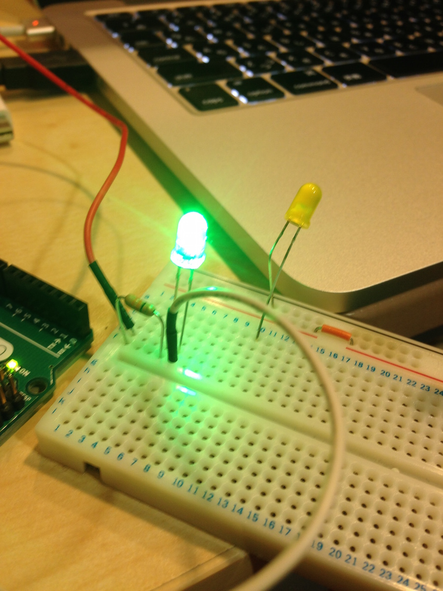
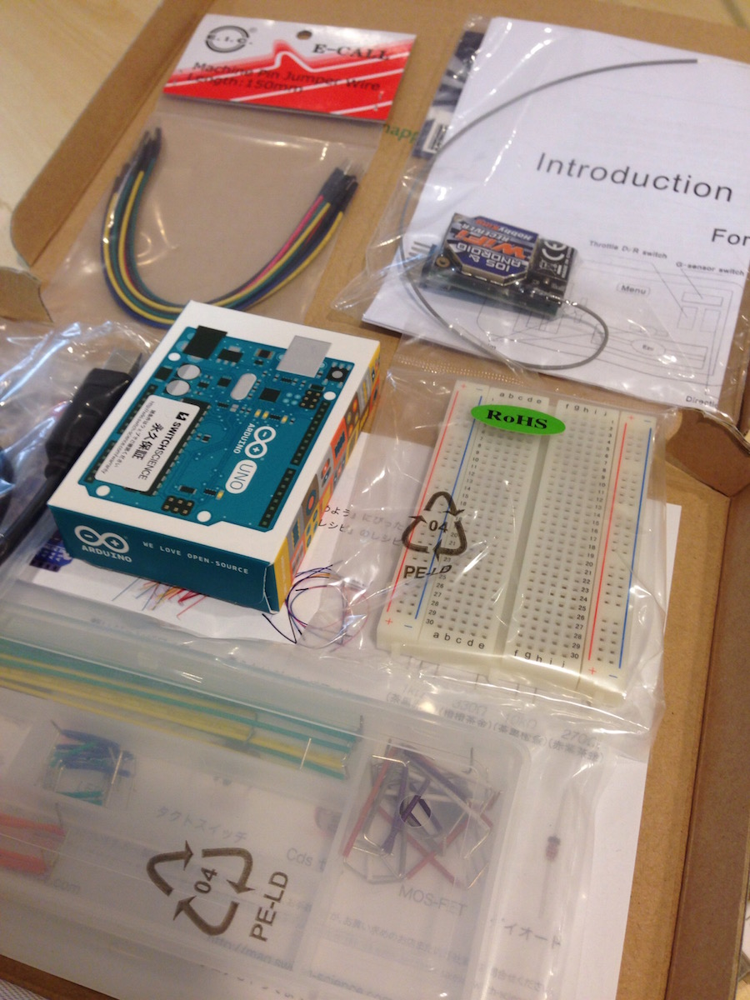
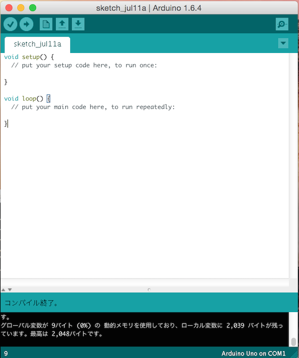
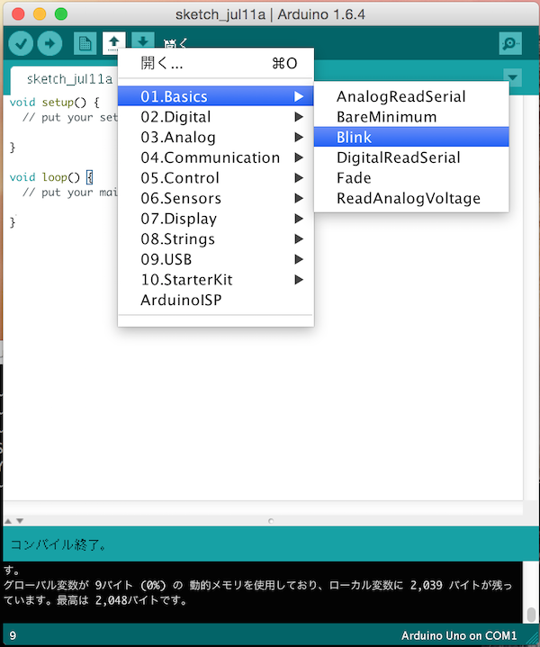
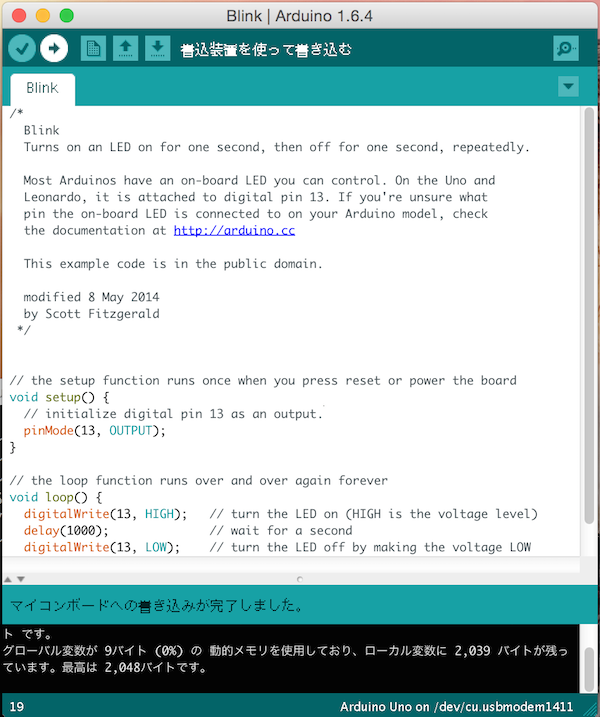
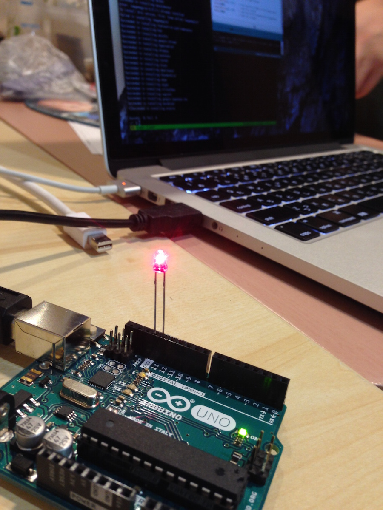
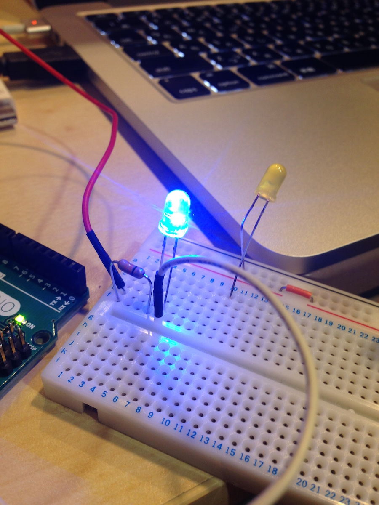

]

## 「Arduinoをはじめようキット」で普通にLチカしてみる

ご存知の通り、LチカとはLEDチカチカの略ですが、Amazonで売ってる「Arduinoをはじめようキット」でそこまで簡単にできるのでやってみました。

<iframe src="http://rcm-fe.amazon-adsystem.com/e/cm?lt1=_blank&bc1=FFFFFF&IS2=1&bg1=FFFFFF&fc1=000000&lc1=0 000FF&t=redhornet09-22&o=9&p=8&l=as1&m=amazon&f=ifr&ref=qf_sp_asin_til&asins=B0025Y6C5G" style="width:120px;height:240px;" scrolling="no" marginwidth="0" marginheight="0" frameborder="0"></iframe>

なかなか手をつける時間がなかったのですが、IoTもふもふ会というイベントを弊社(mofmof inc.)で開催したのでやっとこさチャレンジできた。

開封の儀。
どうやら使い方説明書的なのは入っていなかったのでネットの情報をあたることにする。

]

Arduino公式ページにGetting Startedがあったのでこれを参考にすればよさそう。

[https://www.arduino.cc/en/Guide/HomePage](https://www.arduino.cc/en/Guide/HomePage)

ArduinoIDEという開発環境があるらしいのでインストールします。

[https://www.arduino.cc/en/Main/Software](https://www.arduino.cc/en/Main/Software)

起動するとこんな感じ。

何気なくコンパイルしてみた

]

サンプルコードが付属されている。この`Blink`ってやつがLチカのソースコードらしい。



次にArduinoのBoardを選びます。Arduino Unoを選べばいいっぽい。

次にポートを選ぶ。`/dev/cu.usbmodem1411(Arduino Uno)`を選択

何気なく書き込んでみる。何も起こらない。そりゃそうだ基盤にLED刺してないもんな。


Blinkのソースコードを読む。13番にさせと読み取れる。13とGNDって書いてあるところに刺してみる。

```
// the setup function runs once when you press reset or power the board
void setup() {
  // initialize digital pin 13 as an output.
  pinMode(13, OUTPUT);
}

// the loop function runs over and over again forever
void loop() {
  digitalWrite(13, HIGH);   // turn the LED on (HIGH is the voltage level)
  delay(1000);              // wait for a second
  digitalWrite(13, LOW);    // turn the LED off by making the voltage LOW
  delay(1000);              // wait for a second
}
```

適当に刺してみたLチカしない。どうやらLEDにはプラスマイナスあるみたい。方向を逆に刺したらLチカ成功。

できたああああ！！




## チカチカ速度を5倍速にする

通常の3倍どころか通常の5倍でチカチカさせてみました。ソースコードの修正は簡単。1000msのところを200msに変更するだけ。

```
// the loop function runs over and over again forever
void loop() {
  digitalWrite(13, HIGH);   // turn the LED on (HIGH is the voltage level)
  delay(200);              // wait for a second
  digitalWrite(13, LOW);    // turn the LED off by making the voltage LOW
  delay(200);              // wait for a second
}
```

フルカラーLチカモジュールをもらったのでやってみる。プログラム制御は不要でチカチカをなくしてずっと点灯状態すれば勝手に5色に変わる。こんなに簡単。

```
void loop() {
  digitalWrite(13, HIGH);   // turn the LED on (HIGH is the voltage level)
}
```

わあきれい！！



入門できたので次は何をしようかな。ネタ考えるのが楽しくなりそう。
