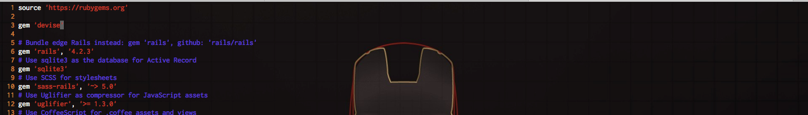
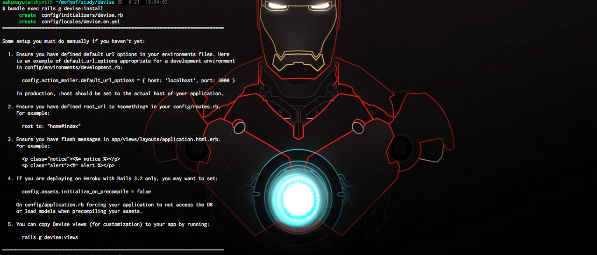
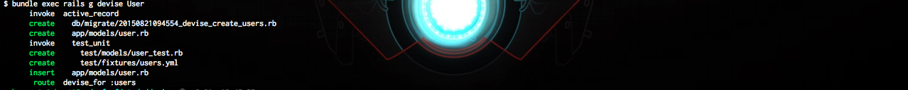
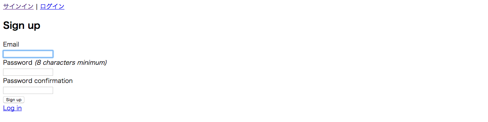
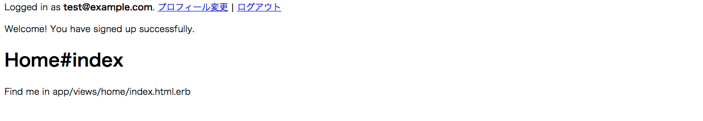
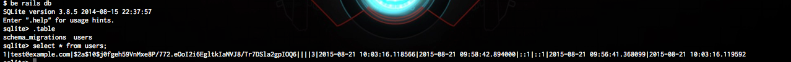
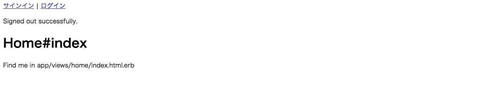

はじめまして、rails初級者のサクマです。現在はアシスタントとして案件に携わりながら、rails経験値を上げております。

開発中のアプリではたくさんの便利なgemが使われているので、使い方を調べながらプログラミングしてるのですが、そのgemが今ひとつ頭に入ってこなくてモヤモヤしてまして。

やはり自分の手でインストールからやってみるのが一番だよね、とういことで、こちらの記事に従ってDeviseをインストールしてみました。（いつも参考にさせて頂いております。ありがとうございます。）

[http://ruby-rails.hatenadiary.com/entry/20140801/1406907000](http://ruby-rails.hatenadiary.com/entry/20140801/1406907000)

## 環境

- Mac (Yosemite)
- ruby 2.2.2
- rails 4.2.3
- rbenv + bundler

## やってみよう　(1. deviseのインストールと初期設定)

何かをインスールするって、参考通りにやっても上手くいかないことよくありますよね。いくつか参考に記事を検索してみると記事毎にやり方も違ったりして、、、。

などと心配せずにやってしまいましょう。

devise gemをインストール

続いて、rails g devise:install

出力されたメッセージはどうやら参考サイトと同じ感じですね。メッセージに従って１〜３を設定しました。

最後に、deviseを動かすためにHomeコントローラとindex、showアクションを生成。

## もう完成？！　(2. deviseのUserモデルの作成)

どうやら、認証の対象となるモデルを作成するらしいですね、今回は例の通りにUserモデルとして rails g devise User で実行。

Userモデルとマイグレーションファイルが作成されたようです。

deviseに用意されている機能のうち、どの機能を使用するかは、生成されたコードをコメントイン／アウトだけで調整できるようですね。
どのような機能があるのかは、後でじっくりと見るとして、そのままマイグレートします。

あとは、viewにログイン／ログアウトのリンクを設定して完成、のようですね。

これだけ？！

rails sをして、ホーム画面からサインインをクリック。おお！

E-mailとpasswordを入力してサインアップを押下すると、アカウントが作成されてログイン状態に。

Userのレコードもしっかり作成されていますね。

ログアウトもちゃんとできました。

動くまでにどれだけの苦難が待っているのだろうと思っていたのですが、ほぼコマンド２つ叩いただけでしたねw。本当に驚きです！！

まあ、導入しただけなのでこの後からが大変なのだろうと思うのですが。（結構ハマるとか聞きました）

とは言えモヤモヤは少し解消されました。これからも頑張るぞー。
