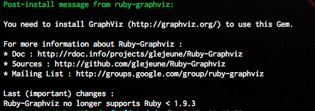
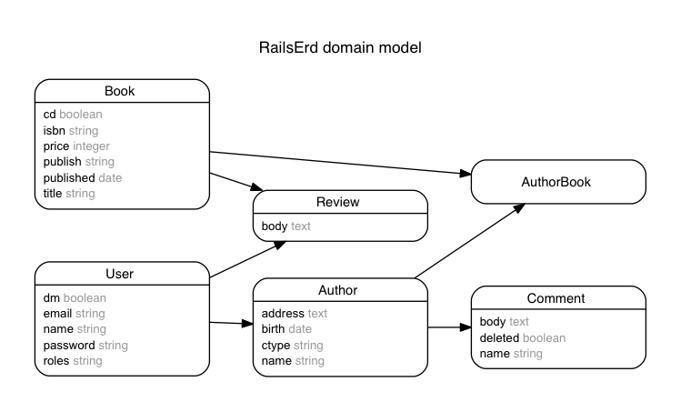
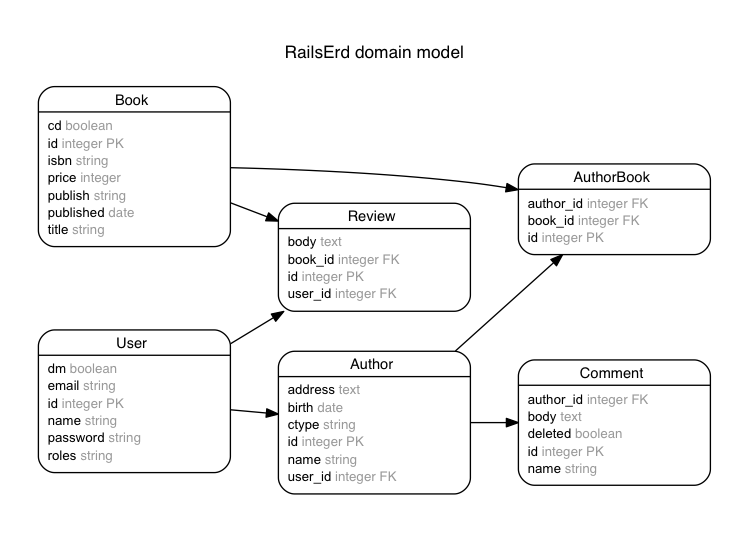

アプリの内部を理解しようとする時ってどうやってますか？

私の場合はDBの構成を調べてそれを手がかりにコードを追っていくのですが、案件参加の当初はschema.rbから紙とペンで構成図を書いてました。

前職ではDB構成表みたいな大量のドキュメントが管理され、何かを調べる際にそいつを開いてたので、普通のことだと思っていたのですが、、、

このgemを使えばrailsプロジェクトのＥＲ図を一瞬で出力してくれるようなので、無駄な時間と管理からお別れできそうですね。

[Rails ERD 公式サイト](http://rails-erd.rubyforge.org/)

## 環境

- Mac (Yosemite)
- ruby 2.2.2
- rails 4.2.4
- rbenv + bundler
- Homebrew

## やってみよう

まずは[graphviz](http://www.graphviz.org/)というグラフ描画ツールが必要らしいので、Homebrewにてインストールします。

```
$ brew install graphviz
```

続いて、お試し用のrailsプロジェクトを生成して、

```
$ mkdir rails-erd
...
$ bundle exec rails new . --skip-bundle
```

プロジェクトのGemfileにrails-erdを追加して、

```
# Gemfile
group :development do
  ...
  gem 'rails-erd'
end
```

gemをインストールします。

```
$ bundle install --path vendor/bundle
```

何か失敗したのかなと思ったら、gemが親切にメッセージを表示してくれたようですね。gemからこんなこともできるのか。



## お試し用のモデルを作成

ER図を出力するためにサンプルのモデルを作成します。（コードが収まりきらないので下に記述しました）

```
$ bundle exec rails g ...
$ bundle exec rake db:migrate
```

rails g scaffold Book isbn:string title:string price:integer publish:string published:date cd:boolean
rails g scaffold User name:string password:string email:string dm:boolean roles:string
rails g scaffold Author name:string birth:date address:text ctype:string user:references
rails g scaffold Review body:text book:references user:references
rails g scaffold Comment name:string body:text deleted:boolean author:references
rails g model Author_book author:references book:references

## ER図を出力

下記のコマンドを入力、これだけです。

```
$ bundle exec rake erd
```

railsプロジェクトの直下にPDFファイルが出力されました。(画像はpngで再出力したものですが内容は同じです)



見やすい！！

オプションをつけると、表示させる情報を増やせるようです。

[Rails ERD 公式サイトのオプション](http://rails-erd.rubyforge.org/customise.html)

```
$ be rake erd attributes=foreign_keys,primary_keys,content filetype=png
```



主キー、外部キーを表示させてみました。こちらの方が解りやすいですね。

## 感想

gemをインストールして、コマンド一発だけという手軽さは助かります。今後、途中参加の案件や他人の改定の時にぜひ使ってみようと思います。

あと他人に説明する時もよくER図を紙とかホワイトボードに書いたりするんですよね。手書き図より説明がし易くなりそうです。

これからも頑張るぞー。
