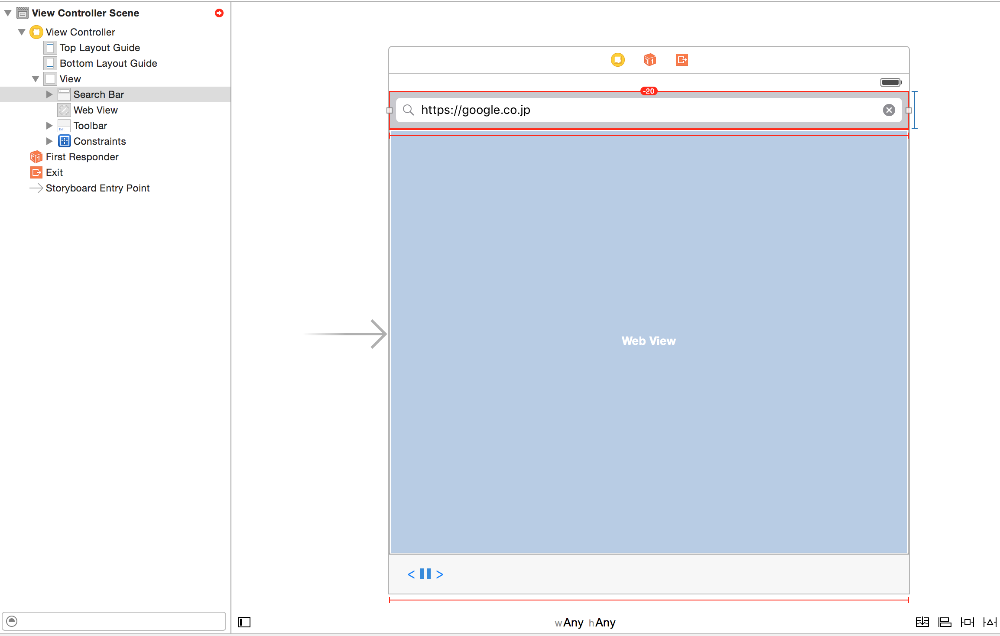
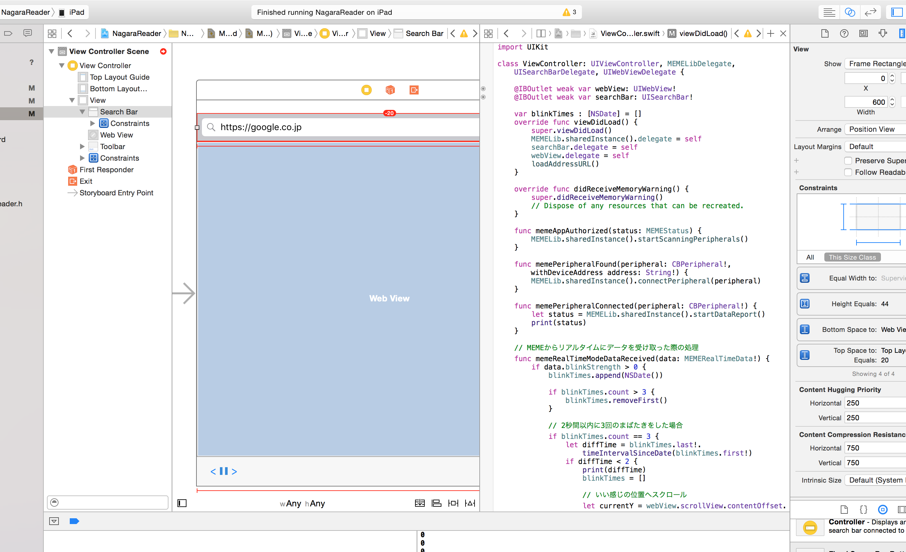

どうも。mofmof inc.のエンジニア兼代表取締役の原田敦です。11/28,29の2日間を利用して開発合宿＠秩父に来ておるのですが、今回はJINS MEMEを題材に「NagaraReader」というiOSをアプリを作りました。

これは手を使わずにまばたきだけでブラウザの画面をスクロール出来るもので、ごはんやお菓子を食べている最中に手が使えなくても快適にブラウジングが出来るというアプリです。申請とかはめんどうなのでダウンロードは出来ませんが、動画撮ったのでそちらを御覧ください。

ソースコードはGitHubにアップしてあります(swiftは初なのでコードに関するツッコミは勘弁してね)。

[https://github.com/harada4atsushi/NagaraReader](https://github.com/harada4atsushi/NagaraReader)

<iframe width="560" height="315" src="https://www.youtube.com/embed/hGZvW3ZIFyU" frameborder="0" allowfullscreen></iframe>

## まばたき3回をトリガーにして画面スクロール
こちらのエントリの続きです。

[http://tech.mof-mof.co.jp/blog/jins-meme-nyumon.html](http://tech.mof-mof.co.jp/blog/jins-meme-nyumon.html)

ViewController.swiftをこんな感じで実装する。

```
import UIKit

class ViewController: UIViewController, MEMELibDelegate, UISearchBarDelegate, UIWebViewDelegate {

    @IBOutlet weak var webView: UIWebView!
    @IBOutlet weak var searchBar: UISearchBar!

    var blinkTimes : [NSDate] = []
    override func viewDidLoad() {
        super.viewDidLoad()
        MEMELib.sharedInstance().delegate = self
        searchBar.delegate = self
        webView.delegate = self
        loadAddressURL()
    }

    override func didReceiveMemoryWarning() {
        super.didReceiveMemoryWarning()
        // Dispose of any resources that can be recreated.
    }

    func memeAppAuthorized(status: MEMEStatus) {
        MEMELib.sharedInstance().startScanningPeripherals()
    }

    func memePeripheralFound(peripheral: CBPeripheral!, withDeviceAddress address: String!) {
        MEMELib.sharedInstance().connectPeripheral(peripheral)
    }

    func memePeripheralConnected(peripheral: CBPeripheral!) {
        let status = MEMELib.sharedInstance().startDataReport()
        print(status)
    }

    // MEMEからリアルタイムにデータを受け取った際の処理
    func memeRealTimeModeDataReceived(data: MEMERealTimeData!) {
        if data.blinkStrength > 0 {
            blinkTimes.append(NSDate())

            if blinkTimes.count > 3 {
                blinkTimes.removeFirst()
            }

            // 2秒間以内に3回のまばたきをした場合
            if blinkTimes.count == 3 {
                let diffTime = blinkTimes.last!.timeIntervalSinceDate(blinkTimes.first!)
                if diffTime < 2 {
                    print(diffTime)
                    blinkTimes = []

                    // いい感じの位置へスクロール
                    let currentY = webView.scrollView.contentOffset.y
                    webView.scrollView.setContentOffset(CGPointMake(0, currentY + webView.scrollView.frame.size.height - 200), animated: true)
                }
            }
        }
    }

    // WebViewでURLのページを開く
    func loadAddressURL() {
        let requestURL = NSURL(string: searchBar.text!)
        print("requestURL: " + String(requestURL))
        let req = NSURLRequest(URL: requestURL!)
        webView.loadRequest(req)
    }

    func webViewDidStartLoad(webView: UIWebView) {
        UIApplication.sharedApplication().networkActivityIndicatorVisible = true
    }

    func webViewDidFinishLoad(webView: UIWebView) {
        UIApplication.sharedApplication().networkActivityIndicatorVisible = false
        searchBar.text = webView.stringByEvaluatingJavaScriptFromString("document.URL")
    }

    func searchBarSearchButtonClicked( searchBar: UISearchBar) {
        searchBar.resignFirstResponder()
        loadAddressURL()
    }

    @IBAction func back(sender: AnyObject) {
        webView.goBack()
    }

    @IBAction func forward(sender: AnyObject) {
        webView.goForward()
    }
}
```

`memeRealTimeModeDataReceived`メソッドでMEMEからリアルタイムにまばたきの状態を取得している。引数の`data: MEMERealTimeData!`に値が入っているので、`data.blinkStrength`でまばたきの強度を取ったり、`data.blinkSpeed`でまばたき時間を取ったり出来る。

MEMEの技術情報はここに一通り載ってます。

[https://developers.jins.com/ja/resource/docs/datalist/ios/](https://developers.jins.com/ja/resource/docs/datalist/ios/)

次に、StroryBoardを編集します。下のように`WebView,SearchBar,ToolBar,BackButton,ForwardButton`を設置します。



StroryBoardのコンポートネント(WebView,SearchBar,BackButton,ForwardButton)をcontrol押しながらドラッグして、ViewContollerにリンクさせる。



このあとautolayoutをごにょごにょやっていたのですが、ほとんど思い通りに出来ず。。ひとまず手元のiPad miniでちゃんと表示されたっぽいので良し。
