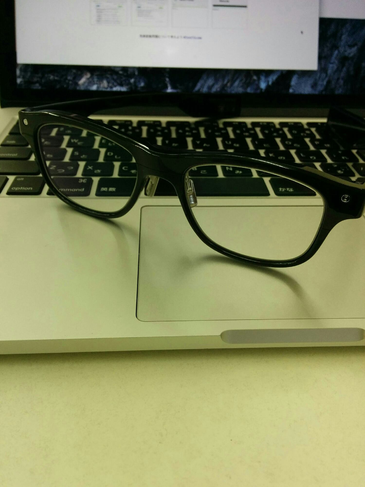
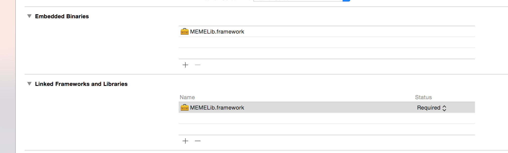
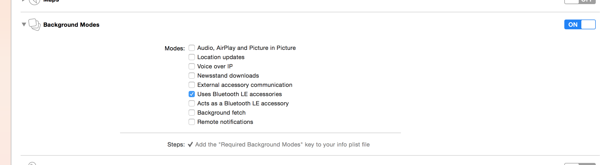
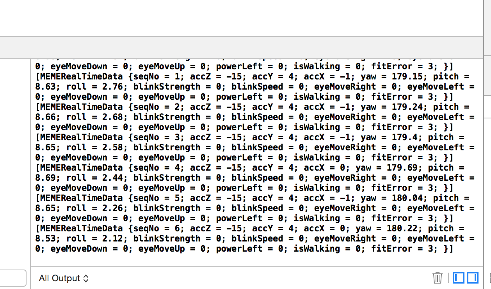

このあたりを参考にやっていきます。

[http://qiita.com/nisshiee/items/9ec409a35f4137e2a32e](http://qiita.com/nisshiee/items/9ec409a35f4137e2a32e)
[http://qiita.com/you_matz/items/4f0f83289cb5f4ee5980](http://qiita.com/you_matz/items/4f0f83289cb5f4ee5980)

普段通りxcodeでプロジェクトを新規作成しておきます。

まずはMEMEのSDKをダウンロード。

[https://developers.jins.com/ja/sdks/ios/](https://developers.jins.com/ja/sdks/ios/)

解凍後ディレクトリ内のframework/universal/MEMELib.frameworkをxcode上でドラッグ&ドロップしてプロジェクトに追加します。

Embedded BinariesにもMEMELib.frameworkを追加。
こんな感じになっていればOKかな？



JINS MEMEはBluetooth LEでiOSアプリと接続するので、BLEを有効にする必要あり。Capabilities > Background ModesをONにして、Use Bluetooth LE accessory にチェックする。



Bridginging Headerファイルを作成するため、ファイル名をdummyとかにしてObj-Cのダミーファイルを作成する。「Bridginging Header作る？」って聞かれるのでcreateうんたらを選択する。

作成されたdummy.mファイルはいらない子なので削除し、もう一方の〜Bridging-Header.hファイルに以下を記述する。

```
#import <MEMELib/MEMELib.h>
```

ちなみにBridginging Headerとは、swiftプロジェクト内でObjective-Cのソースを使うためのおまじないという理解でいいのかな。

公式サイトから作成するアプリの認証コードを取得する。画面上で新しいアプリを作成するとコードが発行される。

[https://developers.jins.com/ja/apps/create/](https://developers.jins.com/ja/apps/create/)

AppDelegate.swiftにキー情報を実装。

```
    func application(application: UIApplication, didFinishLaunchingWithOptions launchOptions: [NSObject: AnyObject]?) -> Bool {
        MEMELib.setAppClientId("<applicationId>", clientSecret: "<secret>")
        return true
    }
```

ViewController.swift

```
import UIKit

class ViewController: UIViewController, MEMELibDelegate {

    override func viewDidLoad() {
        super.viewDidLoad()
        MEMELib.sharedInstance().delegate = self
    }

    override func didReceiveMemoryWarning() {
        super.didReceiveMemoryWarning()
        // Dispose of any resources that can be recreated.
    }

    func memeAppAuthorized(status: MEMEStatus) {
        MEMELib.sharedInstance().startScanningPeripherals()
    }

    func memePeripheralFound(peripheral: CBPeripheral!, withDeviceAddress address: String!) {
        MEMELib.sharedInstance().connectPeripheral(peripheral)
    }

    func memePeripheralConnected(peripheral: CBPeripheral!) {
        let status = MEMELib.sharedInstance().startDataReport()
        print(status)
    }

    func memeRealTimeModeDataReceived(data: MEMERealTimeData!) {
        print(data.description)
    }
}
```

JINS MEMEの公式アプリなので、MEMEとiOS端末を接続した上で、アプリを起動する。下記のようにコンソールにログが出力されれば成功！

できた！！

