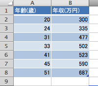
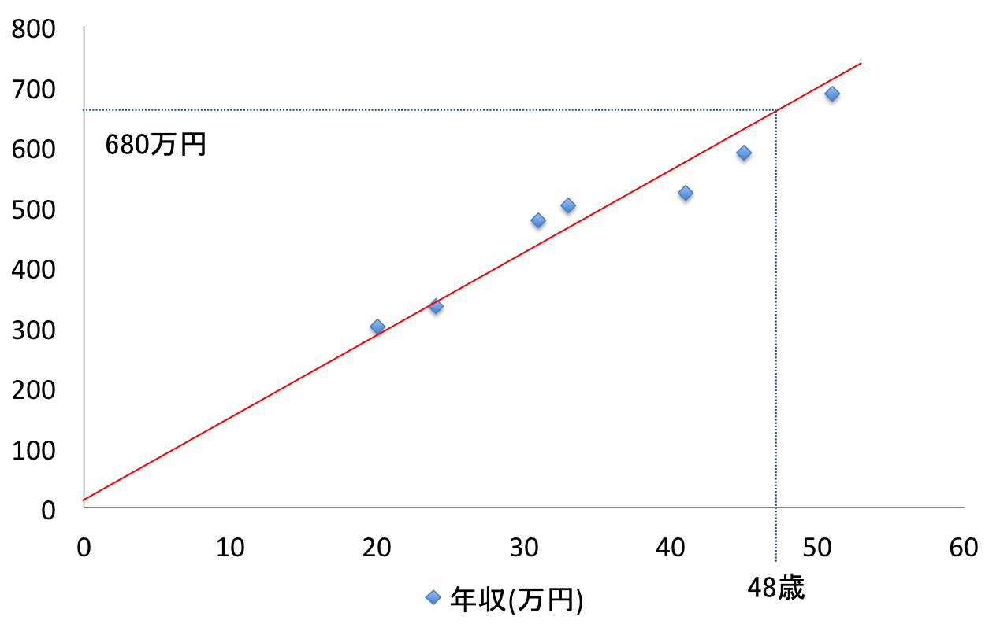

前回エントリで「教師あり学習」には「回帰問題」と「分類問題」という種類があるということを書きましたが、今度はこの「回帰問題」のアルゴリズムの1つである「線形回帰」について書いてみます。

(前回)機械学習に入門するときに一番最初にやったこと  
[http://tech.mof-mof.co.jp/blog/machine-learning-base.html](http://tech.mof-mof.co.jp/blog/machine-learning-base.html)

## 線形回帰とは

例えば、日本人の年齢(x軸)と年収(y軸)をグラフにプロットするとこんな感じになります(適当なデータです)。このグラフを見るとなんとなく1次関数で表現出来そうなことが見えてきます。それっぽい位置に赤線を引いてみる。

仮にこの赤線の1次関数の式が導出出来れば、図のように48歳なら年収は680万円になるっていう予想をすることが出来るようになる。これが線形回帰の考え方っていう理解。

## 仮説関数

上のように赤線を引くことで、大体目視で年齢に対応する年収というものが見えてくるのですが、赤線はあくまでも目視で確認して適当に引いただけであって、数学的に妥当なものとは言えない。そこでこの赤線の式を求めるために、あれこれしていくのがこれからの話になる。

この赤線の式を求めるにはまだあれこれやらねばならんことがたくさんあるので、この赤線を「仮説関数」という名前をつけ以下のように数式で表現する。

$$h_\theta(x)=\theta_0+\theta_1x$$

今回挙げた例では、変数が1つ(年齢)だけだったので、単回帰とも呼ばれているらしい。

LaTex初めて書いて手間取ってしまったので、ちょっと短いですが今回この辺までにしておきます。続きは、この仮説関数を導出するための目的関数なるものが登場してきます。
