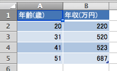
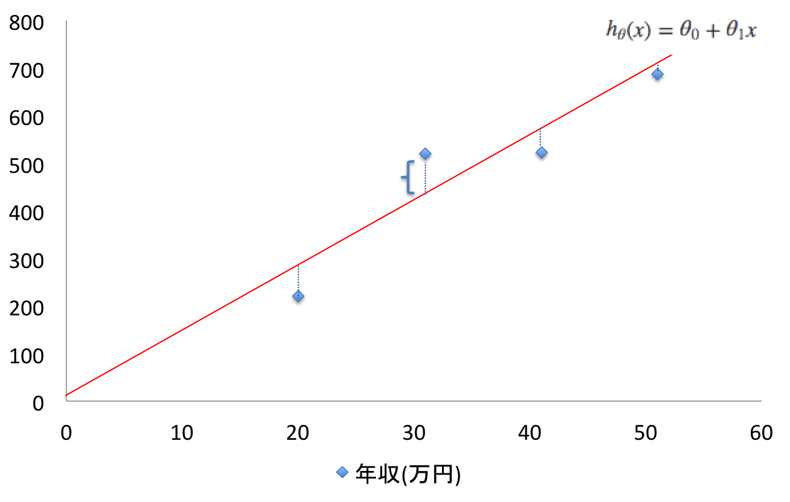

おとといあたりに[【機械学習入門】線形回帰と仮説関数](http://tech.mof-mof.co.jp/blog/machine-learning-linear.html)というエントリを書きましたが、関連して目的関数(cost function)というものがあります。

目的関数は、仮説関数を導くための関数で、簡単に言うと、グラフにプロットされた訓練セットの一つ一つの点に対する誤差(下図の点線部分)の総和を求める関数です。全ての点の誤差が最小であるパラメータθをみつけることで、仮説関数の実際のパラメータが導出出来るというわけです。





数式で表すと、

$$\frac{1}{2m}\sum^m_{i=1}(h_\theta(x^{(i)})-y^{(i)})^2$$

1/2mや2乗しているところは、二乗誤差法と呼ばれる手法らしい。詳しく突っ込まないことにするけども、やりたいことは上で説明したようなこと。訓練セットのy(i)と仮説関数の実行結果の差を、訓練セットm件分実行して総和するっていうことですかね。

で、この実行結果が最小であるときのθ(傾き)が最も適切な値になる。

## 目的関数の実装

Octaveで目的関数を実装したらこんな感じになる(Courseraから)。

```
function J = costFunctionJ(X, y, theta)

m = size(X,1);
predictions = X*theta;
sqrErrors = (predictions-y).^2;

J = 1 / (2*m) * sum(sqrErrors);
```

今回プロットした年収データで目的関数を実行してみる。thetaを変更しながら`costFunctionJ`を繰り返し実行し、ansの値が小さければ小さい程、訓練セットによくフィットした直線になるという仕組み。

これを毎回手動で実行するのはしんどいのですが、実はこのようにパラメータを変えながら最適な値を探るアルゴリズムも存在していて、それが最急降下法というアルゴリズムです。これはまた続きで書いていこうかな。

```
octave> X = [1 20; 1 31; 1 41; 1 51];
octave> y = [220; 520; 523; 687];
octave> theta = [10;10];
octave> costFunctionJ(X, y, theta)
ans =  9824.8

octave> theta = [100;10];
octave> costFunctionJ(X, y, theta)
ans =  3074.8

octave> theta = [130;10]
theta =

   130
    10

octave> costFunctionJ(X, y, theta)
ans =  2624.8
```

なんかこの実装どこかがちょっと間違ってる気がするけど言いたいことは表現出来てるからそのままにしておこう(そのうち見なおしてみる)。
