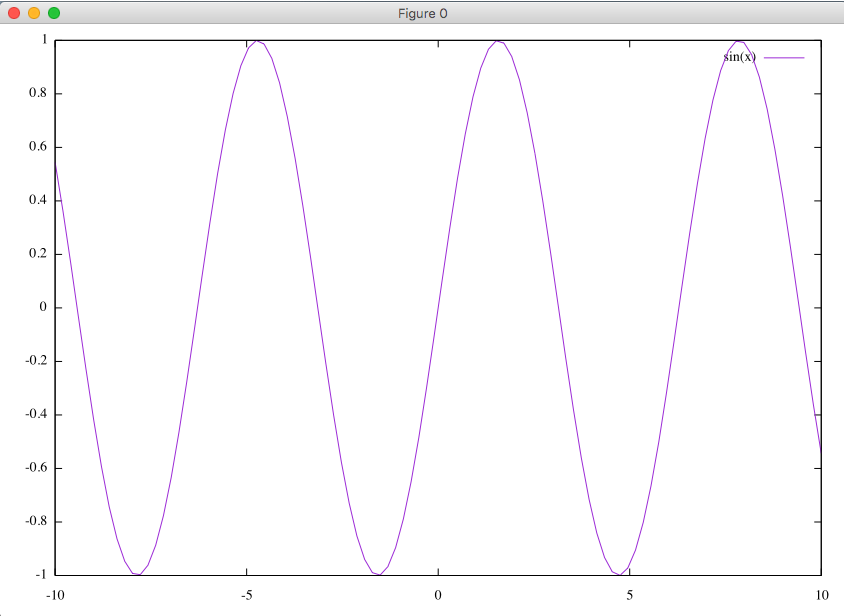
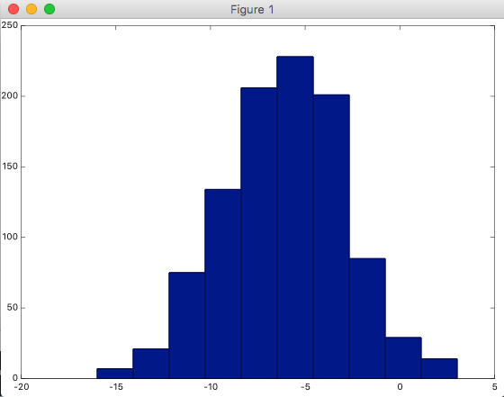

Octaveは数値解析を目的にしたプログラミング言語で、機械学習のコードを実装するときの試作としてよく使われるらしい。RとかJavaとかPythoonとかが機械学習で使われることが多いけども、試作レベルならOctaveが手っ取り早いっぽい。

インストールにちょっとだけつまいづいたのでメモがてら書いておきます。

## OctaveをHomebrewでインストールする。

Courseraの解説にはdmgをダウンロードしてインストールしろって書いてあるけど華麗に無視して、Homebrewでインストールします。依存ライブラリが結構あるっぽくてかなり時間がかかりますが根気強く待ちます。

```
$ brew install octave
```

インストールが完了したらCourseraの動画の通り色々試してみるのですが、`hist(w)`のあたりでコケました。

```
$ octave

octave:1> w = -6 + sqrt(10)*(randn(1,1000))
octave:2> hist(w)

gnuplot> set terminal aqua enhanced title "Figure 1" size 560 420  font "*,6.66667" dashlength 1
                      ^
         line 0: unknown or ambiguous terminal type; type just 'set terminal' for a list

WARNING: Plotting with an 'unknown' terminal.
No output will be generated. Please select a terminal with 'set terminal'.
```

どうやら`gnuplot`の方で`set terminal`しないとダメっぽい？

一旦octaveを終了してgnuplotをを起動して`set terminal`を確認してみます。

```
$ gnuplot

gnuplot> set terminal

Available terminal types:
           canvas  HTML Canvas object
              cgm  Computer Graphics Metafile
          context  ConTeXt with MetaFun (for PDF documents)
            corel  EPS format for CorelDRAW
             dumb  ascii art for anything that prints text
              dxf  dxf-file for AutoCad (default size 120x80)
            eepic  EEPIC -- extended LaTeX picture environment
              emf  Enhanced Metafile format
            emtex  LaTeX picture environment with emTeX specials
         epslatex  LaTeX picture environment using graphicx package
              fig  FIG graphics language for XFIG graphics editor
              gif  GIF images using libgd and TrueType fonts
             hpgl  HP7475 and relatives [number of pens] [eject]
             jpeg  JPEG images using libgd and TrueType fonts
            latex  LaTeX picture environment
              lua  Lua generic terminal driver
               mf  Metafont plotting standardA
               mp  MetaPost plotting standard
             pcl5  HP Designjet 750C, HP Laserjet III/IV, etc. (many options)
              png  PNG images using libgd and TrueType fonts
       postscript  PostScript graphics, including EPSF embedded files (*.eps)
          pslatex  LaTeX picture environment with PostScript \specials
            pstex  plain TeX with PostScript \specials
         pstricks  LaTeX picture environment with PSTricks macros
              qms  QMS/QUIC Laser printer (also Talaris 1200 and others)
              svg  W3C Scalable Vector Graphics
          tek40xx  Tektronix 4010 and others; most TEK emulators
          tek410x  Tektronix 4106, 4107, 4109 and 420X terminals
          texdraw  LaTeX texdraw environment
             tgif  TGIF X11 [mode] [x,y] [dashed] ["font" [fontsize]]
             tikz  TeX TikZ graphics macros via the lua script driver
         tkcanvas  Tk/Tcl canvas widget [perltk] [interactive]
             tpic  TPIC -- LaTeX picture environment with tpic \specials
          unknown  Unknown terminal type - not a plotting device
            vttek  VT-like tek40xx terminal emulator
            xterm  Xterm Tektronix 4014 Mode
```

X11かaquaのどっちかを使うらしいのですが、どちらも一覧にないので、gnuplotのオプションを指定して再インストールする必要があるみたい。

XQuartz(X11)とAquaTermをインストールした後に、gunplotをアンインストール、再インストールします。

```
$ brew cask install xquartz
$ brew cask install aquaterm
$ brew uninstall gnuplot
$ brew install gnuplot --with-aquaterm --with-x11
```

インストールが完了したらもう一度`ser terminal`を試してみると、x11とaquaが表示されるので、`set terminal aqua`する(今回はaquaでやってみる)。

```
$ gnuplot

gnuplot> set terminal

Available terminal types:
             aqua  Interface to graphics terminal server for Mac OS X
           canvas  HTML Canvas object
              cgm  Computer Graphics Metafile
          context  ConTeXt with MetaFun (for PDF documents)
            corel  EPS format for CorelDRAW
             dumb  ascii art for anything that prints text
              dxf  dxf-file for AutoCad (default size 120x80)
            eepic  EEPIC -- extended LaTeX picture environment
              emf  Enhanced Metafile format
            emtex  LaTeX picture environment with emTeX specials
         epslatex  LaTeX picture environment using graphicx package
              fig  FIG graphics language for XFIG graphics editor
              gif  GIF images using libgd and TrueType fonts
             hpgl  HP7475 and relatives [number of pens] [eject]
             jpeg  JPEG images using libgd and TrueType fonts
            latex  LaTeX picture environment
              lua  Lua generic terminal driver
               mf  Metafont plotting standard
               mp  MetaPost plotting standard
             pcl5  HP Designjet 750C, HP Laserjet III/IV, etc. (many options)
              png  PNG images using libgd and TrueType fonts
       postscript  PostScript graphics, including EPSF embedded files (*.eps)
          pslatex  LaTeX picture environment with PostScript \specials
            pstex  plain TeX with PostScript \specials
         pstricks  LaTeX picture environment with PSTricks macros
              qms  QMS/QUIC Laser printer (also Talaris 1200 and others)
              svg  W3C Scalable Vector Graphics
          tek40xx  Tektronix 4010 and others; most TEK emulators
          tek410x  Tektronix 4106, 4107, 4109 and 420X terminals
          texdraw  LaTeX texdraw environment
             tgif  TGIF X11 [mode] [x,y] [dashed] ["font" [fontsize]]
             tikz  TeX TikZ graphics macros via the lua script driver
         tkcanvas  Tk/Tcl canvas widget [perltk] [interactive]
             tpic  TPIC -- LaTeX picture environment with tpic \specials
          unknown  Unknown terminal type - not a plotting device
            vttek  VT-like tek40xx terminal emulator
              x11  X11 Window System
             xlib  X11 Window System (gnulib_x11 dump)
            xterm  Xterm Tektronix 4014 Mode

gnuplot> set terminal aqua
```

plotしてみてグラフが表示されたらgnuplotの方はOK。

```
gnuplot> plot sin(x)
```



Octaveの方でもう一度試してみる。

```
$ octave

octave:6> w = -6 + sqrt(10)*(randn(1,1000))
octave:7> hist(w)
```



うむばっちり。X11の方も試してみたがaquaの方が表示が綺麗なのと表示が速いっぽい。
