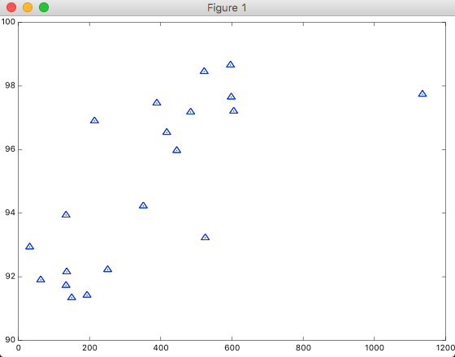

[前回](http://tech.mof-mof.co.jp/blog/machine-learning-octave.html)に引き続き機械学習のインプット中ですが、機械学習で数式ばっかりコネコネやっていると、その数式が示していてるものを可視化したくなるときがあります。目的関数がボウル型になることや、仮説関数の線形などを目で見て確認したくなってきます。

なのでOctaveでデータをプロットする方法を試してみた次第。

## サンプルデータ

[ラーメンデータベース](http://ramendb.supleks.jp/)で、「渋谷区」で検索し、ランキングの上から20件のレビュー件数(x)とポイント数(y)を訓練セットとしました。

```
octave> load ramenX.txt
octave> ramenX
ramenX =

    596
    522
   1135
    598
    389
    605
    484
    214
    417
    445
    351
    134
    525
     32
    251
    136
     63
    134
    193
    150

octave> load ramenY.txt
octave> ramenY
ramenY =

   98.657
   98.454
   97.738
   97.650
   97.461
   97.207
   97.179
   96.901
   96.538
   95.969
   94.228
   93.939
   93.225
   92.935
   92.223
   92.154
   91.902
   91.728
   91.420
   91.341
```

x,yを散布図にプロットします。第3引数は点の大きさですね。

```
octave> scatter(ramenX, ramenY, 20)
```



出来ました！これでざっくり右肩上がりの線形が予測出来そうなことが確認できます。

次は目的関数の結果をプロットして本当に弓型になるかどうか確認してみたい。
