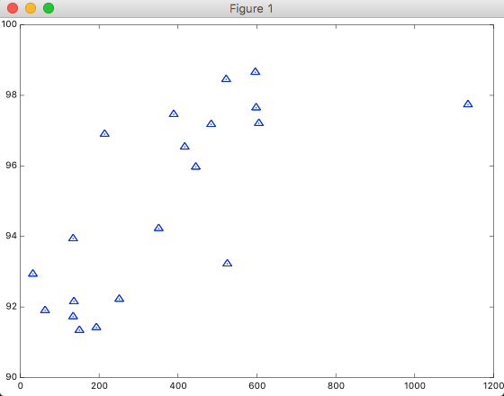

前回の[Octaveで散布図をプロットしてみる](http://tech.mof-mof.co.jp/blog/machine-learning-prot-simple.html)に続いて、今後はOctaveで最急降下法を実装して、θの値を探索してみます。

結論から言うと失敗した。どこかfeature scalingで間違っているっぽいんだけど、どう間違っているのかがわからず。改めてリベンジしたい。ひとまずは記録を残しておく。

前に実装した目的関数(costFunctionJ.m)。

```
function J = costFunctionJ(X, y, theta)

m = size(X,1);
predictions = X*theta;
sqrErrors = (predictions-y).^2;

J = 1 / (2*m) * sum(sqrErrors);
```

今回は、新たに最急降下法の実装をしてみた。解説を書きたいところだけども、ちょっと時間が足りなそうなので一旦諦める。

gradientDescent.m

```
% X => 訓練セットのfeatureのベクトル
% y => 訓練セットの結果のベクトル
% theta => θの初期値
% alpha => 学習の度合い
% num_iters => 反復回数
function theta = gradientDescent(X, y, theta, alpha, num_iters)

m = length(y);

for iter = 1:num_iters
    costFunctionJ(X, y, theta)

    predictions = X * theta;
    theta(1) = theta(1) - alpha / m * sum(predictions - y);
    theta(2) = theta(2) - alpha / m * sum((predictions - y) .* X(:, 2));
end
```

実行してみます。

```
octave> load ramenX.txt
octave> ramenX
ramenX =

    596
    522
   1135
    598
    389
    605
    484
    214
    417
    445
    351
    134
    525
     32
    251
    136
     63
    134
    193
    150

octave> load ramenY.txt
octave> y = ramenY
y =

   98.657
   98.454
   97.738
   97.650
   97.461
   97.207
   97.179
   96.901
   96.538
   95.969
   94.228
   93.939
   93.225
   92.935
   92.223
   92.154
   91.902
   91.728
   91.420
   91.341

octave> m = length(X)
m =  20
octave> X = [ones(m, 1), X];
octave> alpha = 0.01;
octave> theta = [0;0];

octave> gradientDescent(X, y, theta, alpha, 100)
ans =  4510.4
ans =    1.2653e+10
ans =    5.1166e+16
ans =    2.0690e+23
ans =    8.3668e+29
ans =    3.3833e+36
ans =    1.3681e+43
ans =    5.5325e+49
ans =    2.2372e+56
ans =    9.0468e+62
ans =    3.6583e+69
ans =    1.4794e+76
ans =    5.9822e+82
ans =    2.4191e+89
ans =    9.7822e+95
ans =   3.9557e+102
ans =   1.5996e+109
ans =   6.4684e+115
ans =   2.6157e+122
ans =   1.0577e+129
ans =   4.2772e+135
ans =   1.7296e+142
ans =   6.9942e+148
ans =   2.8283e+155
ans =   1.1437e+162
ans =   4.6249e+168
ans =   1.8702e+175
ans =   7.5627e+181
ans =   3.0582e+188
ans =   1.2367e+195
ans =   5.0008e+201
ans =   2.0222e+208
ans =   8.1774e+214
ans =   3.3068e+221
ans =   1.3372e+228
ans =   5.4073e+234
ans =   2.1866e+241
ans =   8.8421e+247
ans =   3.5755e+254
ans =   1.4459e+261
ans =   5.8468e+267
ans =   2.3643e+274
ans =   9.5608e+280
ans =   3.8662e+287
ans =   1.5634e+294
ans =   6.3220e+300
ans = Inf
ans = Inf
ans = Inf
ans = Inf
ans = Inf
ans = Inf
```

学習の度合い(α)が大きすぎて点が降下しなかった。値を変更してやりおなし。

```
octave> alpha = 0.0000099
alpha =    9.9000e-06
octave:89> gradientDescent(X, y, theta, alpha, 1000)
ans =  4510.4
ans =  4459.2
ans =  4408.9
ans =  4359.5
ans =  4310.8
ans =  4262.9
ans =  4215.8
ans =  4169.5
ans =  4123.9
ans =  4079.1
ans =  4035.0
ans =  3991.7
ans =  3949.0
ans =  3907.0
ans =  3865.8
ans =  3825.1
ans =  3785.2
ans =  3745.9
ans =  3707.3
ans =  3669.3
ans =  3631.9
ans =  3595.1
ans =  3558.9
ans =  3523.3
ans =  3488.3
ans =  3453.9
ans =  3420.0
ans =  3386.7
ans =  3353.9
ans =  3321.6
ans =  3289.9
ans =  3258.7
ans =  3228.0
ans =  3197.8
ans =  3168.2
ans =  3138.9
ans =  3110.2
ans =  3081.9
ans =  3054.1
ans =  3026.8
ans =  2999.9
ans =  2973.4
ans =  2947.4
ans =  2921.8
ans =  2896.6
ans =  2871.8
ans =  2847.5
ans =  2823.5
ans =  2799.9
ans =  2776.7
ans =  2753.9
ans =  2731.5
...skipping...
ans =  1373.0
ans =  1372.9
ans =  1372.9
ans =  1372.9
ans =  1372.9
ans =  1372.9
ans =  1372.9
ans =  1372.9
ans =  1372.9
ans =  1372.9
ans =  1372.9
ans =  1372.9
ans =  1372.8
ans =  1372.8
ans =  1372.8
ans =  1372.8
ans =  1372.8
ans =  1372.8
ans =  1372.8
ans =  1372.8
ans =  1372.8
ans =  1372.8
ans =  1372.8
ans =  1372.7
ans =  1372.7
ans =  1372.7
ans =  1372.7
ans =  1372.7
ans =  1372.7
ans =  1372.7
ans =  1372.7
ans =  1372.7
ans =  1372.7
ans =  1372.7
ans =  1372.7
ans =  1372.6
ans =  1372.6
ans =  1372.6
ans =  1372.6
ans =  1372.6
ans =  1372.6
ans =  1372.6
ans =  1372.6
ans =  1372.6
ans =  1372.6
ans =  1372.6
ans =  1372.5
ans =

   0.29602
   0.17578
```

一応降下はしたものの、途中で降下が鈍くなって最適解にたどり着いていない模様。こういう場合はパラメータfeatureをスケーリングすればいいので見よう見まねでやってみる。ここもスケーリングの理論があるんだけれども書くのに時間がかかるので実装だけ載せちゃう。

```
octave> range = max(X(:, 2)) - min(X(:, 2))
octave> avg = sum(X(:,2)) / length(X)
octave> scaledX = [ones(m, 1), (X(:, 2) - avg) ./ range]

octave> alpha = 0.3
octave> gradientDescent(scaledX, y, theta, alpha, 500)
ans =  4510.4
ans =  2211.7
ans =  1085.4
ans =  533.44
ans =  262.96
ans =  130.41
ans =  65.435
ans =  33.575
ans =  17.943
ans =  10.263
ans =  6.4798
ans =  4.6069
ans =  3.6705
ans =  3.1936
ans =  2.9424
ans =  2.8023
ans =  2.7171
ans =  2.6594
ans =  2.6156
ans =  2.5791
ans =  2.5466
ans =  2.5166
ans =  2.4881
ans =  2.4608
ans =  2.4346
ans =  2.4092
ans =  2.3846
ans =  2.3608
ans =  2.3377
ans =  2.3153
ans =  2.2936
ans =  2.2725
ans =  2.2521
ans =  2.2323
ans =  2.2131
ans =  2.1945
ans =  2.1764
ans =  2.1589
ans =  2.1419
ans =  2.1254
ans =  2.1094
ans =  2.0939
ans =  2.0789
ans =  2.0643
ans =  2.0501
ans =  2.0364
ans =  2.0231
ans =  2.0102
ans =  1.9977
ans =  1.9856
ans =  1.9738
ans =  1.9624
...skipping...
ans =  1.5954
ans =  1.5954
ans =  1.5954
ans =  1.5954
ans =  1.5954
ans =  1.5954
ans =  1.5954
ans =  1.5954
ans =  1.5954
ans =  1.5954
ans =  1.5954
ans =  1.5954
ans =  1.5954
ans =  1.5954
ans =  1.5954
ans =  1.5954
ans =  1.5954
ans =  1.5954
ans =  1.5954
ans =  1.5954
ans =  1.5954
ans =  1.5954
ans =  1.5954
ans =  1.5954
ans =  1.5954
ans =  1.5954
ans =  1.5954
ans =  1.5954
ans =  1.5954
ans =  1.5954
ans =  1.5954
ans =  1.5954
ans =  1.5954
ans =  1.5954
ans =  1.5954
ans =  1.5954
ans =  1.5954
ans =  1.5954
ans =  1.5954
ans =  1.5954
ans =  1.5954
ans =  1.5954
ans =  1.5954
ans =  1.5954
ans =  1.5954
ans =  1.5954
ans =  1.5954
ans =

   94.9424
    8.3081
```

どうやら最小値らへんに収束したっぽい。

ただ残念なことにθの値がこれだとすると、仮説関数が以下になるので、

$$h_\theta(x)=94.9424+8.3081x$$

グラフにプロットするまでもなく傾きが間違っていることがわかる。



うーん。またリベンジしよう。
