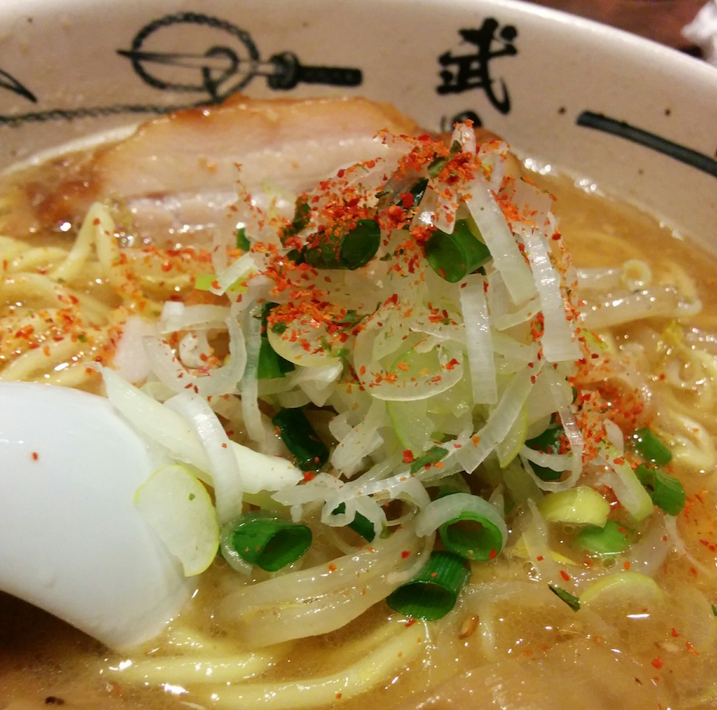
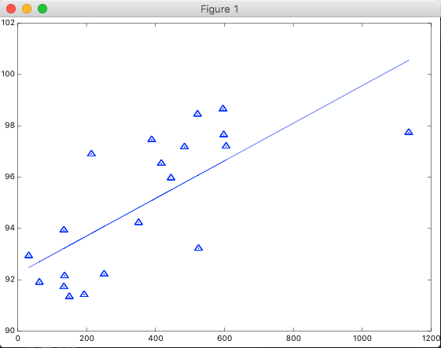

データは[ラーメンデータベース](http://ramendb.supleks.jp/)で「渋谷」で検索した上位20件を使用した。

前回、[最急降下法を実装して線形回帰のθの値を探索してみたけどうまくいかなかった](http://tech.mof-mof.co.jp/blog/machine-learning-prot-simple.html)という記事を書きましたが、どうやらfeature scaling(feature normalization)をして収束することには成功していたけど、求められたθの値を復元する必要があるっぽい？Courseraを観てもその説明がなかったのでわからず。ぐぐっても解決できず。

というわけで、あきらめて最急降下法を使わずに、Normal Equation(正規方程式)でθを求めることにします。

## 訓練セット
前回から引き続きですが、下記のような訓練セットを使います。ramenX.txtはレビュー件数、ramenY.txtは評価点です。

ramenX.txt

```
596
522
1135
598
389
605
484
214
417
445
351
134
525
32
251
136
63
134
193
150
```

ramenY.txt

```
98.657
98.454
97.738
97.65
97.461
97.207
97.179
96.901
96.538
95.969
94.228
93.939
93.225
92.935
92.223
92.154
91.902
91.728
91.42
91.341
```

## 正規方程式で学習させる
正規方程式の実装。

normalEqn.m

```
function [theta] = normalEqn(X, y)
  theta = pinv(X' * X) * X' * y
end
```

Octaveで下記を実行し、学習させる。

```
load ramenX.txt;
load ramenY.txt;

X = ramenX;
y = ramenY;
X1 = [ones(length(X),1) X];

% 正規方程式でθを算出
theta = normalEqn(X1, y)
ans =

   9.2242e+01
   7.3234e-03
```

theta_0が92.242、theta_1が0.0073234となる。

グラフにプロットしてみる。

```
hold on;

% 散布図をプロット
scatter(ramenX, ramenY, 20)

% 仮説関数をプロット
plot(X1(:,2), X1*theta, '-')
```



## 予測してみる

これで仮説関数のθがわかったので、下記のような1次関数で表現することが出来る。

$$y=92.242+0.0073234x$$

これに「[ホープ軒千駄ヶ谷本店](http://ramendb.supleks.jp/s/3357.html)」のレビュー数194件を代入して評価点予測すると…

なんと、驚くべきことに、93.663点となることがわかった。

実際には91.297点なので、まあ大きく的は外していないけれど、ズバッと当たった感じでもなく、なんとも中途半端な煮え切らない、かつあまり役に立ちそうもない予測だな、といったところで線形回帰の学習はひとまず区切ることにする。

次は分類問題のアルゴリズムである「ロジスティック回帰」をやってみようと思ってる。
