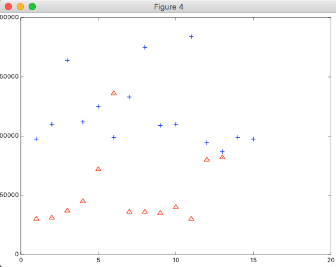

前回のエントリで線形回帰で実際に予測することまで出来たので、今回はロジスティック回帰で予測してみます。

[機械学習で、ラーメン屋のレビュー件数から評価点がどれくらいになるか予測する](machine-learning-liner-ramen.html)

今回は、賃貸情報サイトの[SUUMO](http://suumo.jp/)で、「渋谷駅」で検索した中から、ある程度バラけるようにピックアップして収集したデータを使い、賃貸家賃をインプットして、その家賃で借りれる物件がオートロックかつバストイレ別か予測してみます。

## 使用データ

1列目: 家賃(月額)
2列目: 築年数
3列目: オートロックかつバストイレ別であるかどうか

※ 築年数は収集したけど今回は使わなかった。

data.tsv

```
97500	13	1
30000	41	0
31000	47	0
37000	52	0
45000	42	0
72000	43	0
110000	2	1
136000	29	0
164000	6	1
112000	9	1
125000	0	1
36000	54	0
99000	2	1
133000	0	1
36000	54	0
175000	12	1
109000	11	1
110000	5	1
35000	34	0
40000	32	0
184000	0	1
30000	39	0
94500	13	1
87000	15	1
99000	2	1
97500	13	1
80000	51	0
82000	13	0
```

plotするとこんな感じになる。



plotするための関数はこんな感じ。

```
function plotData(X, y)

figure; hold on;

positive = find(y==1);
negative = find(y==0);

plot(X(positive, :), 'b+');
plot(X(negative, :), 'ro');

hold off;

end
```

## 最急降下法でθを求める

必要な関数を実装する。

sigmoid.m

```
function g = sigmoid(z)

g = zeros(size(z));
g = 1 ./ (1 + e .^ -(z));

end
```

costFunction.m

```
function [J, grad] = costFunction(theta, X, y)

m = length(y);

J = 0;
grad = zeros(size(theta));

J = 1 / m * sum((-y .* log(sigmoid(X * theta))) - ((1 - y) .* log(1 - sigmoid(X * theta))))
grad = 1 / m * sum((sigmoid(X * theta) - y) .* X)

end
```

Octaveで下記を実行。

```
load data.tsv;
m = length(data);
X = [ones(m, 1) data(:,1)];
y = data(:,3);

initial_theta = [0;0];

options = optimset('GradObj', 'on', 'MaxIter', 400);

[theta, cost] = fminunc(@(t)(costFunction(t, X, y)), initial_theta, options);
```

thetaが算出されました。

```
octave> theta
theta =

  -6.5084e+00
   7.7078e-05
```

## 予測してみる

予測するための関数を定義。

predict.m

```
function p = predict(theta, X)

m = size(X, 1);
X = [ones(m ,1), X];

p = sigmoid(X * theta) >= 0.5;

end
```

予測してみる。

```
octave> predict(theta, 60000)
ans = 0

octave> predict(theta, 88000)
ans =  1
```

渋谷駅周辺では家賃60,000円では、バストイレ別かつオートロックの物件は賃貸出来ないが、88,000円なら賃貸出来そうという結論が出来ました！

例によってあんまり役に立ちそうもない予測でした。
