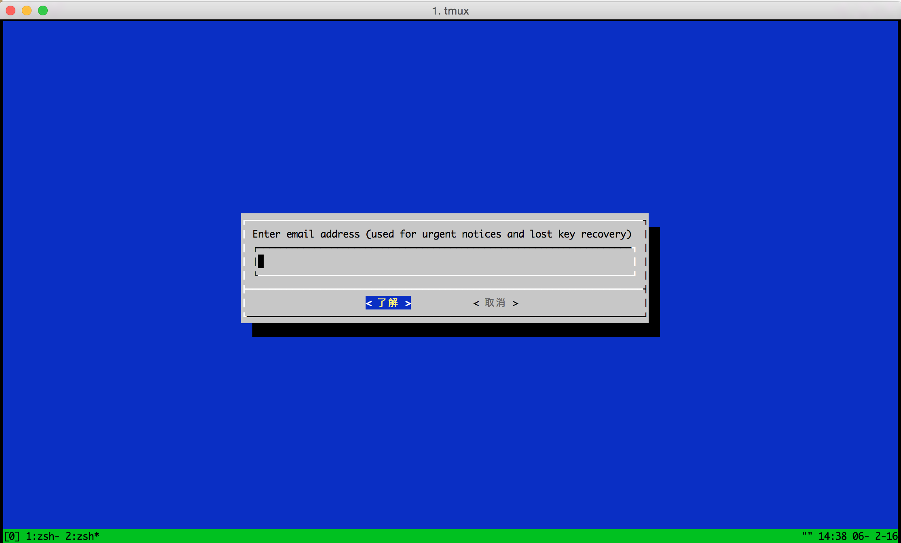

個人の趣味で作っている、夫婦のための自動ごはん予定お知らせサービス「GoHaaan」のSSL証明書がいつの間に期限切れになっていて使えなくなってた。。。

GoHaaan
[https://gohaaan.com/](https://gohaaan.com/)

最近無料SSLのLet's Encryptが話題になっているので試してみました。

## Let's Encrypt実行

まず設定したいサーバにsshログインします。今回はCentOS6+Nginxでやってます。

このあたりの記事を参考にさせていただいた。

http://letsencrypt.readthedocs.org/en/latest/using.html#installation
http://qiita.com/dseg/items/908c1b8aab19a5b26d92

インストールする。

```
git clone https://github.com/letsencrypt/letsencrypt
cd letsencrypt
```

新規に証明書を発行するコマンド。コマンド実行前に必ずNginxを停止しないとダメっす。gohaaan.comは自身のサーバのドメインを入力してね。

```
$ sudo service nginx stop
$ ./letsencrypt-auto certonly -a standalone --server https://acme-v01.api.letsencrypt.org/directory \
 --agree-dev-preview -d gohaaan.com
```

青い設定画面が表示されたらメアド入力してagreeしていきます。



うまくいくとこんな感じのログがでるっぽい。

```
IMPORTANT NOTES:
 - If you lose your account credentials, you can recover through
   e-mails sent to hogehoge@example.com
 - Congratulations! Your certificate and chain have been saved at
   /etc/letsencrypt/live/gohaaan.com/fullchain.pem. Your cert will
   expire on 2016-05-06. To obtain a new version of the certificate in
   the future, simply run Let's Encrypt again.
 - Your account credentials have been saved in your Let's Encrypt
   configuration directory at /etc/letsencrypt. You should make a
   secure backup of this folder now. This configuration directory will
   also contain certificates and private keys obtained by Let's
   Encrypt so making regular backups of this folder is ideal.
 - If you like Let's Encrypt, please consider supporting our work by:

   Donating to ISRG / Let's Encrypt:   https://letsencrypt.org/donate
   Donating to EFF:                    https://eff.org/donate-le
```

証明書ファイルが生成されていることを確認。

```
$ sudo ls /etc/letsencrypt/live/gohaaan.com
cert.pem  chain.pem  fullchain.pem  privkey.pem
```

Nginxの設定ファイルのssl証明書のパスを設定する

```
$ sudo vim /etc/nginx/conf.d/gohaaan.conf

ssl_certificate /etc/letsencrypt/live/gohaaan.com/fullchain.pem;
ssl_certificate_key /etc/letsencrypt/live/gohaaan.com/privkey.pem;
```

Nginxを起動。

```
$ sudo service nginx start
```


超簡単。
GoHaaan復活したあああああ！


