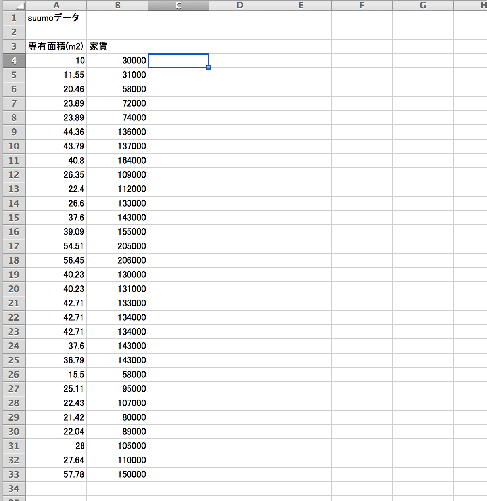

相変わらず機械学習の勉強にハマっているのですが、今はニューラルネットワークのバックプロパゲーションあたりを勉強してます。

勉強も楽しいのですが、何か実践で使えるものをやりたいなーと思って、並行してtensorflowで色々試しているところです。

## 線形回帰(linear regression)

以前に「[機械学習で、ラーメン屋のレビュー件数から評価点がどれくらいになるか予測する](machine-learning-liner-ramen.html)」というエントリを書いたのですが、その時のロジックをそのままtensorflowに適用出来なかなと考えたのですが、ちょっとpythonもtensorflowもまだ詳しく理解できていないので、こちらのサンプルコードを使わせていただくことにしました。

[https://github.com/aymericdamien/TensorFlow-Examples/blob/master/examples/2%20-%20Basic%20Classifiers/linear_regression.py](https://github.com/aymericdamien/TensorFlow-Examples/blob/master/examples/2%20-%20Basic%20Classifiers/linear_regression.py)

データセットは、suumoで渋谷で検索して、ある程度家賃がバラけるように30件程度のデータを手作業で収集した。Xに物件の専有面積、Yに物件の月額家賃を入力してます。



線形回帰のコードはこんな感じ。ほぼコピペにコメントを追加した程度。

```
# -*- coding: utf-8 -*-

import tensorflow as tf
import numpy  # ベクトル演算を出来るようにするための科学計算パッケージ

# def lin_model(X, w, b):
#     return X * w + b

learning_rate = 0.04  # cost = 384699424.000000000
training_epochs = 1000  # 最急降下法のイテレーション回数
display_step = 50

# 物件の専有面積(m2)
train_X = numpy.asarray([10, 11.55, 20.46, 23.89, 23.89, 44.36, 43.79, 40.8, 26.35, 22.4, 26.6, 37.6, 39.09, 54.51, 56.45, 40.23, 40.23, 42.71, 42.71, 42.71, 37.6, 36.79, 15.5, 25.11, 22.43, 21.42, 22.04, 28, 27.64, 57.78])
# 物件の月額家賃(円)
train_Y = numpy.asarray([30000, 31000, 58000, 72000, 74000, 136000, 137000, 164000, 109000, 112000, 133000, 143000, 155000, 205000, 206000, 130000, 131000, 133000, 134000, 134000, 143000, 143000, 58000, 95000, 107000, 80000, 89000, 105000, 110000, 150000])
n_samples = train_X.shape[0]

X = tf.placeholder("float")
Y = tf.placeholder("float")

# Set model weights
W = tf.Variable(numpy.random.randn(), name="weight")
b = tf.Variable(numpy.random.randn(), name="bias")

# Construct a linear model
activation = tf.add(tf.mul(X, W), b)

cost = tf.reduce_sum(tf.pow(activation-Y, 2))/(2*n_samples)  # 二乗誤差
optimizer = tf.train.GradientDescentOptimizer(learning_rate).minimize(cost)  # 最急降下法

# Initializing the variables
init = tf.initialize_all_variables()

with tf.Session() as sess:
    sess.run(init)

    for epoch in range(training_epochs):
        for (x, y) in zip(train_X, train_Y):
            sess.run(optimizer, feed_dict={X: x, Y: y})

        if epoch % display_step == 0:
            print "Epoch:", '%04d' % (epoch+1), "cost=", "{:.9f}".format(sess.run(cost, feed_dict={X: train_X, Y:train_Y})), \
                "W=", sess.run(W), "b=", sess.run(b)

    print "Optimization Finished!"
    training_cost = sess.run(cost, feed_dict={X: train_X, Y: train_Y})
    print "Training cost=", training_cost, "W=", sess.run(W), "b=", sess.run(b), '\n'
```

## 実行する

実行するとこんな感じの結果になる。

```
$ python linear_regression.py
I tensorflow/core/common_runtime/local_device.cc:40] Local device intra op parallelism threads: 4
I tensorflow/core/common_runtime/direct_session.cc:58] Direct session inter op parallelism threads: 4
Epoch: 0001 cost= 19598563328.000000000 W= -2140.82 b= 1039.6
Epoch: 0051 cost= 4473390080.000000000 W= -227.222 b= 41060.2
Epoch: 0101 cost= 1280195328.000000000 W= 644.136 b= 59283.6
Epoch: 0151 cost= 592113984.000000000 W= 1040.9 b= 67581.5
Epoch: 0201 cost= 437600160.000000000 W= 1221.58 b= 71360.0
Epoch: 0251 cost= 400173440.000000000 W= 1303.84 b= 73080.5
Epoch: 0301 cost= 389957280.000000000 W= 1341.31 b= 73864.0
Epoch: 0351 cost= 386722240.000000000 W= 1358.36 b= 74220.7
Epoch: 0401 cost= 385542016.000000000 W= 1366.13 b= 74383.2
Epoch: 0451 cost= 385065120.000000000 W= 1369.67 b= 74457.2
Epoch: 0501 cost= 384860064.000000000 W= 1371.29 b= 74491.1
Epoch: 0551 cost= 384770112.000000000 W= 1372.02 b= 74506.3
Epoch: 0601 cost= 384731200.000000000 W= 1372.34 b= 74512.9
Epoch: 0651 cost= 384714048.000000000 W= 1372.48 b= 74516.0
Epoch: 0701 cost= 384704128.000000000 W= 1372.56 b= 74517.7
Epoch: 0751 cost= 384699424.000000000 W= 1372.6 b= 74518.4
Epoch: 0801 cost= 384699424.000000000 W= 1372.6 b= 74518.4
Epoch: 0851 cost= 384699424.000000000 W= 1372.6 b= 74518.4
Epoch: 0901 cost= 384699424.000000000 W= 1372.6 b= 74518.4
Epoch: 0951 cost= 384699424.000000000 W= 1372.6 b= 74518.4
Optimization Finished!
Training cost= 3.84699e+08 W= 1372.6 b= 74518.4
```

んー。bがtheta0でWがtheta1になると思うのですが、ざっと暗算してみても見当違いの予測がなされるのが見て取れる。

この後も学習率(learning rate)やイテレーション回数を調整してみたけど、ちゃんと最急降下法が収束しなかったりでダメっぽい。feature scalingしないとかな。ちょっとだけtensorflowの使い方が見えてきたけども、今回は失敗ということで。
