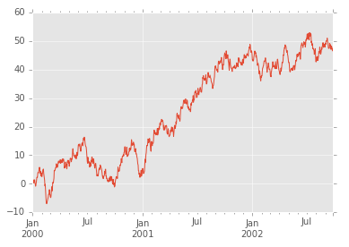
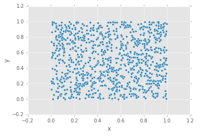
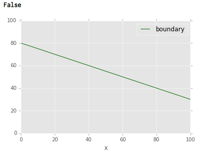
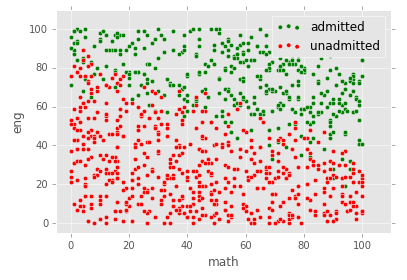

受験シーズンも佳境にはいってきて合格通知が届いて人もいると思います。そこで、1日目のテストを受けてその夜に本命合格がわかり、2日目を受けなかった人で、そのまま試験をしていたら合格していたのか気になる人のために合否判定ツールを作ってみたいと思います。

ただ、受験生全員のテスト結果と合否のデータが取得できるとは思えないので、それっぽいデータを作成することをやってみます。
方法は、受験生が初日に受けたであろう２科目の得点をグラフ上に0〜100の範囲でランダムに1000人分のデータを作成し、合否の境界線1次関数で引きます。その境界線より上のデータを合格とします。
しかし、そのままではくっきり合否がわかれてしまうので、ある程度幅をもたせてリアリティがでればと考えています。

今回のサンプルのIPython notebookはGistに登録してあります。

[https://gist.github.com/nekikara/ce5a1c8b3a0578670919](IPython notebook)

### 環境構築
今回は、MacBook Proで試しています。使用したものはpyenv, virtualenv, pandas, numpy, matplotlibです。

### PandasでPlotしてみる
pandasを使用したことがなかったので、[http://pandas.pydata.org/pandas-docs/stable/visualization.html#scatter-plot](公式ドキュメント)を確認してまずはプロットします。

```
%matplotlib inline
import pandas as pd
import numpy as np
import matplotlib.pyplot as plt
import matplotlib
matplotlib.style.use('ggplot')

ts = pd.Series(np.random.randn(1000), index=pd.date_range('1/1/2000', periods=1000))
ts = ts.cumsum()
ts.plot()
```

これでだけで、綺麗なグラフが作成できます。便利です。



次に、とりあえず1000人分のデータを散布図としてプロットしてみます。

```
df = pd.DataFrame(np.random.rand(1000,2), columns=['x', 'y'])
df.plot(kind='scatter', x='x', y='y')　# kindには他に、bar, hist, box, kde, area, hexbin, pieが渡せるようです。
```



pandasでのプロットがわかってきたので、合否の判定をするクラスを作成していきます。

### 合否境界クラス作成

```
import random
class LinearDecisionBoundary:
    '''
    初期化時に直線の傾きと、y切片をわたして、境界線のデータをもたせます
    '''
    def __init__(self, w, b):
        self.w = w
        self.b = b

    # 境界線の値を返す
    def f(self, x):
        return self.w * x + self.b

    # resultで受験生の2科目の得点の配列を受け取り、
    # swingが境界線を曖昧にするためのパラメータ
    def isAdmitted(self, result, swing=15):
        swingged_y = self.f(result[0]) + self.__swing(swing)
        return swingged_y < result[1]

    # 引数3の場合[-3:3]の範囲の値を返す
    def __swing(self, x):
        return random.uniform(-1 * x, x)

    # 境界線をプロット
    def plot(self):
        pd.DataFrame([[0, self.f(0)], [100,self.f(100)]], columns=['x', 'y']).plot(x='x',y='y',
                                                                                   color='DarkGreen', label='boundary',
                                                                                   xlim=[0,100], ylim=[0,100])
```

このクラスで、ランダムに生成した2科目の結果を渡すと、合否の判定できるので、データに結果のラベルが付けられます。一旦動作確認してみます。

```
ldb = LinearDecisionBoundary(-0.5, 80) # 大体右肩下がりのグラフが妥当な境界線になりそう
print(ldb.isAdmitted([5, 6])) # 明らかに境界グラフよりしたになるのでFalseが返される
ldb.plot() # 境界線をプロット
```



### データ作成

上記で作成したクラスで、1000人分のデータを作成します。

```
l = np.random.randint(0, 101, (1000,2)) # 0〜100までの整数で1000x2の行列を作成
results = np.array([[x[0], x[1], 1] if ldb.isAdmitted(x) else [x[0], x[1], 0] for x in l]) # 合格なら三番目のカラムが1,　不合格なら0のラベルを追加
df = pd.DataFrame(results, columns=['math', 'eng', 'result']) # pandasのフレームに変換

admitted = df[df['result'] == 1] # 合格ものだけにフィルタリング
ax = admitted.plot(kind='scatter', x='math', y='eng', color='Green', label='admitted', xlim=[-5,110], ylim=[-5,110])

unadmitted = df[df['result'] == 0] # 不合格だけにフィルタリング
unadmitted.plot(kind='scatter', x='math', y='eng', color='Red', label='unadmitted', ax=ax)
```
最終的に出来た散布図です。まあまあいい具合に2つのグループにわかれたんじゃないかと思っています。



最後に、データをCSVで出力して、次回のTensorFlowでの合否判定で使用したいと思います。

```
df.to_csv('test.csv', index=False)
```
