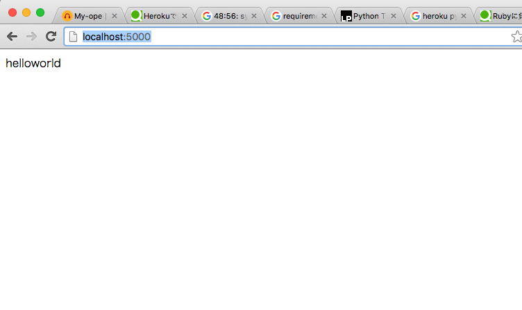
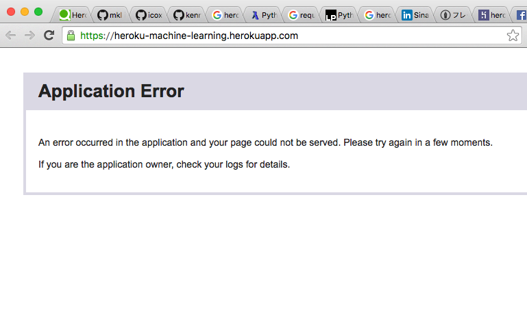

ぼくはRubyエンジニアなのでWEBを書くときはRailsをよく使ってます。最近はPythonで機械学習にハマっているのですが、画面側の実装が必要なとき慣れているRailsを使ってます。

ですが、Pythonをコマンド経由で実行したりしているので、ちょっとWEB側と機械学習側のインタフェースがイケてなさすぎるので、ちょっとしたアプリケーションだったらPythonだけで実装しちゃいたいなーと思い、Python版のSinatraみたいなフレームワークのFlaskを使って、さくっとHerokuで機械学習にチャレンジしてみます。

## ローカルでFlaskを動かしてみる

Flaskをインストールします。

```
$ pip install flask
```

main.rb

```
# -*- coding:utf-8 -*-
from flask import Flask

app = Flask(__name__)

@app.route("/")
def index():
    return 'Hello Wolrd'

app.run()
```


```
$ python main.py
```

`http://localhost:5000/`にアクセスするとHello Worldが表示されます。簡単ですね！



## Herokuへデプロイ

Heroku上にアプリケーションを作ります。

```
$ heroku create heroku-machine-learning
$ git remote add heroku https://git.heroku.com/heroku-machine-learning.git
$ g push heroku master
```

デプロイがはじまり、ちゃんと`requirements.txt`に書いたライブラリをpipでインストールしてくれる模様。
機械学習で使用するライブラリ`matplotlib`とか`scipy`とかはインストールにめちゃめちゃ時間かかるし、pushする度にインストールするから途方も無く時間がかかる。

そもそもHeroku上では`scipy`をそのまま入れることが出来ないらしい。

```
remote:  !     Hello! It looks like you're trying to use scipy on Heroku.
remote:  !     Unfortunately, at this time, we do not directly support this library.
remote:  !     There is, however, a buildpack available that makes it possible to use it on Heroku.
remote:  !     You can learn more here:  https://devcenter.heroku.com/articles/python-c-deps
remote:  !     Sorry for the inconvenience.   -- Much Love, Heroku.
remote:
remote:  !     Push rejected, failed to compile Python app
remote:
remote: Verifying deploy...
remote:
remote: !       Push rejected to heroku-machine-learning.
```

なのでconda-buildpackというものを使います。これはHeroku上にコンパイル済みのバイナリをインストールするためのものらしい。conda-requirements.txtの方にcondaを使ってインストールしたいライブラリを記述します。

参考: [http://qiita.com/icoxfog417/items/1343395a7c42da9426b7](http://qiita.com/icoxfog417/items/1343395a7c42da9426b7)

herokuにbuildpackの設定をして、再度デプロイにチャレンジ。

```
$ heroku config:add BUILDPACK_URL=https://github.com/kennethreitz/conda-buildpack.git
$ git push heroku master
```

Flaskはconda-buildpackに未対応っぽい。

```
remote: -----> Installing dependencies using Conda
remote:        Fetching package metadata: ....
remote:        Solving package specifications: .
remote: Error:  Package missing in current linux-64 channels:
remote:   - flask ==0.11
```

flaskについては普通の`reqirements.txt`に移動しておく。デプロイに再挑戦。
herokuの制限であるスラッグサイズ300Mをこえてしまったらしい。

```
remote: -----> Compressing...
remote:  !     Compiled slug size: 305.6M is too large (max is 300M).
remote:  !     See: http://devcenter.heroku.com/articles/slug-size
remote:
remote:  !     Push failedVerifying deploy....
remote:
remote: !       Push rejected to heroku-machine-learning.
remote:
```

conda-requiments.txtに`nomkl`という記述を加えれば容量をおさえて版のライブラリがインストールされるみたい。再度デプロイしたら成功！

最終的にファイルはこんな感じになった。

main.py

```
# -*- coding:utf-8 -*-
import numpy as np
# import matplotlib.pyplot as plt
from sklearn import linear_model, datasets
import numpy as np
from sklearn import linear_model, datasets
from flask import Flask

app = Flask(__name__)

@app.route("/")
def index():
    iris = datasets.load_iris()
    X = iris.data[:, :2]  # フィーチャーを2つに絞る
    Y = iris.target

    # 学習させる
    logreg = linear_model.LogisticRegression(C=1e5)
    logreg.fit(X, Y)
    result = logreg.predict([6.5, 3])

app.run()
```

conda-requirements.txt

```
nomkl
click==6.6
cycler==0.10.0
itsdangerous==0.24
Jinja2==2.8
MarkupSafe==0.23
numpy==1.11.0
pyparsing==2.1.4
python-dateutil==2.5.3
pytz==2016.4
scipy==0.17.1
scikit-learn==0.17.1
six==1.10.0
```

requirements.txt

```
Flask==0.11
Werkzeug==0.11.10
gunicorn==19.6.0
```

Procfile

```
web: gunicorn main:app --timeout 1200
```



ログを見たところRequest Timeout。手軽にWEBにのせたかったからHerokuとFlaskを選択したのにこれじゃあダメそうだ。
