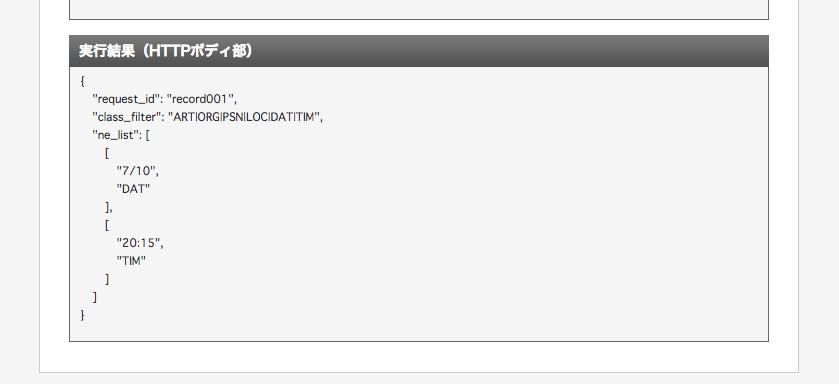

やりたいことは「今度のご飯だけど7/10の20:15はどう？」というテキストから`2016/7/10 20:15:00`という日付型の値を取得したい。

こちらのAPIを使いました。

[https://dev.smt.docomo.ne.jp/?p=docs.api.page&api_name=language_analysis&p_name=api_2](https://dev.smt.docomo.ne.jp/?p=docs.api.page&api_name=language_analysis&p_name=api_2)

まずは画面内の「申請する」ボタンから新規API利用申請をして、API keyを使える状態にします。

## 実装する

とりあえずAPIコンソールから動作を確認出来るので、どんな戻り値が返ってくるかを確認するとこんな感じになりました。



Rubyで実装してみます。

main.rb

```
require 'httparty'
require 'dotenv'
Dotenv.load

def extract(str)
  body = {
    request_id: "record001",
    sentence: str,
    class_filter: "ART|ORG|PSN|LOC|DAT|TIM"
  }

  response = HTTParty.post("https://api.apigw.smt.docomo.ne.jp/gooLanguageAnalysis/v1/entity?APIKEY=#{ENV['APIKEY']}", body: body)
  result = JSON.parse(response.body)

  date = nil
  time = nil
  result['ne_list'].each do |val, cate|
    date = val if cate == 'DAT'
    time = val if cate == 'TIM'
  end

  DateTime.parse("#{date} #{time}")
end

puts extract("今度のご飯だけど7/10の20:15はどう？").strftime("%Y/%m/%d %H:%M")
```

実行するとこうなります。

```
$ bundle exec ruby main.rb
2016/07/10 20:15
```

7月10日って表記したり、20時15分って表記したりもするので、そのケースだと日付フォーマットが対応せず落ちてしまいますが、細かく実装していけば使い物になりそう。

コードの全体はGitHubを参照くだしあ。

[https://github.com/harada4atsushi/date-extracter](https://github.com/harada4atsushi/date-extracter)
