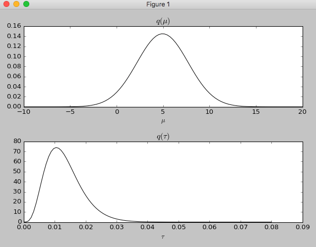

ベイジアンネットワークというのは複数の要因によって捉えられる事象を確率的にモデル化する手法の一つです。どっかの例でみたのは「風が吹けば桶屋が儲かる」的な事象を複雑な要因を含めて数学的にモデル化出来るわけです。

機械学習での応用としては音声認識とか障害検知とか、比較的広く使われてるみたい。人間ならふわっとうまく判断出来ることをコンピューターにやらせたいときに向いてるっぽい。

## まずは入門
概要としてはこのpdfがわかりやすかった。

[http://www.ne.jp/asahi/hiroki/suyari/BayesianNetworkIntro1.pdf](http://www.ne.jp/asahi/hiroki/suyari/BayesianNetworkIntro1.pdf)

`pebl`というpythonでベイジアンネットワークを実装するライブラリがあるのだが、チュートリアルをやってみると`Segmentation fault: 11`が出てしまい先に進めない。GitHubにissueも立っているがMac特有の問題らしく未解決で放置。

次に`bayespy`というライブラリを見つけたので試してみる。

[https://github.com/bayespy/bayespy](https://github.com/bayespy/bayespy)

## 変分ベイズ法を試す
`bayespy`のクイックスタートをやってみる。ベイジアンネットワークを実装したかったんだけど、どうやらクイックスタートは変分ベイズ法の実装らしいので、これでいいや。

ちなみに変分ベイズ法というのは確率モデルのベイズ推定を行うための近似解法らしい。

[http://bayespy.org/en/latest/user_guide/quickstart.html](http://bayespy.org/en/latest/user_guide/quickstart.html)

まずはインストールですが、python3系じゃないと使えないっぽい。pyenvを使っているのでしれっと3.5.1をインスコしました。

```
$ pip install bayespy
```

依存パッケージもインストール。

```
$ pip install "distribute>=0.6.28"
$ pip install "numpy>=1.8.0" "scipy>=0.13.0" "matplotlib>=1.2" h5py
```

main.py

```
import numpy as np
import bayespy.plot as bpplt
from bayespy.nodes import GaussianARD, Gamma
from bayespy.inference import VB

data = np.random.normal(5, 10, size=(10,))
mu = GaussianARD(0, 1e-6)
tau = Gamma(1e-6, 1e-6)
y = GaussianARD(mu, tau, plates=(10,))

y.observe(data)
Q = VB(mu, tau, y)
Q.update(repeat=20)

bpplt.pyplot.subplot(2, 1, 1)
bpplt.pdf(mu, np.linspace(-10, 20, num=100), color='k', name=r'\mu')
bpplt.pyplot.subplot(2, 1, 2)
bpplt.pdf(tau, np.linspace(1e-6, 0.08, num=100), color='k', name=r'\tau')
bpplt.pyplot.tight_layout()
bpplt.pyplot.show()
```

わーい。何かできたあ。



変分ベイズ法で何かをしているのですが、ちょっと解説出来るほどには理解できていない。機械学習で使う前にベイズ統計学を勉強することにします。

WEBだとこれが易しそう。

[http://logics-of-blue.com/%E3%83%99%E3%82%A4%E3%82%BA%E7%B5%B1%E8%A8%88%E5%AD%A6%E5%9F%BA%E7%A4%8E/](http://logics-of-blue.com/%E3%83%99%E3%82%A4%E3%82%BA%E7%B5%B1%E8%A8%88%E5%AD%A6%E5%9F%BA%E7%A4%8E/)

本も買った。

[https://www.amazon.co.jp/%E5%9F%BA%E7%A4%8E%E3%81%8B%E3%82%89%E3%81%AE%E3%83%99%E3%82%A4%E3%82%BA%E7%B5%B1%E8%A8%88%E5%AD%A6-%E3%83%8F%E3%83%9F%E3%83%AB%E3%83%88%E3%83%8B%E3%82%A2%E3%83%B3%E3%83%A2%E3%83%B3%E3%83%86%E3%82%AB%E3%83%AB%E3%83%AD%E6%B3%95%E3%81%AB%E3%82%88%E3%82%8B%E5%AE%9F%E8%B7%B5%E7%9A%84%E5%85%A5%E9%96%80-%E8%B1%8A%E7%94%B0-%E7%A7%80%E6%A8%B9/dp/4254122128](https://www.amazon.co.jp/%E5%9F%BA%E7%A4%8E%E3%81%8B%E3%82%89%E3%81%AE%E3%83%99%E3%82%A4%E3%82%BA%E7%B5%B1%E8%A8%88%E5%AD%A6-%E3%83%8F%E3%83%9F%E3%83%AB%E3%83%88%E3%83%8B%E3%82%A2%E3%83%B3%E3%83%A2%E3%83%B3%E3%83%86%E3%82%AB%E3%83%AB%E3%83%AD%E6%B3%95%E3%81%AB%E3%82%88%E3%82%8B%E5%AE%9F%E8%B7%B5%E7%9A%84%E5%85%A5%E9%96%80-%E8%B1%8A%E7%94%B0-%E7%A7%80%E6%A8%B9/dp/4254122128)
