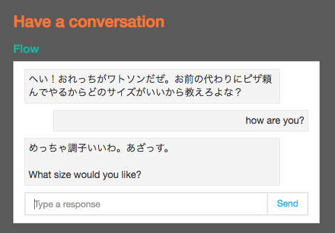
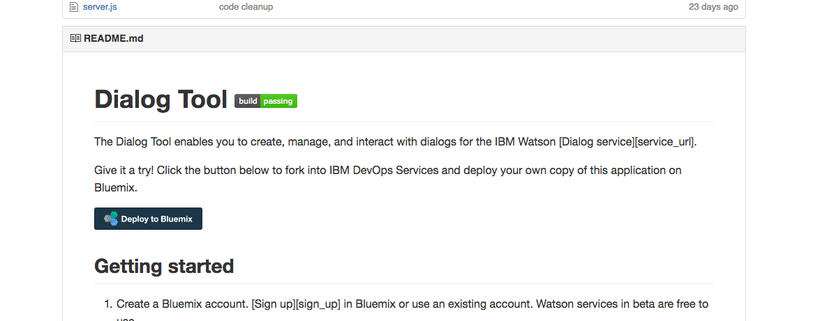
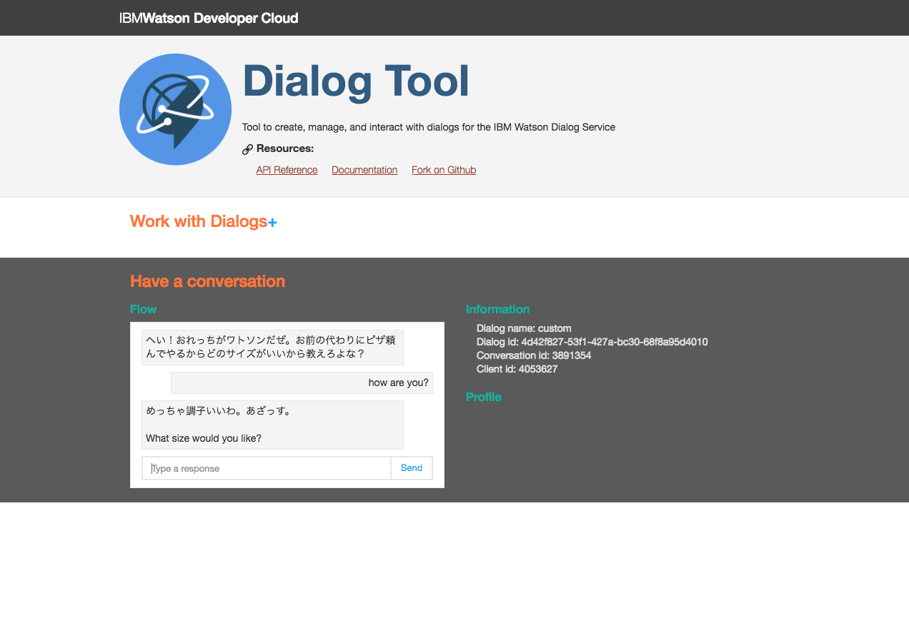

今週末にチャットbotハッカソンに参加することになったので、IBM Bluemix Watson君の対話APIを試してみます。

こちらのQiita記事を参考にさせていただいた。これ見れば全部わかる。

[http://qiita.com/y_some/items/03858ed87aad15ac7998](http://qiita.com/y_some/items/03858ed87aad15ac7998)

## 試してみる

Bluemixをはじめて使うので、まずはトライアルアカウントの作成から。試用は30日間の模様。ユーザー登録に関しても上記エントリで言及されていたのでここでは割愛。

アカウントが使えるようになったら、対話システムであるDialogを簡単に試すために、Dialog Toolというものを使います。これはGitHubでソースコードが共有されているので、Bluemix上にデプロイすればすぐに使えるようになります。

Dialog Tool

[https://github.com/watson-developer-cloud/dialog-tool](https://github.com/watson-developer-cloud/dialog-tool)

ありがたいことに、GitHubのREADMEにDeploy to Bluemixボタンがついているので、これをポチっとするだけでデプロイが完了しちゃいます。



進めていくとBluemix上で下記のような謎メッセージが表示されるのですが、いつものGitHubとかで使っているIDを入れておきました。なんでもいいのかな？

```
Pick an alias

Git リポジトリーをセットアップするには、IBM ID を別名に関連付ける必要があります。

別名は、Git リポジトリー・パス、Track & Plan、および デスクトップ・クライアントとコマンド行クライアントで使用される、固有で、公開される可視のショート・ネームです。
```

OrganizationとSpaceを選択してデプロイ。Regionが違うとOrganizationとSpacesが表示されないので注意。しばらく(3分くらい)時間がかかるので気長にまつ。

完了したらVIEW YOUR APPSボタンが表示されるので、押すとDialog Toolが起動出来るようになりました。うーん簡単。

## 対話定義ファイルを更新

デフォは英語なので、英語の対話しかみれません。なので、日本語で対話させたいなら日本語の定義ファイルをアップロードする必要があります。Dialog Toolのリポジトリの`dialogs`ディレクトリに`pizza_sample.xml`というのが保存されているので、これをダウンロードするなりコピペするなりしてローカルに保存します。

とりあえず手っ取り早く日本語化されることを確認出来そうなところを修正しました。

pizza_sample.xml

```
# ENをja-JPに変更する
<setting name="LANGUAGE" type="USER">ja-JP</setting>

# 350行目らへん
<output>
    <prompt>
        <item>めっちゃ調子いいわ。あざっす。</item>
        <item>まあそこそこかな。あざっす。</item>
        <item>お前と話してるからけっこう気分いいぜ</item>
        <item>気分いいね</item>
        <item>まあまあだね。あざっす。</item>
    </prompt>
</output>
```

編集できたら、Dialog Tool上の+ボタン押すとファイルアップロード出来るのでアップします。で、アップロードした後、さらにボタン押すとチャットが始まります。

こんな感じ。




## まとめ

あまり検証はしていないけど、日本語でもきっといい感じに回答してくれのかな。正直ちょっとXMLが巨大過ぎてだるいなーと思ってしまうけれど、どうせアプリケーションから吐いて作るだろうから、仕様さえ覚えればーというところなのか。
