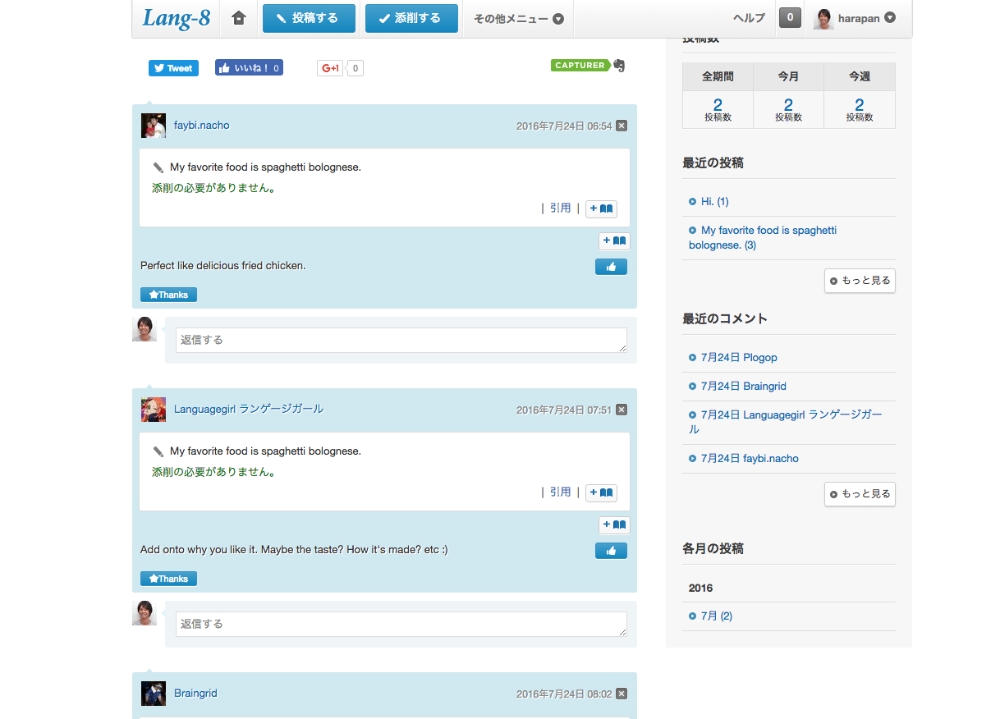
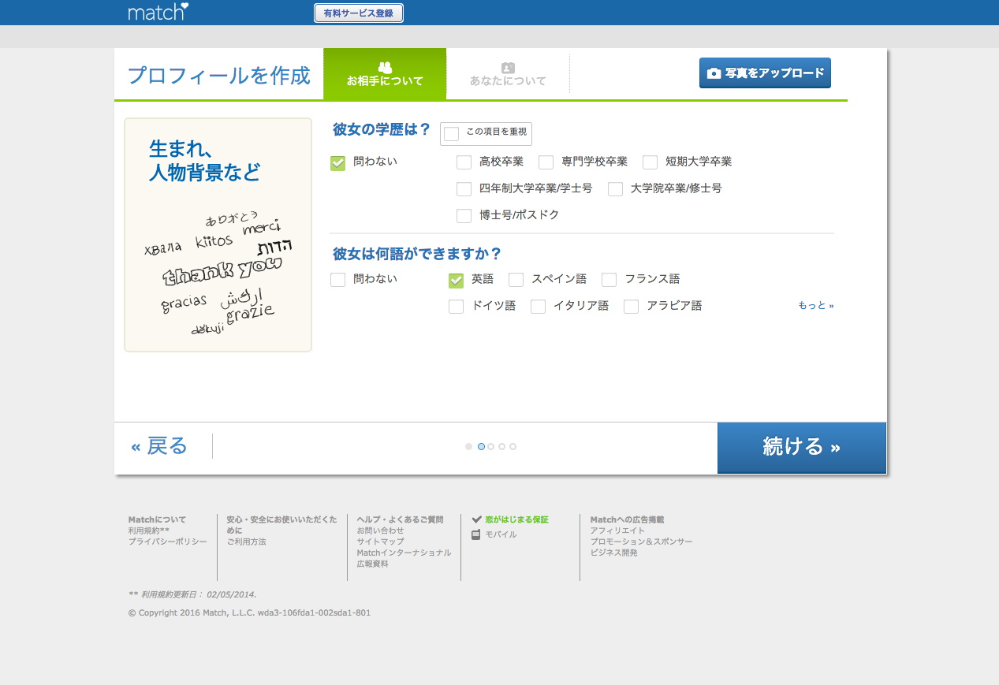

最近機械学習にハマっているのですが、新しいアルゴリズムだったり、機械学習ライブラリのドキュメントを見たりするとき、日本語情報がなく英語で書かれたものが多くて困ることがよくありました。

前々から英語はやろうやろうと思っていたのですが、ようやくそのときが来たようです。英語の学習には確固たる目的が存在しなくてはならないと思っているのですが、ぼくにとって新しい技術をインプットしていくことは非常に重要なことなので、これを原動力にしてやっていこうと思ってます。

## 前提

まず前提ですが、ぼくは就職後は一切英語に触れる機会はなく、全くの素人からスタートです。

一番初めにやったのは、テキストを使って中学生レベルの文法を学習することでした。テキスト一冊分はクリアしたので、ある程度文法の知識は復活している状態です。今後はライティングが中心にしてリーディングはニュースを読む程度でやっていきたいと思ってます。

ちなみにリーディングはPolyglotsというアプリを使ってます。暗記物はつまらないので単語系アプリは却下。楽しく続けられるものを探すのが今回の目的です。

ざっと検索して出てきた下記のアプリ・サービスを試してみることにします。

- Lang-8
- busuu
- Tinder
- マッチ・ドットコム
- Hello Pal
- Hello Talk

## Hello Talk
外国人と出会えるっていう文脈で紹介されていることが多いアプリ。簡単に言うとネイティブの外国人とお友達になれるSNSアプリ。Facebookの投稿みたいに何気ない日常をアップしたり、そういう投稿にコメントをつけたり出来る。

DMもできるし、文章の添削も可能。外国人異性とお友達になれるっていう点でモチベーション維持にも寄与しているのだろうか。ただ使ってみた感じだと、気楽にネイティブとチャットしたりコメントしあったりできるので、習慣化という意味ではかなり良さ気。

日本語を覚えたい人を選んで適当に友達申請を何回かやればすぐにチャットしてくれる人が見つかります。だがしかしこっちから一生懸命話題を振ったりするのだけども、あんまり続かないのがつらいところではある。どっちかというと日記投稿みたいな感じの使い方の方がやりやすいかも。

電車内とかでポチポチできるし、そこそこ楽しいでこのアプリはけっこうオススメです。

コイキングかわいい。コイキングはアメリカではMagikarpと言うそうですよ。

## Lang-8

[http://lang-8.com/](http://lang-8.com/)

英語の添削をしてもらう代わりに、日本語を勉強したい人を添削してあげるlanguage exchangeサービス。幾つか添削してみたところ、易しい文章は簡単に添削できるものの、原文がないと何を言っているのかサッパリわからないのもあった。

添削はこんな感じ。

`My favorite food is spaghetti bolognese.`という文章を投稿したら数十分のうちに3件の添削がついた。ちゃんとした英語を学ぶには良いかもしれない。

添削してくれるので、独学英語のクオリティを上げるのは向いてそうだけど、コミュニケーションが中心ではないので、モチベーション維持が難しそう。

## busuu

[https://www.busuu.com/ja/](https://www.busuu.com/ja/)

無料のビギナーコースをやってみた。`Nice to meet you.`とか`See you later.`とかあいさつの基本中の基本から勉強できる。音声もついていたり、穴埋めの問題を解いたりと、パパパっとスムーズに学習出来そう。オンラインレッスンという感じ。コースと言う形で学習出来るので、包括的に学習したい人に向いている気がする。

ぼくは実戦型が好きだからあんまり基礎から学習するのはおもしろくなし続けられなそう。あと今やりたいのはライティングだからちょっと包括的じゃない方が良いな。

## Tinder
外国人のユーザーも一部いるが、現在は日本人の方が多いっぽい。ほとんど見つけられないし、マッチしないと会話も出来ないので英語学習という意味ではほぼ使えないと思う。女性(日本人) => 男性(外国人)みたいなパターンの方が可能性高いのかな。

調べてみたところ、TinderはかなりイケイケGoGoな出会い系アプリらしい。英語の勉強のために使おうとするとミスマッチしそうだ。

## マッチ・ドットコム
こちらも出会い系サービスなのですが、世界25カ国で展開されているサービスだから外国人もけっこういるらしい。1995年にアメリカでサービス開始した老舗。

マッチ対象の希望を細かく設定出来る。英語を使える人っていう条件を入れることが出来る。宗教とか政治観とかまで入力出来る。検索してみたら数人の外国人が見つかったが、そんなに多くはないみたい。

あと有料にしないとメッセージも送れないみたい。英語を学習する目的のために、有料で婚活するっていうのはちょっと重すぎる。もっとカジュアルに勉強したい。

## まとめ
外国人の彼女を作るといいよ、なんてよく言われていますが、語学学習したいのに出会い系からスタートっていうのはちょっと現実的じゃないなーと思った。

あと、チャット系のアプリ非常にいいんだけど、素人レベルだと一通返事するだけでも結構時間取られてしまうからなかなか返事するのが大変で続かなかったりする。あと話題が続かない。。

そういうところ踏まえて考えると、ライティングの勉強としては、Hello Talkあたりで毎日その日の出来事を投稿するくらいがやりやすいんじゃないかという結論に至った。
