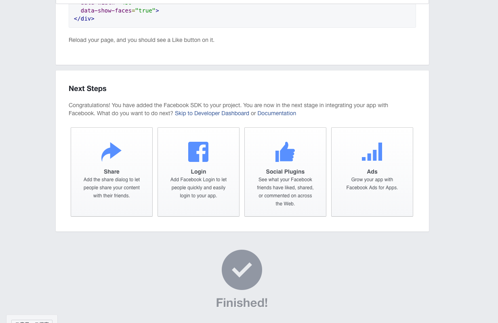
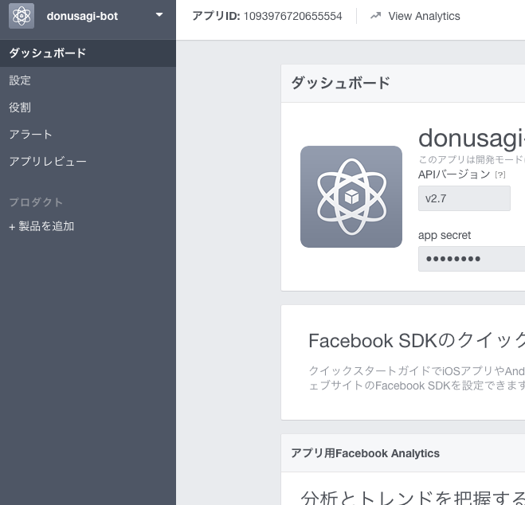
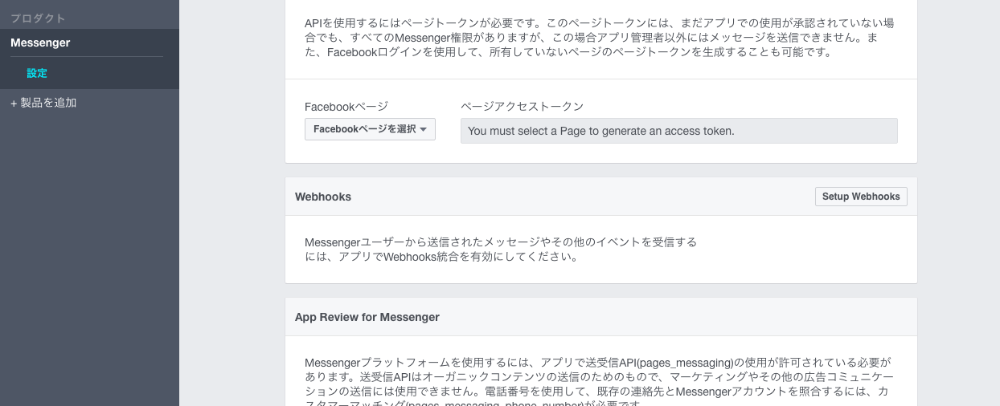
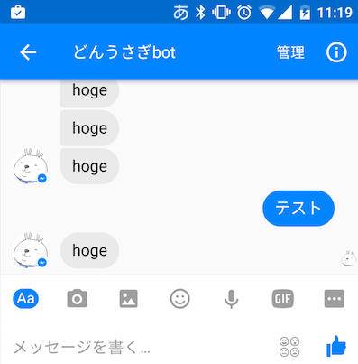

今mofmof inc.で[チャットbotサービスのMy-ope](http://www.my-ope.net/)というものを開発をしていまして、Facebook Botとしても使えるようにしたいなーと思って試してみました。パッとみたところグループチャットには対応していないのかな。グループで使いたかったんだけどなー。

このあたりを参考にさせていただきました。

- [http://qiita.com/pochi-sato/items/f3f5598e36c1fa92d840](http://qiita.com/pochi-sato/items/f3f5598e36c1fa92d840)
- [http://qiita.com/ysk_1031/items/1d0736126f121f93a84d](http://qiita.com/ysk_1031/items/1d0736126f121f93a84d)
- [http://qiita.com/fuji_syan/items/85723cb5e53ec6dc9e95](http://qiita.com/fuji_syan/items/85723cb5e53ec6dc9e95)

## 手順

Facebookアプリのクイックスタートを開きます。Botを作るにはWEBサイトという形で良いみたい。

[https://developers.facebook.com/quickstarts/?platform=web9](https://developers.facebook.com/quickstarts/?platform=web)

新しくアプリを作るので、「Create a New App ID」を選択して適当な名前をつける。「Site URL」にはとりあえず適当に自社のURLでも入れておいた。「Next」を押すと色々出てくるが、Next StrepsのShareとかLoginとかSocial Plugins Adsとかは無視して「Skip to Developer Dashboard」を選択してdeveloper dashboardへひとっ飛びする。



ダッシュボード画面はこちら



「製品を追加」から、「Messenger」を選択し、次にメッセージを受けた時に処理するURLを指定するために「Setup Webhooks」を選択。新しくサーバサイドの環境立てるの面倒だったので、以前[LINE botを試した](http://tech.mof-mof.co.jp/blog/line-bot.html)時のHerokuアプリをそのまま使っちゃいます。

コールバックURLはhttps必須。URL登録時に実際にリクエストしてレスポンスの内容で検証しているため、サーバ側に下記のコードを実装(Ruby x Sinatra)し、HerokuアプリのHostと`/facebook/callback`を入力。<VALIDATION TOKEN>は画面で入力したvalidation tokenです。

main.rb

```
get '/facebook/callback' do
  if params["hub.verify_token"] != "<VALIDATION TOKEN>"
     return "Error, wrong validation token"
   end
   params["hub.challenge"]
end
```

Setup Webhooksが正しく登録出来ればOK。

## 返事の実装

次にユーザー側からメッセージが来た際に返事をする部分を実装します。サーバ側のコードに下記を実装。この例では常に「hoge」という返事をします。

Gemfile

```
gem 'rest-client'
```

main.rb

```
require 'rest-client'

post '/facebook/callback' do
  request_endpoint = "https://graph.facebook.com/v2.6/me/messages?access_token=#{ENV["FACEBOOK_ACCESS_TOKEN"]}"

  request_body = JSON.parse(request.body.read)
  events = request_body["entry"][0]["messaging"]
  events.each do |event|
    sender = event["sender"]["id"]
    body = { recipient: { id: sender }, message: { text: 'hoge' } }
    RestClient.post request_endpoint, body.to_json, content_type: :json, accept: :json
  end
  'OK'
end
```

## チャットbotの起動と確認
どうやらbotはFacebookページに紐付いているようなので、どのページに紐付けるかを決定してアクセストークンを取得します。



Facebook APIを通してPOSTしてチャットbotを起動します。`<ACCESS_TOKEN`にさっき取得したアクセストークンを入れる。

```
curl -ik -X POST "https://graph.facebook.com/v2.6/me/subscribed_apps?access_token=<ACCESS_TOKEN>"
```

これで一通り出来たはずなので、あとはスマホのメッセンジャーアプリでbot名を検索して、話しかけてみれば出来あがり！

できたー！！


