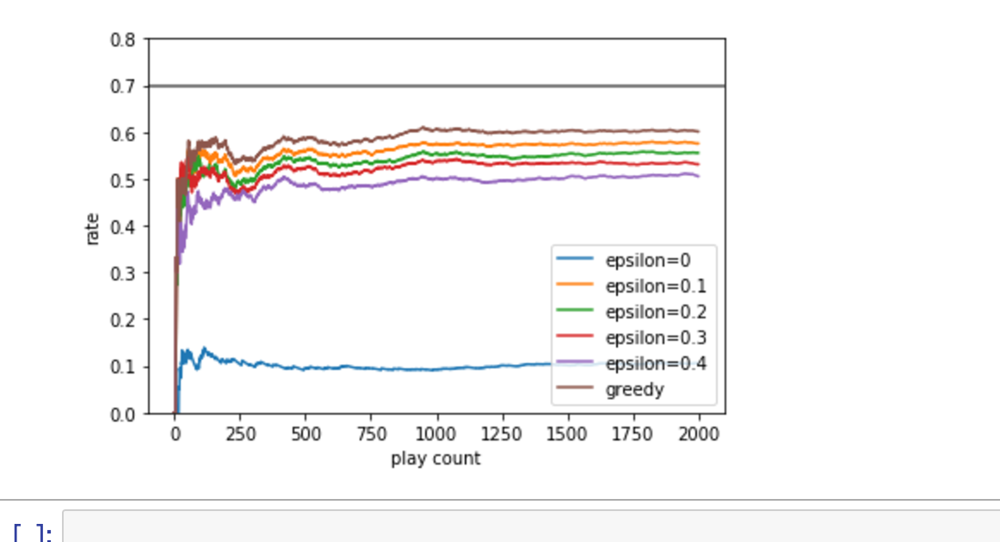
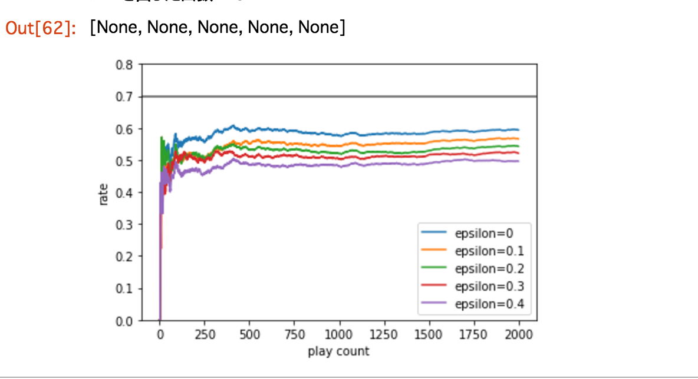

強化学習に入門したいのですが、入門にちょうどいい難易度の本とか記事とか見当たらなかったんで、簡単そうな問題を考えてそれに強化学習に当てはめて解いてみようと思いました。

あ、Python3.5.2でやってます。

ジャンケンの出す手に偏りがある人に、高確率で勝つ選択を見つける問題なんかめっちゃシンプルでちょうどいいじゃないかなーと思いついたのでやってみようと思います。

色々検索して見たところ、**多腕バンディット問題**というのがかなり近い性質のものであることがわかった。

ここでは詳しくは書きませんが、情報はたくさんあるみたいなのでそちらを参照くだしあ。

[http://yamaimo.hatenablog.jp/entry/2015/08/20/200000](http://yamaimo.hatenablog.jp/entry/2015/08/20/200000)
[http://qiita.com/ta-ka/items/90f0580fd15293c35881](http://qiita.com/ta-ka/items/90f0580fd15293c35881)

強化学習そのものについてこのあたりを読んだ。今回の問題には直接関係ないけど。

[http://qiita.com/Hironsan/items/56f6c0b2f4cfd28dd906](http://qiita.com/Hironsan/items/56f6c0b2f4cfd28dd906)

## 前提
まず、Aさんという人がいて、Bさんは今からこの人と2,000回ジャンケンしたいと思っています(2,000回とかやりたくねえ)。

Aさんはちょっと天然さんでして、どうも出す手が偏っていて、やたらパーばかり出す人です。出す手は確率は以下だとしましょう。ただしジャンケン相手であるエージェントのBさんはこのことを知りません。

- グー(G): 0.3
- チョキ(C): 0.1
- パー(P): 0.6

すると、バンディット問題におけるアームと確率は以下のようになります。要するにBさんが手を出したときに勝てる確率ですね。

- グー(G): 0.1
- チョキ(C): 0.6
- パー(P): 0.3

この前提がある場合、Bさんはひたすらチョキを出すことが最適解なわけですね。それを機械で求めてみましょう。

## 実装
ソースコードはほぼこちらのコピペです。

[https://iridge.jp/blog/201412/5508/](https://iridge.jp/blog/201412/5508/)

使う定数を定義する。

```
import numpy as np
import matplotlib.pyplot as plt

TRIAL_NUMBER = 2000
# 出す手ごとの勝てる確率
OBVERSE_PROP = np.array([0.1, 0.6, 0.3])
# 勝負したときの勝敗 { 0 or 1 }
RESULT_DATA = np.array(
    [np.random.binomial(1, p, TRIAL_NUMBER)for p in OBVERSE_PROP])

COINS = range(3)
```

Greedyアルゴリズムを実装。今回時間がなかったので中身はよく読んでいない。強化学習のアルゴリズムだと思う。

```
class Greedy(object):
    def __init__(self):
        self.rewards = dict()
        self.cnt = 0
        self.result = np.zeros(TRIAL_NUMBER)
        self.choiced_coins = np.array([])

    def get_reward(self, coin):
        return RESULT_DATA[coin][self.cnt]

    def estimate_q(self, coin):
        """説明を省きたいので、漸進的ではない方法で実装"""
        reward = self.rewards.get(coin)
        q = sum(reward) / float(len(reward)) if reward else 0
        return q

    def choice_coin(self):
        choiced_coin = np.argmax(
            [self.estimate_q(coin) for coin in COINS])
        return choiced_coin

    def first_throw(self):
        choiced_coin = np.random.choice(
            list(set(COINS) - set(self.rewards.keys())))
        self.rewards[choiced_coin] = [self.get_reward(choiced_coin)]
        self.cnt += 1

    def throw(self):
        choiced_coin = self.choice_coin()
        self.choiced_coins = np.append(self.choiced_coins, choiced_coin)
        reward = self.get_reward(choiced_coin)
        self.rewards[choiced_coin].append(reward)
        self.result[self.cnt] = reward
        self.cnt += 1

    def execute(self):
        print('execute')
        [self.first_throw() if i < len(COINS) else self. throw()
         for i in range(TRIAL_NUMBER)]
```

実はGreedyアルゴリズムは、最初の方に出した手の結果に大きく依存されてしまうため、うまく振る舞えないことがある。実際にやってみたら、勝率0.1であるグーを出し続ける選択をしてしまった。



そこでGreedyアルゴリズムを拡張したε-Greedyアルゴリズムを実装。超ざっくりいうと、εの割合で探索を続けるというものですが、詳しい説明は割愛。

```
class EpsilonGreedy(Greedy):
    def __init__(self, epsilon):
        self.epsilon = epsilon
        super(EpsilonGreedy, self).__init__()

    def choice_coin(self):
        is_random = np.random.choice(
            2, 1, p=[1 - self.epsilon, self.epsilon])[0]
        choiced_coin = (np.random.choice(COINS) if is_random else
                        np.argmax([self.estimate_q(coin) for coin in COINS]))
        return choiced_coin
```

プロットする関数と、アルゴリズムの実行。

```
def verification(alg, title):
    print('choiced_coins: %s' % alg.choiced_coins)
    print('グーを出した回数: %s' % alg.choiced_coins[alg.choiced_coins==0].size)
    print('チョキを出した回数: %s' % alg.choiced_coins[alg.choiced_coins==1].size)
    print('パーを出した回数: %s' % alg.choiced_coins[alg.choiced_coins==2].size)

    plt.plot(np.cumsum(alg.result) / np.arange(1, TRIAL_NUMBER+1),label=title)
    plt.legend(loc='lower right')
    plt.axhline(y=0.7, color='gray')
    plt.xlabel('play count')
    plt.ylabel('rate')
    plt.ylim(0, 0.8)
    plt.show


epsilons = [0, 0.1, 0.2, 0.3, 0.4]
epsilon_greedy_list = [EpsilonGreedy(epsilon) for epsilon in epsilons]
[eg.execute() for eg in epsilon_greedy_list]
[verification(eg, 'epsilon='+str(eg.epsilon)) for eg in epsilon_greedy_list]
```

アウトプット。

```
choiced_coins: [ 1.  1.  1. ...,  1.  1.  1.]
グーを出した回数: 0
チョキを出した回数: 1997
パーを出した回数: 0
choiced_coins: [ 1.  1.  1. ...,  1.  1.  2.]
グーを出した回数: 71
チョキを出した回数: 1845
パーを出した回数: 81
choiced_coins: [ 1.  1.  1. ...,  1.  1.  1.]
グーを出した回数: 122
チョキを出した回数: 1741
パーを出した回数: 134
choiced_coins: [ 0.  1.  1. ...,  0.  1.  0.]
グーを出した回数: 189
チョキを出した回数: 1611
パーを出した回数: 197
choiced_coins: [ 1.  1.  1. ...,  1.  0.  1.]
グーを出した回数: 260
チョキを出した回数: 1475
パーを出した回数: 262
```



`ε = 0`でたまたま出したチョキが勝ったからひたすらチョキを出し続けて探索していないのがもっとも良い結果になってしまったが、まあこのように複数のεを指定して探索して、最適な結果を見つけるというものですかね。

## まとめ
強化学習についてはそれほど理解は進まなかったけれども、調べたり試したりしているうちに概要が少しだけわかった気がしないでもない。

今日はこれにて。


