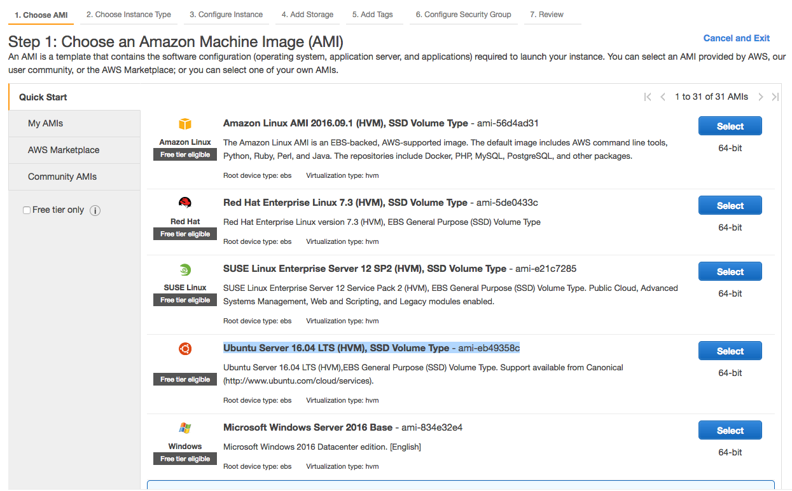
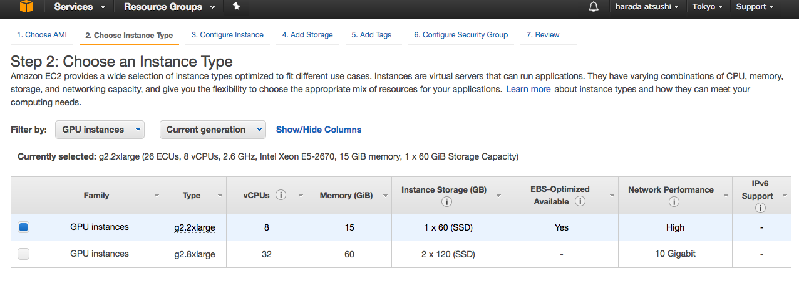
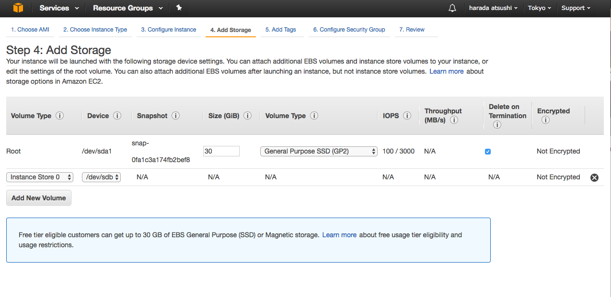
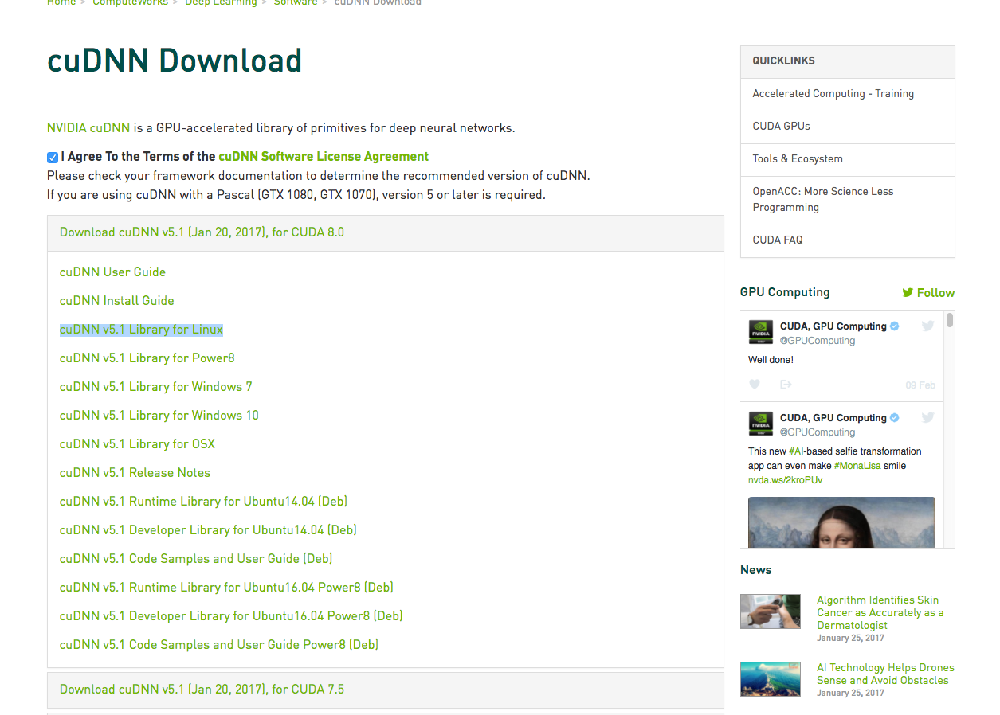

TensorFlowでseq2seqを試してみたりしているのですが、やはりローカルPCのCPUでディープラーニングはつらすぎるということがよくわかったのですが、とりあえずさくっとAWSのGPUインスタンスで対応できないかと思ったので、やってみます。

けっこう色んな人が取り組んでいて情報はそこそこあるのですが、結果的に普通のUbuntuでやってうまくいきました。

## EC2インスタンスを立ち上げる

スポットインスタンスの方が相当安いのですが、セットアップの手間がそこそこあるので、普通のインスタンスにして、学習させてないときは寝かせておく運用にしようと思います。

AWSのEC2の「Launch Instance」で、AMI `Ubuntu Server 16.04 LTS (HVM), SSD Volume Type - ami-eb49358c`を選択します。



インスタンスは`g2.2xlarge`を選択。



cudaとかセットアップするとそこそこ容量食うみたいなので、ストレージSizeを30GBに変更しておいた。




SSHでログイン出来ることを確認。

```
$ ssh ubuntu@ec2hogehogehoge.compute.amazonaws.com
```

## セットアップ

主にこちらのエントリを参考にしました。

[http://zudoh.com/archives/286](http://zudoh.com/archives/286)

必要なパッケージをインストール

```
$ sudo apt-get update
$ sudo apt-get upgrade -y
$ sudo apt-get install -y build-essential python-pip python-dev git python-numpy swig python-dev default-jdk zip zlib1g-dev ipython
```

ブラックリストに登録？このへんはちょっと何しているのかわかってない。

```
$ echo -e "blacklist nouveau\nblacklist lbm-nouveau\noptions nouveau modeset=0\nalias nouveau off\nalias lbm-nouveau off\n" | sudo tee /etc/modprobe.d/blacklist-nouveau.conf
$ echo options nouveau modeset=0 | sudo tee -a /etc/modprobe.d/nouveau-kms.conf
$ sudo update-initramfs -u
```

再起動。

```
$ sudo reboot
```

また必要なパッケージをインストールして再起動。

```
$ sudo apt-get install -y linux-image-extra-virtual
$ sudo reboot
```

更に必要なパッケージをインストール。

```
$ sudo apt-get install -y linux-source linux-headers-`uname -r`
```

次はGPU版のtensorflowをインストール。

```
$ pip install tensorflow-gpu
```

試しにちょっとtensorflowをインポートしているスクリプトを実行してみると、Cudaのセットアップ済んでいないのでエラーになることを確認。`main.py`の内容は後で貼ります。

```
$ python main.py
deep mnist start
Traceback (most recent call last):
  File "main.py", line 5, in <module>
    from tensorflow.examples.tutorials.mnist import input_data
  File "/home/ubuntu/.local/lib/python2.7/site-packages/tensorflow/__init__.py", line 24, in <module>
    from tensorflow.python import *
  File "/home/ubuntu/.local/lib/python2.7/site-packages/tensorflow/python/__init__.py", line 60, in <module>
    raise ImportError(msg)
ImportError: Traceback (most recent call last):
  File "/home/ubuntu/.local/lib/python2.7/site-packages/tensorflow/python/__init__.py", line 49, in <module>
    from tensorflow.python import pywrap_tensorflow
  File "/home/ubuntu/.local/lib/python2.7/site-packages/tensorflow/python/pywrap_tensorflow.py", line 28, in <module>
    _pywrap_tensorflow = swig_import_helper()
  File "/home/ubuntu/.local/lib/python2.7/site-packages/tensorflow/python/pywrap_tensorflow.py", line 24, in swig_import_helper
    _mod = imp.load_module('_pywrap_tensorflow', fp, pathname, description)
ImportError: libcudart.so.8.0: cannot open shared object file: No such file or directory


Error importing tensorflow.  Unless you are using bazel,
you should not try to import tensorflow from its source directory;
please exit the tensorflow source tree, and relaunch your python interpreter
from there.
```

## Cuda ToolkitとcuDNNのセットアップ

Cuda Toolkitのインストールについてはtensorflowの公式ドキュメントを参照。

[https://www.tensorflow.org/get_started/os_setup#optional_install_cuda_gpus_on_linux](https://www.tensorflow.org/get_started/os_setup#optional_install_cuda_gpus_on_linux)

[https://developer.nvidia.com/cuda-downloads](https://developer.nvidia.com/cuda-downloads)からUbuntu版のインストーラーをダウンロードする。けっこう容量が大きいのでnetworkインストーラーがおすすめ。


scpでファイルをローカルからEC2にアップする

```
$ scp ~/Downloads/cuda-repo-ubuntu1604_8.0.61-1_amd64.deb ubuntu@ec2hogehogehoge.compute.amazonaws.com:/home/ubuntu
```

インストールする。

```
$ sudo dpkg -i cuda-repo-ubuntu1604_8.0.61-1_amd64.deb
$ sudo apt-get update
$ sudo apt-get install cuda
```

次にcuDNNのインストール。こちらも[NVIDIAのサイト](https://developer.nvidia.com/cudnn)からダウンロードしてくる必要がある。



`cuDNN v5.1 Library for Linux`をダウンロードして、scpでEC2にアップする。

```
$ scp ~/Downloads/cudnn-8.0-linux-x64-v5.1.tgz  ubuntu@ec2hogehogehoge.compute.amazonaws.com:/home/ubuntu
```

EC2にsshログインして、cuDNNをインストールする。

```
$ tar xvzf cudnn-8.0-linux-x64-v5.1.tgz
$ sudo cp -P cuda/include/cudnn.h /usr/local/cuda/include
$ sudo cp -P cuda/lib64/libcudnn* /usr/local/cuda/lib64
$ sudo chmod a+r /usr/local/cuda/include/cudnn.h /usr/local/cuda/lib64/libcudnn*
```

最後に必要なパッケージインストール。

```
$ sudo apt-get install libcupti-dev
```

## TensorFlowのチュートリアル「Deep MNIST for Experts」を実行する

[Deep MNIST for Exports](https://www.tensorflow.org/tutorials/mnist/pros/)のサンプルコードをそのままコピペしてして実行する。

```
$ vim python main.py

print('deep mnist start')
import time
start = time.time()

from tensorflow.examples.tutorials.mnist import input_data
mnist = input_data.read_data_sets('MNIST_data', one_hot=True)

import tensorflow as tf
sess = tf.InteractiveSession()

x = tf.placeholder(tf.float32, shape=[None, 784])
y_ = tf.placeholder(tf.float32, shape=[None, 10])

W = tf.Variable(tf.zeros([784,10]))
b = tf.Variable(tf.zeros([10]))

sess.run(tf.initialize_all_variables())

y = tf.matmul(x,W) + b

cross_entropy = tf.reduce_mean(
    tf.nn.softmax_cross_entropy_with_logits(labels=y_, logits=y))

train_step = tf.train.GradientDescentOptimizer(0.5).minimize(cross_entropy)

for i in range(1000):
  batch = mnist.train.next_batch(100)
  train_step.run(feed_dict={x: batch[0], y_: batch[1]})

correct_prediction = tf.equal(tf.argmax(y,1), tf.argmax(y_,1))

accuracy = tf.reduce_mean(tf.cast(correct_prediction, tf.float32))

print(accuracy.eval(feed_dict={x: mnist.test.images, y_: mnist.test.labels}))

def weight_variable(shape):
  initial = tf.truncated_normal(shape, stddev=0.1)
  return tf.Variable(initial)

def bias_variable(shape):
  initial = tf.constant(0.1, shape=shape)
  return tf.Variable(initial)

def conv2d(x, W):
  return tf.nn.conv2d(x, W, strides=[1, 1, 1, 1], padding='SAME')

def max_pool_2x2(x):
  return tf.nn.max_pool(x, ksize=[1, 2, 2, 1],
                        strides=[1, 2, 2, 1], padding='SAME')

W_conv1 = weight_variable([5, 5, 1, 32])
b_conv1 = bias_variable([32])

x_image = tf.reshape(x, [-1,28,28,1])

h_conv1 = tf.nn.relu(conv2d(x_image, W_conv1) + b_conv1)
h_pool1 = max_pool_2x2(h_conv1)

W_conv2 = weight_variable([5, 5, 32, 64])
b_conv2 = bias_variable([64])

h_conv2 = tf.nn.relu(conv2d(h_pool1, W_conv2) + b_conv2)
h_pool2 = max_pool_2x2(h_conv2)

W_fc1 = weight_variable([7 * 7 * 64, 1024])
b_fc1 = bias_variable([1024])

h_pool2_flat = tf.reshape(h_pool2, [-1, 7*7*64])
h_fc1 = tf.nn.relu(tf.matmul(h_pool2_flat, W_fc1) + b_fc1)

keep_prob = tf.placeholder(tf.float32)
h_fc1_drop = tf.nn.dropout(h_fc1, keep_prob)

W_fc2 = weight_variable([1024, 10])
b_fc2 = bias_variable([10])

y_conv = tf.matmul(h_fc1_drop, W_fc2) + b_fc2

cross_entropy = tf.reduce_mean(
    tf.nn.softmax_cross_entropy_with_logits(labels=y_, logits=y_conv))
train_step = tf.train.AdamOptimizer(1e-4).minimize(cross_entropy)
correct_prediction = tf.equal(tf.argmax(y_conv,1), tf.argmax(y_,1))
accuracy = tf.reduce_mean(tf.cast(correct_prediction, tf.float32))
sess.run(tf.initialize_all_variables())
for i in range(300):
  batch = mnist.train.next_batch(50)
  if i%100 == 0:
    train_accuracy = accuracy.eval(feed_dict={
        x:batch[0], y_: batch[1], keep_prob: 1.0})
    print("step %d, training accuracy %g"%(i, train_accuracy))
  train_step.run(feed_dict={x: batch[0], y_: batch[1], keep_prob: 0.5})

print("test accuracy %g"%accuracy.eval(feed_dict={
    x: mnist.test.images, y_: mnist.test.labels, keep_prob: 1.0}))

elapsed_time = time.time() - start
print ("elapsed_time:{0}".format(elapsed_time)) + "[sec]"
```

うごいたあああ！

```
$ python main.py

deep mnist start
I tensorflow/stream_executor/dso_loader.cc:128] successfully opened CUDA library libcublas.so locally
I tensorflow/stream_executor/dso_loader.cc:128] successfully opened CUDA library libcudnn.so locally
I tensorflow/stream_executor/dso_loader.cc:128] successfully opened CUDA library libcufft.so locally
I tensorflow/stream_executor/dso_loader.cc:128] successfully opened CUDA library libcuda.so.1 locally
I tensorflow/stream_executor/dso_loader.cc:128] successfully opened CUDA library libcurand.so locally
Extracting MNIST_data/train-images-idx3-ubyte.gz
Extracting MNIST_data/train-labels-idx1-ubyte.gz
Extracting MNIST_data/t10k-images-idx3-ubyte.gz
Extracting MNIST_data/t10k-labels-idx1-ubyte.gz
E tensorflow/stream_executor/cuda/cuda_driver.cc:509] failed call to cuInit: CUDA_ERROR_UNKNOWN
I tensorflow/stream_executor/cuda/cuda_diagnostics.cc:145] kernel driver does not appear to be running on this host (ip-172-31-22-207): /proc/driver/nvidia/version does not exist
WARNING:tensorflow:From main.py:17 in <module>.: initialize_all_variables (from tensorflow.python.ops.variables) is deprecated and will be removed after 2017-03-02.
Instructions for updating:
Use `tf.global_variables_initializer` instead.
0.918
WARNING:tensorflow:From main.py:84 in <module>.: initialize_all_variables (from tensorflow.python.ops.variables) is deprecated and will be removed after 2017-03-02.
Instructions for updating:
Use `tf.global_variables_initializer` instead.
step 0, training accuracy 0.1
step 100, training accuracy 0.86
step 200, training accuracy 0.96
test accuracy 0.9156
elapsed_time:37.9471111298[sec]
```

ローカルで実行したときは、143秒かかったので、約4倍くらいの早さで動作しているみたい。うーん。もうちょっと早い方がいいなー。

## 実は失敗していた

4倍は遅いなーとか思ってたら、よく見たらNVIDIAのドライバを認識出来ておらず、たぶんCPUが使われてる？

失敗。

```
$ nvidia-smi
NVIDIA-SMI has failed because it couldn't communicate with the NVIDIA driver. Make sure that the latest NVIDIA driver is installed and running.
```

何度やってもうまくいかないのであきらめて、こちらのエントリで紹介されているAMIを使ってtensorflow動かしてみた。

http://qiita.com/h860a/items/294262d98e1223008252

```
$ python main.py
deep mnist start
I tensorflow/stream_executor/dso_loader.cc:101] successfully opened CUDA library libcublas.so.7.0 locally
I tensorflow/stream_executor/dso_loader.cc:101] successfully opened CUDA library libcudnn.so.6.5 locally
I tensorflow/stream_executor/dso_loader.cc:101] successfully opened CUDA library libcufft.so.7.0 locally
I tensorflow/stream_executor/dso_loader.cc:101] successfully opened CUDA library libcuda.so locally
I tensorflow/stream_executor/dso_loader.cc:101] successfully opened CUDA library libcurand.so.7.0 locally
Successfully downloaded train-images-idx3-ubyte.gz 9912422 bytes.
Extracting MNIST_data/train-images-idx3-ubyte.gz
Successfully downloaded train-labels-idx1-ubyte.gz 28881 bytes.
Extracting MNIST_data/train-labels-idx1-ubyte.gz
Successfully downloaded t10k-images-idx3-ubyte.gz 1648877 bytes.
Extracting MNIST_data/t10k-images-idx3-ubyte.gz
Successfully downloaded t10k-labels-idx1-ubyte.gz 4542 bytes.
Extracting MNIST_data/t10k-labels-idx1-ubyte.gz
I tensorflow/stream_executor/cuda/cuda_gpu_executor.cc:909] successful NUMA node read from SysFS had negative value (-1), but there must be at least one NUMA node, so returning NUMA node zero
I tensorflow/core/common_runtime/gpu/gpu_init.cc:103] Found device 0 with properties:
name: GRID K520
major: 3 minor: 0 memoryClockRate (GHz) 0.797
pciBusID 0000:00:03.0
Total memory: 4.00GiB
Free memory: 3.95GiB
I tensorflow/core/common_runtime/gpu/gpu_init.cc:127] DMA: 0
I tensorflow/core/common_runtime/gpu/gpu_init.cc:137] 0:   Y
I tensorflow/core/common_runtime/gpu/gpu_device.cc:702] Creating TensorFlow device (/gpu:0) -> (device: 0, name: GRID K520, pci bus id: 0000:00:03.0)
I tensorflow/core/common_runtime/gpu/gpu_bfc_allocator.cc:42] Allocating 3.66GiB bytes.
I tensorflow/core/common_runtime/gpu/gpu_bfc_allocator.cc:52] GPU 0 memory begins at 0x7023e0000 extends to 0x7ec556000
I tensorflow/core/common_runtime/gpu/gpu_bfc_allocator.cc:66] Creating bin of max chunk size 1.0KiB
I tensorflow/core/common_runtime/gpu/gpu_bfc_allocator.cc:66] Creating bin of max chunk size 2.0KiB
I tensorflow/core/common_runtime/gpu/gpu_bfc_allocator.cc:66] Creating bin of max chunk size 4.0KiB
I tensorflow/core/common_runtime/gpu/gpu_bfc_allocator.cc:66] Creating bin of max chunk size 8.0KiB
I tensorflow/core/common_runtime/gpu/gpu_bfc_allocator.cc:66] Creating bin of max chunk size 16.0KiB
I tensorflow/core/common_runtime/gpu/gpu_bfc_allocator.cc:66] Creating bin of max chunk size 32.0KiB
I tensorflow/core/common_runtime/gpu/gpu_bfc_allocator.cc:66] Creating bin of max chunk size 64.0KiB
I tensorflow/core/common_runtime/gpu/gpu_bfc_allocator.cc:66] Creating bin of max chunk size 128.0KiB
I tensorflow/core/common_runtime/gpu/gpu_bfc_allocator.cc:66] Creating bin of max chunk size 256.0KiB
I tensorflow/core/common_runtime/gpu/gpu_bfc_allocator.cc:66] Creating bin of max chunk size 512.0KiB
I tensorflow/core/common_runtime/gpu/gpu_bfc_allocator.cc:66] Creating bin of max chunk size 1.00MiB
I tensorflow/core/common_runtime/gpu/gpu_bfc_allocator.cc:66] Creating bin of max chunk size 2.00MiB
I tensorflow/core/common_runtime/gpu/gpu_bfc_allocator.cc:66] Creating bin of max chunk size 4.00MiB
I tensorflow/core/common_runtime/gpu/gpu_bfc_allocator.cc:66] Creating bin of max chunk size 8.00MiB
I tensorflow/core/common_runtime/gpu/gpu_bfc_allocator.cc:66] Creating bin of max chunk size 16.00MiB
I tensorflow/core/common_runtime/gpu/gpu_bfc_allocator.cc:66] Creating bin of max chunk size 32.00MiB
I tensorflow/core/common_runtime/gpu/gpu_bfc_allocator.cc:66] Creating bin of max chunk size 64.00MiB
I tensorflow/core/common_runtime/gpu/gpu_bfc_allocator.cc:66] Creating bin of max chunk size 128.00MiB
I tensorflow/core/common_runtime/gpu/gpu_bfc_allocator.cc:66] Creating bin of max chunk size 256.00MiB
I tensorflow/core/common_runtime/gpu/gpu_bfc_allocator.cc:66] Creating bin of max chunk size 512.00MiB
I tensorflow/core/common_runtime/gpu/gpu_bfc_allocator.cc:66] Creating bin of max chunk size 1.00GiB
I tensorflow/core/common_runtime/gpu/gpu_bfc_allocator.cc:66] Creating bin of max chunk size 2.00GiB
I tensorflow/core/common_runtime/gpu/gpu_bfc_allocator.cc:66] Creating bin of max chunk size 4.00GiB
0.9197
step 0, training accuracy 0.04
step 100, training accuracy 0.84
step 200, training accuracy 0.94
test accuracy 0.9268
elapsed_time:18.188421011[sec]
ubuntu@ip-172-31-28-233:~$ python main.py
deep mnist start
I tensorflow/stream_executor/dso_loader.cc:101] successfully opened CUDA library libcublas.so.7.0 locally
I tensorflow/stream_executor/dso_loader.cc:101] successfully opened CUDA library libcudnn.so.6.5 locally
I tensorflow/stream_executor/dso_loader.cc:101] successfully opened CUDA library libcufft.so.7.0 locally
I tensorflow/stream_executor/dso_loader.cc:101] successfully opened CUDA library libcuda.so locally
I tensorflow/stream_executor/dso_loader.cc:101] successfully opened CUDA library libcurand.so.7.0 locally
Extracting MNIST_data/train-images-idx3-ubyte.gz
Extracting MNIST_data/train-labels-idx1-ubyte.gz
Extracting MNIST_data/t10k-images-idx3-ubyte.gz
Extracting MNIST_data/t10k-labels-idx1-ubyte.gz
I tensorflow/stream_executor/cuda/cuda_gpu_executor.cc:909] successful NUMA node read from SysFS had negative value (-1), but there must be at least one NUMA node, so returning NUMA node zero
I tensorflow/core/common_runtime/gpu/gpu_init.cc:103] Found device 0 with properties:
name: GRID K520
major: 3 minor: 0 memoryClockRate (GHz) 0.797
pciBusID 0000:00:03.0
Total memory: 4.00GiB
Free memory: 3.95GiB
I tensorflow/core/common_runtime/gpu/gpu_init.cc:127] DMA: 0
I tensorflow/core/common_runtime/gpu/gpu_init.cc:137] 0:   Y
I tensorflow/core/common_runtime/gpu/gpu_device.cc:702] Creating TensorFlow device (/gpu:0) -> (device: 0, name: GRID K520, pci bus id: 0000:00:03.0)
I tensorflow/core/common_runtime/gpu/gpu_bfc_allocator.cc:42] Allocating 3.66GiB bytes.
I tensorflow/core/common_runtime/gpu/gpu_bfc_allocator.cc:52] GPU 0 memory begins at 0x7023e0000 extends to 0x7ec556000
I tensorflow/core/common_runtime/gpu/gpu_bfc_allocator.cc:66] Creating bin of max chunk size 1.0KiB
I tensorflow/core/common_runtime/gpu/gpu_bfc_allocator.cc:66] Creating bin of max chunk size 2.0KiB
I tensorflow/core/common_runtime/gpu/gpu_bfc_allocator.cc:66] Creating bin of max chunk size 4.0KiB
I tensorflow/core/common_runtime/gpu/gpu_bfc_allocator.cc:66] Creating bin of max chunk size 8.0KiB
I tensorflow/core/common_runtime/gpu/gpu_bfc_allocator.cc:66] Creating bin of max chunk size 16.0KiB
I tensorflow/core/common_runtime/gpu/gpu_bfc_allocator.cc:66] Creating bin of max chunk size 32.0KiB
I tensorflow/core/common_runtime/gpu/gpu_bfc_allocator.cc:66] Creating bin of max chunk size 64.0KiB
I tensorflow/core/common_runtime/gpu/gpu_bfc_allocator.cc:66] Creating bin of max chunk size 128.0KiB
I tensorflow/core/common_runtime/gpu/gpu_bfc_allocator.cc:66] Creating bin of max chunk size 256.0KiB
I tensorflow/core/common_runtime/gpu/gpu_bfc_allocator.cc:66] Creating bin of max chunk size 512.0KiB
I tensorflow/core/common_runtime/gpu/gpu_bfc_allocator.cc:66] Creating bin of max chunk size 1.00MiB
I tensorflow/core/common_runtime/gpu/gpu_bfc_allocator.cc:66] Creating bin of max chunk size 2.00MiB
I tensorflow/core/common_runtime/gpu/gpu_bfc_allocator.cc:66] Creating bin of max chunk size 4.00MiB
I tensorflow/core/common_runtime/gpu/gpu_bfc_allocator.cc:66] Creating bin of max chunk size 8.00MiB
I tensorflow/core/common_runtime/gpu/gpu_bfc_allocator.cc:66] Creating bin of max chunk size 16.00MiB
I tensorflow/core/common_runtime/gpu/gpu_bfc_allocator.cc:66] Creating bin of max chunk size 32.00MiB
I tensorflow/core/common_runtime/gpu/gpu_bfc_allocator.cc:66] Creating bin of max chunk size 64.00MiB
I tensorflow/core/common_runtime/gpu/gpu_bfc_allocator.cc:66] Creating bin of max chunk size 128.00MiB
I tensorflow/core/common_runtime/gpu/gpu_bfc_allocator.cc:66] Creating bin of max chunk size 256.00MiB
I tensorflow/core/common_runtime/gpu/gpu_bfc_allocator.cc:66] Creating bin of max chunk size 512.00MiB
I tensorflow/core/common_runtime/gpu/gpu_bfc_allocator.cc:66] Creating bin of max chunk size 1.00GiB
I tensorflow/core/common_runtime/gpu/gpu_bfc_allocator.cc:66] Creating bin of max chunk size 2.00GiB
I tensorflow/core/common_runtime/gpu/gpu_bfc_allocator.cc:66] Creating bin of max chunk size 4.00GiB
0.9192
step 0, training accuracy 0.14
step 100, training accuracy 0.84
step 200, training accuracy 0.9
test accuracy 0.9166
elapsed_time:14.7425532341[sec]
```

14秒とな。これでCPU使うより10倍早いということがわかった。


## 追記

NVIDIAのドライバー入れ直したらちゃんと動くようになった。

```
$ sudo apt-get remove --purge nvidia*
$ sudo apt-get install nvidia-367
$ sudo reboot
```

わーい。

```
$ nvidia-smi
Sat Feb 11 07:01:07 2017
+-----------------------------------------------------------------------------+
| NVIDIA-SMI 367.57                 Driver Version: 367.57                    |
|-------------------------------+----------------------+----------------------+
| GPU  Name        Persistence-M| Bus-Id        Disp.A | Volatile Uncorr. ECC |
| Fan  Temp  Perf  Pwr:Usage/Cap|         Memory-Usage | GPU-Util  Compute M. |
|===============================+======================+======================|
|   0  GRID K520           Off  | 0000:00:03.0     Off |                  N/A |
| N/A   35C    P0    45W / 125W |      0MiB /  4036MiB |      0%      Default |
+-------------------------------+----------------------+----------------------+

+-----------------------------------------------------------------------------+
| Processes:                                                       GPU Memory |
|  GPU       PID  Type  Process name                               Usage      |
|=============================================================================|
|  No running processes found                                                 |
+-----------------------------------------------------------------------------+
```

