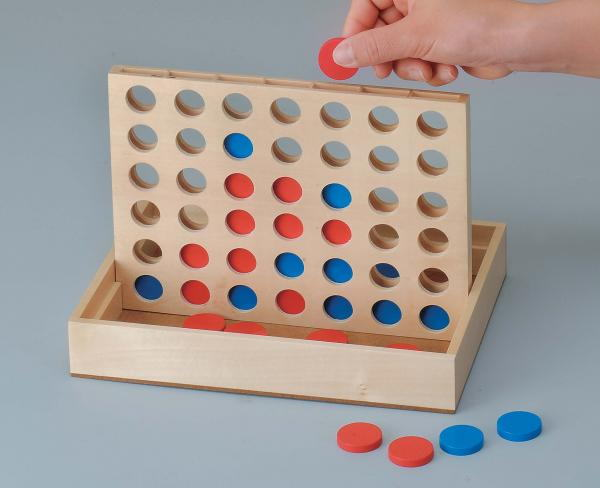

ちょっとだけ余暇を確保出来たのでずっと前からやりたかった強化学習をやります。強化学習を使って最強のスマブラ64AIを作って、練習相手になってもらいたいなーと思っているのですが、さすがにいきなりそれは難し過ぎるので、簡単なゲームのAIを作ってみます。

今回は重力四目並べでやってみます。アメリカでは Connect Four という名前で販売されているみたいですね。

1対1の対戦ゲームで、5x7とか6x7くらいの盤面に、自分のコマを置いていき、縦・横・斜めのいずれかで4つ隣接させれば勝利というシンプルなゲームですね。◯×ゲームの拡張という感じです。違う点としては、「重力」の概念があって、下から上へと積み上げていく必要があり、コマを空中に浮かすことが出来ません。



WEBでプレー出来るものもあるので、やってみればすぐわかると思います。

[http://www.gamedesign.jp/flash/balls/balls_jp.html](http://www.gamedesign.jp/flash/balls/balls_jp.html)

## 四目並べ実装

学習の計算量の都合で、今回は5x5のマスで実装しました。、ほとんどこちらのエントリの三目並べ(◯×ゲーム)の実装をベースに作ってます。

[ChainerでDQN。強化学習を三目並べでいろいろ試してみた。（Deep Q Network、Q-Learning、モンテカルロ）](http://qiita.com/narisan25/items/e64a5741864d5a3b0db0)

今回ぼくが実装したソースコードはこちら

[https://github.com/harada4atsushi/connect_for](https://github.com/harada4atsushi/connect_for)

`board.py`(盤面の実装)

```
import numpy as np
from more_itertools import chunked

EMPTY=0
PLAYER_X=1
PLAYER_O=-1
RED = '\033[91m'
ENDC = '\033[0m'
MARKS={PLAYER_X: RED + "X" + ENDC, PLAYER_O: "O", EMPTY: " "}
DRAW=2
COL_NUM = 5
ROW_NUM = 5
ALL_POS_COUNT = 25

class Board:

    def __init__(self,board=None):
        if board==None:
            self.board = []
            for i in range(ALL_POS_COUNT):self.board.append(EMPTY)
        else:
            self.board=board
        self.winner=None

    def get_possible_pos(self):
        pos = []
        append = pos.append

        for i in range(ALL_POS_COUNT):
            if self.board[i] == EMPTY:
                # 下のマスが埋まっている場合(重力対応)
                below_i = i + COL_NUM
                if below_i >= ALL_POS_COUNT or self.board[below_i] != EMPTY:
                    append(i)

        return pos

    def print_board(self):
        tempboard=[]
        for i in self.board:
            tempboard.append(MARKS[i])
        row = ' {} | {} | {} | {} | {} '
        hr = '\n-------------------\n'

        matrix_str = ''
        for i in range(ROW_NUM):
            matrix_str += row
            if i != ROW_NUM - 1:
                matrix_str += hr

        print(matrix_str.format(*tempboard))


    def check_winner(self, pos):
        self.check_winner_horizontal(pos)
        self.check_winner_vertical()
        self.check_winner_skew()
        return None


    def check_winner_horizontal(self, pos):
        start_pos = pos - (pos % COL_NUM)
        end_pos = start_pos + COL_NUM - 1

        for i in range(start_pos, end_pos):
            if i + COL_NUM - 1 > end_pos:
                break
            if self.board[i] == self.board[i + 1] == self.board[i + 2] == self.board[i + 3]:
                if self.board[i] != EMPTY:
                    self.winner = self.board[i]
                    return self.winner

        # ②
        # for i in range(ALL_POS_COUNT - 4):
        #     if i % COL_NUM < (i + 3) % COL_NUM:
        #         if self.board[i] == self.board[i + 1] == self.board[i + 2] == self.board[i + 3]:
        #             if self.board[i] != EMPTY:
        #                 self.winner = self.board[i]
        #                 return self.winner

        # ①
        # rows = list(chunked(self.board, COL_NUM))
        # self.check_connected(rows)


    def check_winner_vertical(self):
        rows = list(chunked(self.board, COL_NUM))
        cols = list(zip(*rows))
        self.check_connected(cols)


    def check_winner_skew(self):
        # indexに対応するマスに埋まっているプレイヤーの行列を作る
        for index_list in Board.__get_check_indices():
            if self.board[index_list[0]] == self.board[index_list[1]] == self.board[index_list[2]] == self.board[index_list[3]]:
               if self.board[index_list[0]] != EMPTY:
                   self.winner = self.board[index_list[0]]
                   return self.winner
        # self.check_connected(rows)


    def check_connected(self, lists):
        for list in lists:
            pre = EMPTY
            count = 0
            for player in list:
                if player == EMPTY:
                    count = 0
                elif pre == player:
                    count += 1
                    if count == 4:
                        self.winner = player
                else:
                    count = 1

                pre = player


    def check_draw(self):
        if len(self.get_possible_pos())==0 and self.winner is None:
            self.winner=DRAW
            return DRAW
        return None

    def move(self,pos,player):
        if self.board[pos]== EMPTY:
            self.board[pos]=player
        else:
            self.winner=-1*player
        self.check_winner(pos)
        self.check_draw()

    def clone(self):
        return Board(self.board.copy())

    def switch_player(self):
        if self.player_turn == self.player_x:
            self.player_turn=self.player_o
        else:
            self.player_turn=self.player_x


    @classmethod
    def __get_check_indices(cls):
        if hasattr(cls, 'check_indices'):
            return cls.check_indices

        # print('__get_check_indices')
        indices = []

        # 左上がり斜め方向のindexのリストを作る
        for i in range(ALL_POS_COUNT):
            list = []
            next_i = i
            while next_i < ALL_POS_COUNT:
                if next_i % COL_NUM >= i % COL_NUM:
                    list.append(next_i)
                next_i += COL_NUM + 1

            if len(list) >= 4:
                indices.append(list)

        # 右上がり斜め方向のindexのリストを作る
        for i in range(ALL_POS_COUNT):
            list = []
            next_i = i
            while next_i < ALL_POS_COUNT:
                if (next_i % COL_NUM < i % COL_NUM) or i == next_i:
                    list.append(next_i)
                next_i += COL_NUM - 1

            if len(list) >= 4:
                indices.append(list)

        cls.check_indices = indices
        # print(indices)
        return cls.check_indices

```

`game_organizer.py`(ゲームの進行役)

```
import random

from board import DRAW, Board


class GameOrganizer:

    act_turn=0
    winner=None

    def __init__(self, px, po, nplay=1, showBoard=True, showResult=True, stat=100):
        self.player_x=px
        self.player_o=po
        self.nwon={px.myturn:0,po.myturn:0,DRAW:0}
        self.nplay=nplay
        self.players=(self.player_x,self.player_o)
        self.board=None
        self.disp=showBoard
        self.showResult=showResult
        self.player_turn=self.players[random.randrange(2)]
        self.nplayed=0
        self.stat=stat

    def progress(self):
        while self.nplayed < self.nplay:
            self.board = Board()

            while self.board.winner == None:
                if self.disp:
                    print("Turn is " + self.player_turn.name)

                act = self.player_turn.act(self.board)
                self.board.move(act,self.player_turn.myturn)

                if self.disp:
                    self.board.print_board()

                if self.board.winner != None:
                    # notice every player that game ends
                    for i in self.players:
                        i.getGameResult(self.board)

                    if self.board.winner == DRAW:
                        if self.showResult:print ("Draw Game")
                    elif self.board.winner == self.player_turn.myturn:
                        out = "Winner : " + self.player_turn.name
                        if self.showResult: print(out)
                    else:
                        print ("Invalid Move!")
                    self.nwon[self.board.winner]+=1
                else:
                    self.switch_player()
                    # Notice other player that the game is going
                    self.player_turn.getGameResult(self.board)

            self.nplayed += 1
            if self.nplayed%self.stat==0 or self.nplayed==self.nplay:
                print(self.player_x.name+":"+str(self.nwon[self.player_x.myturn])+","+self.player_o.name+":"+str(self.nwon[self.player_o.myturn])
                    +",DRAW:"+str(self.nwon[DRAW]))


    def switch_player(self):
        if self.player_turn == self.player_x:
            self.player_turn=self.player_o
        else:
            self.player_turn=self.player_x
```

## プレーヤーの実装
たぶん元コードからいじっていないけど、一応載せておきます。


### ランダム
勝てる状態のときには必ず勝てる手を打つが、それ以外は全てランダムな手を打つザコ。

`player_alpha_random.py`

```
import random


class PlayerAlphaRandom:


    def __init__(self,turn,name="AlphaRandom"):
        self.name=name
        self.myturn=turn

    def getGameResult(self,winner):
        pass

    def act(self,board):
        acts=board.get_possible_pos()
        #see only next winnable act
        for act in acts:
            tempboard=board.clone()
            tempboard.move(act,self.myturn)
            # check if win
            if tempboard.winner==self.myturn:
                #print ("Check mate")
                return act
        i=random.randrange(len(acts))
        return acts[i]
```

### 人間
自分で手を打って対戦できるプレーヤー。

`player_human.py`

```
class PlayerHuman:
    def __init__(self,turn):
        self.name="Human"
        self.myturn=turn

    def act(self,board):
        valid = False
        while not valid:
            try:
                act = input("Where would you like to place " + str(self.myturn) + " (1-35)? ")
                act = int(act)
                #if act >= 1 and act <= 9 and board.board[act-1]==EMPTY:
                if act >= 1 and act <= 35:
                    valid=True
                    return act-1
                else:
                    print ("That is not a valid move! Please try again.")
            except Exception as e:
                    print (act +  "is not a valid move! Please try again.")
        return act

    def getGameResult(self,board):
        if board.winner is not None and board.winner!=self.myturn and board.winner!=DRAW:
            print("I lost...")
```

### 竜王モンテカルロ

次の手以降をしらみつぶし的にシミュレーションして、良い手を選択するなかなか賢いヤツ。考えるのが遅いのが難点。とりあえずシミュレーションの試行回数は50回になっている。

`player_mc.py`

```
import random

from board import DRAW


class PlayerMC:
    def __init__(self, turn, name="MC"):
        self.name = name
        self.myturn = turn

    def getGameResult(self,winner):
        pass

    def win_or_rand(self,board,turn):
        acts = board.get_possible_pos()
        #see only next winnable act
        for act in acts:
            tempboard=board.clone()
            tempboard.move(act,turn)
            # check if win
            if tempboard.winner==turn:
                return act
        i=random.randrange(len(acts))
        return acts[i]

    def trial(self,score,board,act):
        tempboard=board.clone()
        tempboard.move(act,self.myturn)
        tempturn=self.myturn
        while tempboard.winner is None:
            tempturn=tempturn*-1
            tempboard.move(self.win_or_rand(tempboard,tempturn),tempturn)

        if tempboard.winner==self.myturn:
            score[act]+=1
        elif tempboard.winner==DRAW:
            pass
        else:
            score[act]-=1


    def getGameResult(self,board):
        pass


    def act(self,board):
        acts = board.get_possible_pos()
        scores = {}
        n = 50
        for act in acts:
            scores[act] = 0
            for i in range(n):
                #print("Try"+str(i))
                self.trial(scores, board, act)

            #print(scores)
            scores[act]/=n

        max_score = max(scores.values())
        for act, v in scores.items():
            if v == max_score:
                #print(str(act)+"="+str(v))
                return act
```

### Q-Learning
期待のQ学習プレーヤー。Q値を更新し、良い手を学習します。時折ランダムな手を打って局所最適に収束するのを回避してます。

`player_ql.py`

```
import random
from board import DRAW

class PlayerQL:
    def __init__(self, turn, name="QL", e=0.2, alpha=0.3):
        self.name=name
        self.myturn=turn
        self.q={} #set of s,a
        self.e=e
        self.alpha=alpha
        self.gamma = 0.9
        self.last_move=None
        self.last_board=None
        self.totalgamecount = 0


    def policy(self,board):
        self.last_board = board.clone()
        acts = board.get_possible_pos()

        # Explore sometimes
        # ゲーム回数が少ない間は、ある程度の確率で打ち手をランダムにする
        if random.random() < (self.e / (self.totalgamecount // 10000 + 1)):
            i = random.randrange(len(acts))
            return acts[i]

        qs = [self.getQ(tuple(self.last_board.board),act) for act in acts]
        maxQ= max(qs)

        if qs.count(maxQ) > 1:
            # more than 1 best option; choose among them randomly
            best_options = [i for i in range(len(acts)) if qs[i] == maxQ]
            i = random.choice(best_options)
        else:
            i = qs.index(maxQ)

        self.last_move = acts[i]
        return acts[i]

    def getQ(self, state, act):
        # encourage exploration; "optimistic" 1.0 initial values
        if self.q.get((state, act)) is None:
            self.q[(state, act)] = 1
        return self.q.get((state, act))

    def getGameResult(self,board):
        r=0
        if self.last_move is not None:
            if board.winner is None:
                self.learn(self.last_board,self.last_move, 0, board)
                pass
            else:
                if board.winner == self.myturn:
                    self.learn(self.last_board,self.last_move, 1, board)
                elif board.winner !=DRAW:
                    self.learn(self.last_board,self.last_move, -1, board)
                else:
                    self.learn(self.last_board,self.last_move, 0, board)
                self.totalgamecount+=1
                self.last_move=None
                self.last_board=None

    def learn(self,s,a,r,fs):
        pQ=self.getQ(tuple(s.board),a)
        if fs.winner is not None:
            maxQnew=0
        else:
            maxQnew=max([self.getQ(tuple(fs.board),act) for act in fs.get_possible_pos()])
        self.q[(tuple(s.board),a)]=pQ+self.alpha*((r+self.gamma*maxQnew)-pQ)
        #print (str(s.board)+"with "+str(a)+" is updated from "+str(pQ)+" refs MAXQ="+str(maxQnew)+":"+str(r))
        #print(self.q)


    def act(self,board):
        return self.policy(board)
```

## 対戦させてみる

### 人間 vs 竜王モンテカルロ

4目並べは初心者レベルだと、単なるうっかりゲーなので、相手のリーチに気づかずに敗北ってパターンがほとんど。ともすると竜王モンテカルロは論理的にはうっかりしないヤツだったはずなので、人間が普通に戦ったら負けるのではないか？

やってみる。

`versus.py`

```
def human_vs_mc():
    p1 = PlayerHuman(PLAYER_X)
    p2 = PlayerMC(PLAYER_O, 'M2')
    game = GameOrganizer(p1, p2)
    game.progress()
```

`main.py`

```
human_vs_mc()
```

```
Turn is M2
   |   |   |   |   
-------------------
   |   |   |   |   
-------------------
   |   |   |   |   
-------------------
   |   |   |   |   
-------------------
   |   |   | O |   
Turn is Human
Where would you like to place 1 (1-35)? 21
   |   |   |   |   
-------------------
   |   |   |   |   
-------------------
   |   |   |   |   
-------------------
   |   |   |   |   
-------------------
 X |   |   | O |   
Turn is M2
   |   |   |   |   
-------------------
   |   |   |   |   
-------------------
   |   |   |   |   
-------------------
   |   |   | O |   
-------------------
 X |   |   | O |   
Turn is Human
Where would you like to place 1 (1-35)? 16
   |   |   |   |   
-------------------
   |   |   |   |   
-------------------
   |   |   |   |   
-------------------
 X |   |   | O |   
-------------------
 X |   |   | O |   
Turn is M2
   |   |   |   |   
-------------------
   |   |   |   |   
-------------------
   |   |   | O |   
-------------------
 X |   |   | O |   
-------------------
 X |   |   | O |   
Turn is Human
Where would you like to place 1 (1-35)? 9
   |   |   |   |   
-------------------
   |   |   | X |   
-------------------
   |   |   | O |   
-------------------
 X |   |   | O |   
-------------------
 X |   |   | O |   
Turn is M2
   |   |   |   |   
-------------------
   |   |   | X |   
-------------------
 O |   |   | O |   
-------------------
 X |   |   | O |   
-------------------
 X |   |   | O |   
Turn is Human
Where would you like to place 1 (1-35)? 6
   |   |   |   |   
-------------------
 X |   |   | X |   
-------------------
 O |   |   | O |   
-------------------
 X |   |   | O |   
-------------------
 X |   |   | O |   
Turn is M2
   |   |   |   |   
-------------------
 X |   |   | X |   
-------------------
 O |   |   | O |   
-------------------
 X |   |   | O |   
-------------------
 X |   |   | O | O
Turn is Human
Where would you like to place 1 (1-35)? 20
   |   |   |   |   
-------------------
 X |   |   | X |   
-------------------
 O |   |   | O |   
-------------------
 X |   |   | O | X
-------------------
 X |   |   | O | O
Turn is M2
   |   |   |   |   
-------------------
 X |   |   | X |   
-------------------
 O |   |   | O |   
-------------------
 X |   |   | O | X
-------------------
 X | O |   | O | O
Turn is Human
Where would you like to place 1 (1-35)? 17
   |   |   |   |   
-------------------
 X |   |   | X |   
-------------------
 O |   |   | O |   
-------------------
 X | X |   | O | X
-------------------
 X | O |   | O | O
Turn is M2
   |   |   |   |   
-------------------
 X |   |   | X |   
-------------------
 O |   |   | O |   
-------------------
 X | X |   | O | X
-------------------
 X | O | O | O | O
I lost...
Winner : M2
Human:0,M2:1,DRAW:0
```

やっぱり勝てねえ…。モンテカルロつよし。

モンテカルロに勝てるQ-Learningを実現したい。

### Q-Learning vs モンテカルロ

#### 学習①
Q-Learningとランダムで100万回対戦させて学習させる。学習処理に30分以上かかるので、結果をファイルにdumpしておく。

`versus.py`

```
def ql_vs_alpha_random():
    p1 = PlayerQL(PLAYER_X, 'Q1')
    p2 = PlayerAlphaRandom(PLAYER_O)
    game = GameOrganizer(p1, p2, 1000000, False, False, 10000)
    game.progress()

    with open('dump/ql_vs_alpha_random_%s.pkl' % sdate(), mode='wb') as f:
        pickle.dump(p1, f)
```

`main.py`

```
ql_vs_alpha_random()
```

ログ保存するの忘れちゃったよ。。大体ですね30万回くらい対戦させると、Q-Learningの方が勝利数が上回るみたい。これでランダム野郎より強いのは分かる。

#### 対戦①

10回戦した結果をみてみます。

`versus.py`

```
def mc_vs_dumped():
    p1 = PlayerMC(PLAYER_X, 'M1')
    with open('dump/ql_vs_alpha_random_2017_05_19_17_42_46.pkl', mode='rb') as f:
        p2 = pickle.load(f)

    p2.e = 0
    game = GameOrganizer(p1, p2, 10, False)
    game.progress()
```

`main.py`

```
mc_vs_dumped()
```

ログ

```
Winner : M1
Winner : M1
Winner : M1
Winner : M1
Winner : Q1
Winner : M1
Winner : M1
Winner : M1
Winner : M1
Winner : M1
M1:9,Q1:1,DRAW:0
```

9対1でモンテカルロさんの圧勝ですね。。100万回も戦ったのに。。

#### 学習②

悔しいので今度は、Q-Learning vs Q-Learningで100万回対戦させてみます。

`versus.py`

```
def ql_vs_ql():
    p1 = PlayerQL(PLAYER_X, 'Q1')
    p2 = PlayerQL(PLAYER_O, 'Q2')
    game = GameOrganizer(p1, p2, 1000000, False, False, 10000)
    game.progress()

    with open('dump/ql_vs_ql_%s.pkl' % sdate(), mode='wb') as f:
        pickle.dump(p1, f)
```

`main.py`

```
ql_vs_ql()
```

すさまじく時間がかかります。

ログを一部抜粋。当然同じアルゴリズムなのでほぼ互角の戦いをしていますね。dumpしたファイルを見ると1.21GBとな。。。

```
...
Q1:285772,Q2:285673,DRAW:68555
Q1:290402,Q2:289947,DRAW:69651
Q1:294845,Q2:294393,DRAW:70762
Q1:299172,Q2:298911,DRAW:71917
Q1:303581,Q2:303374,DRAW:73045
Q1:308033,Q2:307850,DRAW:74117
Q1:312373,Q2:312432,DRAW:75195
Q1:316757,Q2:316871,DRAW:76372
Q1:321205,Q2:321323,DRAW:77472
Q1:325535,Q2:325913,DRAW:78552
Q1:329798,Q2:330599,DRAW:79603
Q1:334360,Q2:334965,DRAW:80675
Q1:338741,Q2:339487,DRAW:81772
Q1:343038,Q2:344011,DRAW:82951
Q1:347604,Q2:348288,DRAW:84108
...
```

#### 対戦②

さあ、先程と同様に竜王モンテカルロにぶつけてみます！dumpしたファイルがでかすぎるのでロードにも時間がかかる。

`versus.py`

```
def mc_vs_dumped():
    p1 = PlayerMC(PLAYER_O, 'M1')
    # with open('dump/ql_vs_alpha_random_2017_05_19_17_42_46.pkl', mode='rb') as f:
    with open('dump/ql_vs_ql_2017_05_19_18_35_32.pkl', mode='rb') as f:
        p2 = pickle.load(f)

    p2.e = 0
    game = GameOrganizer(p1, p2, 10, False)
    game.progress()
```

`main.py`

```
mc_vs_dumped()
```

どうなるかどうなるか？

ログ

```
Winner : M1
Winner : M1
Winner : M1
Winner : M1
Winner : M1
Winner : M1
Winner : M1
Winner : M1
Winner : M1
Winner : M1
M1:10,Q1:0,DRAW:0
```

結果は竜王モンテカルロの圧勝。Q-Learning頑張ったのに。。。

3x3の三目並べならQ-Learningは竜王モンテカルロに勝てるのは確認したんですが、このルールでは厳しかったかなー。いずれロジックを見直したいところ。
