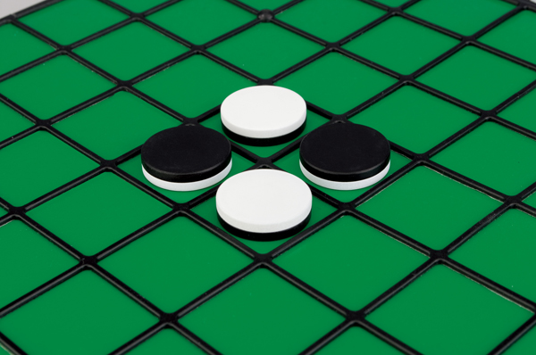

前回4x4のオセロで最強のAIを作ろうとしたらランダムさんごときにボッコボコされたところからの続きです。

[強化学習(Q-Learning)でオセロAIを学習させてみた](http://tech.mof-mof.co.jp/blog/reversi-ai.html)

ロジックの大枠は出来ていたのですが、強くなってくれないという問題がありまして、デバッグしていた感じだと、相手のターンを考慮してQ値の更新をしないと、勝敗の報酬が伝播されないのではないかと仮説立ててやってみました。

`qlearning_player.py`の一部を修正(他の箇所も修正しているけど主にここが原因)。

```
  def getGameResult(self, board_data, opponent_player=None):
       board = Board(deepcopy(board_data))

       # 相手のターン行動後のQ値を取得するための処理
       # これをしないと、自分のターン終了後の盤面でQ値が取得されるため、
       # ほとんどのケースでで初期値1が取得されてしまい、最初の方の手のQ値に伝播していなかった
       act = opponent_player.next_move(board.board_data, opponent_player.color)
       gameplay.doMove(board.board_data, opponent_player.color, act)
       is_game_over = board.is_game_over()

       reward = 0
       if is_game_over:
           color = board.color_of_more()

           if color == self.color:
               reward = 1
           elif color == '':
               reward = 0
           elif color != self.color:
               reward = -1

       # passしていない場合のみ学習させる
       if self._last_move != None:
           self.learn(self._last_board, self._last_move, reward, board, is_game_over)

       if not is_game_over:
           self._action_count += 1
           self._last_move = None
           self._last_board = None


   def learn(self, s, a, r, fs, game_ended):
       flattend_data = s.flattend_data()

       list = []
       for position in fs.valid_positions(self):
           list.append(self.q.get(tuple(fs.flattend_data()), position))

       if game_ended or len(list) == 0:
           max_q_new = 0
       else:
           max_q_new = max(list)

       self.q.update(tuple(flattend_data), a, r, max_q_new)
```

確実に学習状況を観察出来るようにするため、ランダム野郎を超えるザコプレーヤーのナイーブさんを実装。

この人は常に盤面の左上から右下に向かう方向で走査して最初に見つけた打てる手を打つ、ザコ中のザコ。ザコ・オブ・ザ・ザコである。

盤面が同じ状況なら必ず同じ手を打つため、少しでも学習していれば勝てるはずの相手。

`naive_player.py`

```
from board import Board


class NaivePlayer:
    """
    常に同一のポリシーで同じ手を打つプレーヤー
    盤面の左上を起点に、右に一つずつ移していき、
    最初に到達した打てる箇所に打つ
    """

    def __init__(self, color):
        self.color = color
        self.name = 'naive'

    def next_move(self, board_data, color):
        board = Board(board_data)
        positions = board.valid_positions(self)

        if len(positions) == 0:
            return "pass"

        for row_i in range(0, Board.BOARD_SIZE):
            for col_i in range(0, Board.BOARD_SIZE):
                if (row_i, col_i) in positions:
                    return (row_i, col_i)


    def nextMoveR(self, board, color, time):
        return self.next_move(board, color)


    def getGameResult(self, board_data, game_ended=False, opponent_player=None):
        pass
```

## Q学習 vs ナイーブ
1,000回対戦させたところ、ちゃんとQ学習が勝っている様子がわかる。最初の100回くらいはナイーブさんにすら負けていてウケる。

```
$ python gameplay.py --p1 ql --p2 naive
Win count, player1(ql): 0, player2(naive): 1, draw: 0
Win count, player1(ql): 38, player2(naive): 56, draw: 7
Win count, player1(ql): 84, player2(naive): 103, draw: 14
Win count, player1(ql): 151, player2(naive): 130, draw: 20
Win count, player1(ql): 224, player2(naive): 150, draw: 27
Win count, player1(ql): 294, player2(naive): 168, draw: 39
Win count, player1(ql): 357, player2(naive): 198, draw: 46
Win count, player1(ql): 423, player2(naive): 225, draw: 53
Win count, player1(ql): 495, player2(naive): 248, draw: 58
Win count, player1(ql): 572, player2(naive): 265, draw: 64
Win count, player1(ql): 642, player2(naive): 283, draw: 75
```

## Q学習 vs ランダム
前回コテンパに敗北させられたランダムさんとのリベンジ戦。ちょっとあやしげな勝率ではあるが、辛くも勝利と言ったところか。

```
$ python gameplay.py --p1 ql --p2 random
Win count, player1(ql): 4326, player2(random): 3292, draw: 683
Win count, player1(ql): 4396, player2(random): 3316, draw: 689
Win count, player1(ql): 4464, player2(random): 3347, draw: 690
Win count, player1(ql): 4531, player2(random): 3376, draw: 694
Win count, player1(ql): 4596, player2(random): 3407, draw: 698
Win count, player1(ql): 4660, player2(random): 3440, draw: 701
Win count, player1(ql): 4729, player2(random): 3470, draw: 702
Win count, player1(ql): 4798, player2(random): 3496, draw: 707
Win count, player1(ql): 4862, player2(random): 3525, draw: 714
Win count, player1(ql): 4926, player2(random): 3557, draw: 718
Win count, player1(ql): 4981, player2(random): 3594, draw: 726
Win count, player1(ql): 5049, player2(random): 3623, draw: 729
Win count, player1(ql): 5112, player2(random): 3655, draw: 734
Win count, player1(ql): 5170, player2(random): 3691, draw: 740
Win count, player1(ql): 5219, player2(random): 3729, draw: 753
Win count, player1(ql): 5272, player2(random): 3766, draw: 763
Win count, player1(ql): 5322, player2(random): 3803, draw: 776
Win count, player1(ql): 5381, player2(random): 3838, draw: 781
```

## Q学習(バトルモード) vs 竜王ミニマックス
さて、大ボスの竜王ミニマックスとぶつけてみます。

Q学習同士で1万回戦わせた状態で戦わせます。ランダムさんと戦ったときは`ε-greedy`で探索させながらの結果でしたが、今回は大ボスが相手なので手加減はしないで、探索させず最善手を選ぶモード(バトルモード)にして戦わせます。

`gameplay.py`の一部

```
from organizer import Organizer
organizer = Organizer(nplay=10000, show_board=False, show_result=False, stat=1000)
# organizer = Organizer(nplay=10000, debug=True)
organizer.play_game(p1, p2, verbose, clockTime)

# 学習済みのQ-Learningプレイヤーで再度戦わせる
organizer = Organizer(nplay=600, show_board=False, show_result=False)
p1.change_to_battle_mode()
from player.minmax_player import MinmaxPlayer
p2 = MinmaxPlayer('W')
organizer.play_game(p1, p2, verbose, clockTime)
```

やったああああ！！！憎き竜王ミニマックスを一網打尽にしてやりました！！ざまあみろ！！気持ちいい！！

```
$ python gameplay.py --p1 ql --p2 ql
Win count, player1(ql): 1, player2(ql): 0, draw: 0
Win count, player1(ql): 439, player2(ql): 449, draw: 113
Win count, player1(ql): 880, player2(ql): 891, draw: 230
Win count, player1(ql): 1303, player2(ql): 1358, draw: 340
Win count, player1(ql): 1742, player2(ql): 1831, draw: 428
Win count, player1(ql): 2205, player2(ql): 2267, draw: 529
Win count, player1(ql): 2652, player2(ql): 2723, draw: 626
Win count, player1(ql): 3088, player2(ql): 3235, draw: 678
Win count, player1(ql): 3460, player2(ql): 3765, draw: 776
Win count, player1(ql): 3933, player2(ql): 4201, draw: 867
Win count, player1(ql): 4426, player2(ql): 4642, draw: 932

Win count, player1(ql): 0, player2(minmax): 1, draw: 0
Win count, player1(ql): 44, player2(minmax): 48, draw: 9
Win count, player1(ql): 104, player2(minmax): 84, draw: 13
Win count, player1(ql): 200, player2(minmax): 86, draw: 15
Win count, player1(ql): 300, player2(minmax): 86, draw: 15
Win count, player1(ql): 400, player2(minmax): 86, draw: 15
Win count, player1(ql): 499, player2(minmax): 86, draw: 15

```

## おまけ: Q学習(バトルモード) vs ランダム
上で微妙な勝率だったので、本気を出したバトルモードのQ学習とランダムをぶつけてみるとどうなるか試してみた。

ランダムに1回も勝たせることなく完膚なきまでにフルボッコにしました！！

```
$ python gameplay.py --p1 ql --p2 ql
Win count, player1(ql): 0, player2(ql): 1, draw: 0
Win count, player1(ql): 434, player2(ql): 464, draw: 103
Win count, player1(ql): 883, player2(ql): 931, draw: 187
Win count, player1(ql): 1320, player2(ql): 1392, draw: 289
Win count, player1(ql): 1810, player2(ql): 1802, draw: 389
Win count, player1(ql): 2220, player2(ql): 2297, draw: 484
Win count, player1(ql): 2670, player2(ql): 2754, draw: 577
Win count, player1(ql): 3197, player2(ql): 3119, draw: 685
Win count, player1(ql): 3603, player2(ql): 3630, draw: 768
Win count, player1(ql): 4078, player2(ql): 4080, draw: 843
Win count, player1(ql): 4604, player2(ql): 4493, draw: 903

Win count, player1(ql): 1, player2(random): 0, draw: 0
Win count, player1(ql): 101, player2(random): 0, draw: 0
Win count, player1(ql): 201, player2(random): 0, draw: 0
Win count, player1(ql): 301, player2(random): 0, draw: 0
Win count, player1(ql): 401, player2(random): 0, draw: 0
Win count, player1(ql): 501, player2(random): 0, draw: 0
Win count, player1(ql): 600, player2(random): 0, draw: 0
```

## まとめ
計算量の都合で4x4でやりましたが、6x6や8x8でも試してみたいですね。

あと今回ミニマックスアルゴリズムに勝ったと言いましたが、確かちゃんと実装されたミニマックス(アルファベータ？)は、後攻を取れば絶対に負けることがないはずなので、今回の竜王ミニマックスはまだ本気を出していなかったのかも(コードにバグが残っているかもしれない)。
