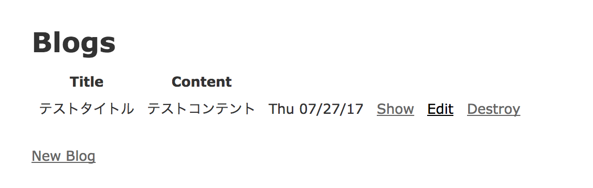

#### Draperとは？
Draperとはデコレーター(ビューとモデルの中間の処理を引き受ける)で、railsのプレゼンテーション層を担います。
Draperを利用することで、以下のような事態を避けられます。  

- ファットモデル
- ビューファイル内のif文多用
- helperの名前空間の衝突  

結果、コードの可読性、保守性を向上することできます。  
早速Draperを使ってみます。  

#### draperをインストール
```ruby
gem 'draper'
```

`$ bundle install`

#### 土台となるアプリケーションを作成
`$ rails g scaffold Blog title:string content:text`  
draperをインストールしているため、decoratorsも作成されます。  

`$ rails db:migrate`  

#### 生成されたコードを確認
`app/decorators/blog_decorator.rb`に以下ようなコードが自動生成されます。  
```ruby
class BlogDecorator < Draper::Decorator
  delegate_all

  # Define presentation-specific methods here. Helpers are accessed through
  # `helpers` (aka `h`). You can override attributes, for example:

   # created_atメソッドのコメントアウトを外します
   def created_at
     helpers.content_tag :span, class: 'time' do
       object.created_at.strftime("%a %m/%d/%y")
     end
   end
end
```

`delegate_all`とは、decoratorに存在しないメソッドがコールされた場合、モデルの処理が実行されます。  


#### controllerにてdecoratorインスタンスを作成
オブジェクトをデコレートする(decorator内で利用できるようにする)ためには、以下の方法を利用します。  

- 複数のオブジェクトの場合、`decorate_collection`
- 単体のオブジェクトの場合、`decorate`

```ruby
class BlogsController < ApplicationController
  before_action :set_blog, only: [:show, :edit, :update, :destroy]

  # GET /blogs
  # GET /blogs.json
  def index
    @blogs = BlogDecorator.decorate_collection(Blog.all)
  end

...

  private
    # Use callbacks to share common setup or constraints between actions.
    def set_blog
      # Blog.find(params[:id]).decorate これでもいけます
      @blog = BlogDecorator.decorate(Blog.find(params[:id]))
    end
end
```
このようにデコレーターインスタンスを生成します。  


#### ビューからdecoratorメソッドを利用する。
`app/views/blogs/index.html.erb`から`created_at`メソッドをコールする。
```html
<p id="notice"><%= notice %></p>

<h1>Blogs</h1>

<table>
  <thead>
    <tr>
      <th>Title</th>
      <th>Content</th>
      <th colspan="3"></th>
    </tr>
  </thead>

  <tbody>
    <% @blogs.each do |blog| %>
      <tr>
        <td><%= blog.title %></td>
        <td><%= blog.content %></td>
        <td><%= blog.created_at %></td>
        <td><%= link_to 'Show', blog %></td>
        <td><%= link_to 'Edit', edit_blog_path(blog) %></td>
        <td><%= link_to 'Destroy', blog, method: :delete, data: { confirm: 'Are you sure?' } %></td>
      </tr>
    <% end %>
  </tbody>
</table>
```


#### 表示を確認する


draperで定義したメソッド`created_at`がコールされています。  


このようにDaperを利用することで、コードの保守性、可読性を向上させることができます。
